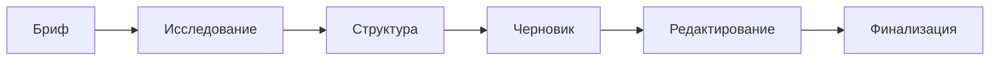

import { Aside } from '@astrojs/starlight/components';

Workflow для создания текстового контента со структурированным исследованием, циклами валидации и точками подтверждения. Поддерживает статьи, посты и техническую документацию.

## Запуск

```bash
mcp__moira__start({ workflowId: "content-creation" })
```

## Процесс



## Шаги

| Шаг | Действие | Результат |
|-----|----------|-----------|
| 1. Бриф | Сбор требований: тема, формат, аудитория, тональность, ограничения | Структурированный бриф |
| 2. Исследование | Исследование темы из авторитетных источников | Мин. 3 источника, 3 факта |
| 3. Структура | Создание структуры контента | Согласованная структура |
| 4. Черновик | Написание по структуре и тональности | Черновик по брифу |
| 5. Редактирование | Редактирование для ясности и engagement | Отредактированный контент |
| 6. Финализация | Финальное согласование и подготовка к публикации | Готовый контент |

## Особенности

<Aside type="tip">
Валидация исследования требует минимум 3 авторитетных источника и 3 ключевых факта перед переходом к структуре.
</Aside>

### Форматы контента

| Формат | Описание |
|--------|----------|
| `article` | Длинная статья |
| `post` | Пост в блог или соцсети |
| `documentation` | Техническая документация |
| `other` | Другой формат |

### Тональности

| Тональность | Описание |
|-------------|----------|
| `formal` | Профессиональная, формальная |
| `casual` | Разговорная, дружелюбная |
| `technical` | Техническая, точная |
| `mixed` | Комбинация по контексту |

### Циклы валидации

- **Валидация исследования**: Проверка полноты (мин. 3 источника, 3 факта)
- **Валидация черновика**: Проверка соответствия структуре и тональности

### Точки согласования

- **Согласование структуры**: Подтверждение перед написанием
- **Согласование контента**: Финальное одобрение

## Пример конфигурации ноды

```json
{
  "id": "research-topic",
  "type": "agent-directive",
  "directive": "Исследуй тему из авторитетных источников. Найди минимум 3 источника и выдели 3 ключевых факта.",
  "completionCondition": "Исследование завершено с 3+ верифицированными источниками и 3+ ключевыми фактами",
  "connections": {
    "next": "validate-research"
  }
}
```

## Связанное

- [Verified Research](/ru/docs/reference/workflows/verified-research/) — Для глубокого исследования с верификацией источников
- [Robust Task](/ru/docs/reference/workflows/robust-task/) — Для многошаговых задач
- [Обзор шаблонов](/ru/docs/reference/workflow-templates/) — Все доступные шаблоны
