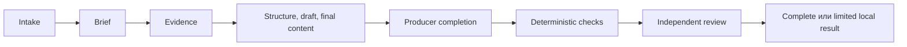

Content Creation создаёт один ограниченный текстовый результат — статью, пост, документацию, сценарий, email, landing copy или другой запрошенный формат — из разрешённого brief.

```bash
mcp__moira__start({ workflowId: "moira/content-creation", parentExecutionId: "none" })
```

Используйте его, когда результатом является сам текст. Для campaign positioning и multi-channel материалов выбирайте [Marketing Campaign](/ru/docs/reference/workflows/marketing-campaign/), для evidence discovery как результата — research workflow, для изменений репозитория — Software Development Flow.

## Долговечный процесс

Workflow создаёт execution-correlated workspace с неизменяемым content contract, накопительными независимо проверенными corrections, content brief, evidence register, structure, draft, final content, limitations, validation observations, independent findings, repair account и final report.


```mermaid
flowchart LR
  A[Intake] --> B[Brief]
  B --> C[Evidence]
  C --> D[Structure, draft, final content]
  D --> E[Producer completion]
  E --> F[Deterministic checks]
  F --> G[Independent review]
  G --> H[Complete или limited local result]
```

Evidence разделяет sourced facts и quotations, переданные утверждения, inference, assumptions, creative invention и недоступные материалы. Фиксированные source, section, word, score, issue или retry quotas не определяют semantic quality.

Content, evidence и brief findings имеют source-specific repair owners и повторяют все устаревшие downstream responsibilities. Ошибочные criteria проходят cumulative corrected-contract review. Autonomous mode пропускает только финальную пользовательскую приёмку; interactive mode поддерживает accept, abort или один конкретный brief/evidence/content/contract rework request.

## Опциональные эффекты

Локального результата достаточно. Publication требует originating authority для конкретного destination и использует точную принятую редакцию. Telegram требует отдельного originating authority. Исходы остаются `not_requested`, `declined`, `succeeded`/`sent` или `failed` и не меняют complete либо reviewed-limited качество текста.

Workflow не коммитит, не выпускает релиз, не деплоит, не изменяет product code, не связывается с клиентами и не угадывает source/effect authority.
