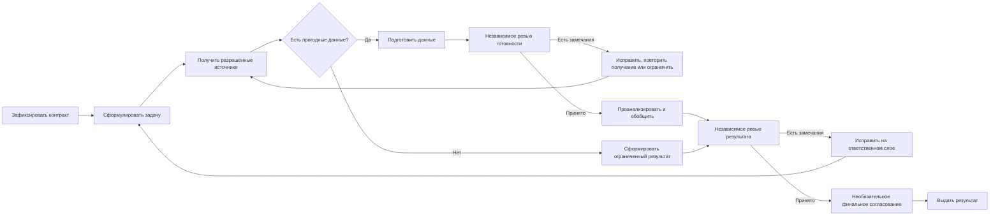

import { Aside } from '@astrojs/starlight/components';

`moira/data-analysis` превращает один или несколько предоставленных либо явно разрешённых наборов данных в независимо проверенный результат для принятия решения. Флоу сохраняет исходные полномочия пользователя на источники, отдельно фиксирует фактическую доступность, проверяет готовность данных до анализа и выдаёт полный либо честно ограниченный результат, если доказательств недостаточно.

## Запуск

```js
mcp__moira__start({
  workflowId: "moira/data-analysis",
  parentExecutionId: "none"
})
```

Передайте аналитический вопрос, решение, для которого нужен результат, объём, аудиторию, ограничения, критерии успеха, ожидаемые материалы, правила конфиденциальности и хотя бы один inline-, file- или API-источник. Для каждого источника укажите безопасный идентификатор, несекретный locator, разрешение, изначально известную доступность, классификацию данных и ограничения.

## Когда выбирать этот флоу

| Потребность | Флоу |
| --- | --- |
| Проанализировать уже предоставленные или явно разрешённые наборы данных | **Data Analysis** |
| Найти и проверить внешнюю литературу или веб-источники для ограниченного ответа | [Verified Research](/ru/docs/reference/workflows/verified-research/) |
| Развивать исследовательское направление через повторное изучение и уточнение | [Iterative Research](/ru/docs/reference/workflows/iterative-research/) |
| Реализовать изменение продукта вместе с тестами и документацией | [Software Development Flow](/ru/docs/reference/workflow-templates/#software-development-flow) |

<Aside type="note">
Упоминание источника в запросе само по себе не даёт Data Analysis право доступа. Используйте флоу только для данных, которые вызывающая сторона предоставила или явно разрешила. Если главная задача — найти внешние доказательства, выберите исследовательский флоу.
</Aside>

## Процесс



Флоу выполняет связанные обязанности как единый процесс:

- фиксирует канонический контракт анализа, не расширяя доступ к источникам;
- связывает вопрос с указанным решением, аудиторией, объёмом и критериями успеха;
- записывает типизированный исход получения для каждого источника, включая разрешённый, но недоступный источник, отсутствие разрешения и ошибку доступа;
- готовит только пригодные данные и документирует происхождение, преобразования, обработку пропусков, наблюдения о качестве, ограничения выборки, условия законного использования и воспроизводимость;
- выбирает методы по вопросу и доказательствам, а не принудительно применяет фиксированный чеклист разведочного анализа;
- создаёт безопасные для приватности визуализации, только если они существенно улучшают понимание;
- связывает выводы, неопределённость, ограничения, рекомендации и воспроизводимость с доказательствами по источникам;
- независимо проверяет готовность и итог, после чего направляет подтверждённый дефект на владеющий им слой.

## Контракт источников и фактическое получение

Контракт источников — исходное утверждение пользователя о полномочиях. Получение данных его не перезаписывает: флоу отдельно фиксирует фактический исход попытки работы с источником.

| Группа полей | Значение |
| --- | --- |
| Исходный контракт | Идентификатор, тип, безопасный locator, разрешение, изначально известная доступность, классификация и ограничение |
| Доказательства получения | Фактическая доступность, типизированный исход доступа, безопасное происхождение и наблюдаемое ограничение |
| Финальная проекция источника | Исходный контракт и результат получения, однозначно связанные по ID |

Фактическая доступность может оставаться `unknown`. Источник с исходом `not_authorized` или `access_error` нельзя объявить доступным только ради продолжения анализа. Дублирующиеся ID и финальные записи без однозначного соответствия контракту отклоняются как дефекты.

## Режимы выдачи

| Режим | Результат |
| --- | --- |
| `inline` | Самодостаточный отчёт возвращается в финальном результате флоу |
| `filesystem` | Флоу материализует ограниченный локальный workspace и возвращает путь к проверенному отчёту и разрешённым артефактам |

Файловые пути остаются внутри текущего канонического workspace. Флоу не загружает и не публикует данные, не выполняет commit, deploy или изменение production и не отправляет содержательные уведомления.

## Гарантии ревью и исправления

Ревью готовности определяет, могут ли доказательства и подготовка поддержать запрошенный анализ. Подтверждённое замечание ведёт к одному из исходов:

- локальное исправление подготовки;
- повторное получение, если дефект относится к источнику или происхождению;
- ограниченный результат, если полный анализ нельзя обосновать.

Финальное ревью сверяет текущий результат с каноническим вопросом, контекстом решения, исходами источников, методами, доказательствами, неопределённостью, правилами приватности, ограничениями, рекомендациями и контрактом выдачи. Замечание направляется на локальное исправление результата, подготовку данных, получение источников или канонический контракт анализа. Исправление контракта повторно проходит постановку задачи и затронутые последующие этапы; обычное исправление представления не может скрыто заменить пользовательский контекст.

Автономный режим пропускает только человеческие согласования. Независимые ревью готовности и результата, проверка схем, циклы исправления и ограниченный результат остаются обязательными. Интерактивный режим дополнительно просит принять постановку задачи и финальный результат; при отказе флоу обязан учесть обратную связь до завершения.

## Ограниченный результат

Ограниченный результат — проверенный терминальный исход, а не ложный успех. Он используется, когда не осталось разрешённых пригодных источников или ревью готовности подтвердило недостаточность доказательств. Такой результат явно перечисляет исходы доступа, неподдержанные выводы, ограничения и необходимые следующие данные, не выдумывая находки.

## Полномочия и приватность

Флоу минимизирует чувствительные данные и не переносит credentials и лишние сырые записи в директивы, отчёты, материалы ревью или логи. Он соблюдает переданные ограничения приватности, согласия, хранения, лицензирования и конфиденциальности. Флоу не расширяет разрешения, не обходит контроль доступа, не развёртывает модели и не выдаёт корреляцию за причинность без доказательств.

## Финальный результат

Терминальный `analysis_result` содержит:

- статус `complete` или `limited`;
- режим выдачи и inline-отчёт либо путь к локальному отчёту;
- контекст решения;
- типизированное исходное и фактическое состояние каждого источника;
- executive summary и сводку доказательств;
- ограничения и рекомендации;
- сводку визуализаций;
- инструкции воспроизводимости.

## Связанные материалы

- [Verified Research](/ru/docs/reference/workflows/verified-research/) — ограниченное исследование внешних источников
- [Iterative Research](/ru/docs/reference/workflows/iterative-research/) — исследование с повторным уточнением
- [PRD Creation](/ru/docs/reference/workflows/prd-creation/) — проверенные продуктовые требования на основе доказательств
- [Обзор шаблонов](/ru/docs/reference/workflow-templates/) — сравнение всех публичных флоу
