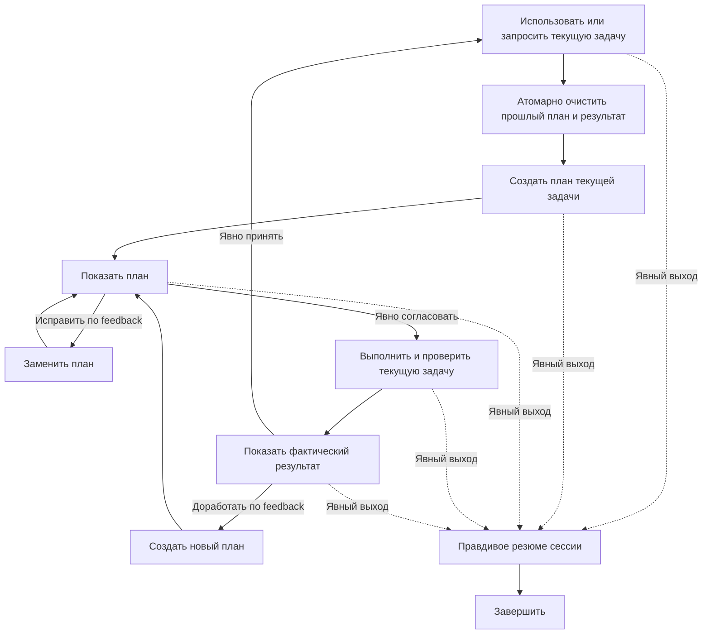

import { Aside } from '@astrojs/starlight/components';

`moira/infinite-task-loop` выполняет управляемую человеком последовательность задач, которые заранее неизвестны. Флоу принимает одну текущую задачу, создаёт и показывает относящийся к ней план, выполняет работу только после явного согласования, показывает фактический результат и спрашивает следующую задачу только после явной приёмки.

## Запуск

```js
mcp__moira__start({
  workflowId: "moira/infinite-task-loop",
  parentExecutionId: "none"
})
```

Исходный запрос уже может содержать первую задачу. Флоу использует её и не задаёт повторный вопрос. Иначе он ждёт следующую конкретную задачу от пользователя. Просьба остановиться, выйти или закончить обрабатывается штатным teleport выхода и никогда не записывается как рабочая задача.

## Когда выбирать этот флоу

Выбирайте Infinite Task Loop, когда человек хочет оставаться в одной интерактивной сессии и формулировать следующую задачу только после просмотра предыдущего результата.

| Потребность | Флоу |
| --- | --- |
| Выполнять открытую последовательность заранее неизвестных задач с согласованием между ними | **Infinite Task Loop** |
| Выполнить одну ограниченную задачу с долговечными артефактами и независимым ревью | [Quick Task](./quick-task/) |
| Добавить долговечные попытки, checkpoints, retries и восстановление после сбоя | [Robust Task](./robust-task/) |
| Выполнить конечный checklist, известный заранее | [Todo List](./todo-list/) |
| Выполнить один текущий универсальный план с последовательным evidence и zero-only ревью | [Simple Plan Execution](./simple-plan-execution/) |
| Реализовать ПО вместе с тестами, документацией, ревью и локальным VCS-завершением в пределах полномочий | [Software Development Flow](/ru/docs/reference/workflow-templates/#разработка-по) |

<Aside type="caution">
Infinite Task Loop интерактивен и хранит состояние только в текущем контексте выполнения. Это не автономный batch-оркестратор, долговечный реестр задач, механизм восстановления или замена полного жизненного цикла разработки ПО.
</Aside>

## Процесс



Каждая текущая задача проходит следующие гейты:

- intake фиксирует одну непустую задачу без планирования или выполнения;
- атомарный reset очищает план и результат предыдущей задачи до первого читателя новой задачи;
- планирование определяет применимые инструкции, зависимости, полномочия, риски, критерии успеха и проверку;
- выполнение плана требует фактического решения пользователя `approve`;
- выполнение записывает ограниченное фактическое резюме, разделяющее завершённую работу, сбои и блокеры;
- следующая задача начинается только после явной приёмки результата пользователем.

Молчание и обычное продолжение диалога не считаются согласованием или приёмкой.

## Исправление плана и доработка результата

Отклонение плана требует непустой feedback. Владелец revision использует его для создания полного нового плана той же задачи и возвращает план на тот же гейт согласования. Он не выполняет работу и не расширяет полномочия задачи.

Отклонение результата также требует непустой feedback. Отдельный владелец result replan использует наблюдаемый результат и feedback для замены текущего плана. Новый план должен быть согласован до повторного выполнения, поэтому доработка результата не обходит просмотр плана.

Нет автоматического пути, который превращает отклонение, отсутствующий feedback или неизвестное значение решения в успех.

## Изоляция состояния задач

Runtime хранит четыре ограниченных глобальных значения:

- `task_description` — точная текущая задача;
- `execution_plan` — план текущей задачи;
- `execution_summary` — результат текущей задачи;
- `session_summary` — терминальное резюме выхода.

После принятия новой задачи движок атомарно устанавливает предыдущие план и результат в пустое состояние до начала планирования. Если пользователь выйдет в этот момент, отчёт назовёт новую задачу и укажет, что у неё ещё нет плана и результата выполнения. Он не сможет показать план или результат предыдущей задачи как текущий.

Feedback и решения локальны для соответствующего гейта плана или результата. Они не передаются между задачами через глобальные значения.

## Выход и ограничения

Штатный узел `teleport-exit` — единственный путь к терминальному узлу, доступный с каждого шага флоу. Он записывает одно ограниченное непустое `session_summary`, используя только сведения, наблюдаемые в текущем контексте агента и выполнения.

Флоу не хранит долговечную историю всех завершённых задач. Если ранний результат уже не наблюдаем, владелец выхода обязан раскрыть это ограничение, а не восстанавливать или выдумывать полную историю. Выход не выполняет дополнительную работу и не означает, что сессию можно восстановить после сбоя.

Терминальный результат содержит только `session_summary`.

## Полномочия и гарантии

Согласование плана разрешает работу только в рамках исходной текущей задачи и применимых инструкций хоста или проекта. Оно само по себе не разрешает использование credentials, разрушительные действия, публикацию, деплой, уведомления, изменения production, финансовые действия, обработку чувствительных данных или коммуникацию с другим человеком. Для таких эффектов по-прежнему требуется отдельное согласие, если его требует контракт хоста.

Когда необходимых полномочий, информации или внешнего состояния нет, исполнитель записывает проверенный блокер, а не выполняет и не объявляет действие выполненным.

Infinite Task Loop не предоставляет:

- файловые артефакты или долговечный реестр задач;
- retries, checkpoints, восстановление после сбоя или гарантию resume;
- независимого ревьюера или zero-finding quality gate;
- автономную оркестрацию конечного списка;
- software-specific гарантии реализации, тестов, документации, релиза или деплоя.

Выбирайте соседний флоу, гарантии которого соответствуют всей задаче, и не разбивайте один связный жизненный цикл на несколько итераций цикла.

## Связанные материалы

- [Quick Task](./quick-task/) — одна ограниченная задача с долговечными артефактами и независимым ревью
- [Robust Task](./robust-task/) — долговечные retries, checkpoints и recovery
- [Todo List](./todo-list/) — конечный checklist от вызывающей стороны
- [Simple Plan Execution](./simple-plan-execution/) — один текущий универсальный план с evidence и ревью
- [Software Development Flow](/ru/docs/reference/workflow-templates/#разработка-по) — полный жизненный цикл поставки ПО
- [Готовые workflows](./) — сравнение публичных флоу
