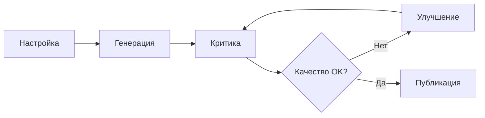

import { Aside } from '@astrojs/starlight/components';

Workflow для исследования с итеративным улучшением качества через циклы critique/improve. Субагент-критик оценивает результаты, предлагает улучшения, процесс повторяется до достижения quality gates.

## Запуск

```bash
mcp__moira__start({ workflowId: "moira/iterative-research", parentExecutionId: "none" })
```

## Процесс



## Шаги

| Шаг | Действие | Результат |
|-----|----------|-----------|
| 1. Настройка | Конфигурация параметров и workspace | Конфигурация исследования |
| 2. Генерация | Генерация начального исследования | Черновик исследования |
| 3. Критика | Оценка качества с метриками | Отчёт критики |
| 4. Проверка качества | Оценка против quality gates | Решение Pass/Fail |
| 5. Улучшение | Устранение замечаний критики | Улучшенное исследование |
| 6. Публикация | Подготовка и публикация | Опубликованное исследование |

## Особенности

### Уровни глубины

| Уровень | Источники | Слова | Фокус |
|---------|-----------|-------|-------|
| quick | 5-8 | 1500-2500 | Быстрый обзор |
| normal | 12-20 | 3000-5000 | Практическое руководство |
| deep | 25-35 | 6000-10000 | Стратегический анализ |
| scientific | 40+ | 10000+ | Академическая строгость |

### Quality Gates

- Critical issues: 0
- Major issues: 0
- Formatting score: ≥ 8/10

### Лимиты итераций

- Максимум 5 итераций
- Принудительное завершение при достижении лимита
- Решение пользователя о принудительном завершении

<Aside type="caution">
Если quality gates не достигнуты после 5 итераций, workflow запрашивает решение пользователя: опубликовать как есть или остановить.
</Aside>

### Классификация issues

| Серьёзность | Описание |
|-------------|----------|
| Critical | Фундаментальные ошибки, фактические неточности |
| Major | Проблемы ясности, пробелы в attribution источников |
| Moderate | Улучшение глубины, альтернативные перспективы |
| Minor | Полировка, консистентность форматирования |

## Пример конфигурации ноды

```json
{
  "id": "critique-research",
  "type": "agent-directive",
  "directive": "Оцени качество исследования используя {{research_critique_prompt}}",
  "completionCondition": "Критика завершена с численными метриками",
  "inputSchema": {
    "type": "object",
    "properties": {
      "critical_issues_count": { "type": "number" },
      "major_issues_count": { "type": "number" },
      "formatting_score": { "type": "number" }
    }
  }
}
```

## Отличие от Verified Research

| Workflow | Фокус |
|----------|-------|
| `moira/verified-research` | Линейный 8-шаговый, верификация источников |
| `moira/iterative-research` | Итеративный с циклами улучшения качества |

Используй `iterative-research` когда нужен высококачественный результат с несколькими циклами ревизии.

## Связанное

- [Verified Research](/ru/docs/reference/workflows/verified-research/) — Для линейного исследования с верификацией источников
- [Content Creation](/ru/docs/reference/workflows/content-creation/) — Для создания контента на основе исследования
- [Обзор шаблонов](/ru/docs/reference/workflow-templates/) — Все доступные шаблоны
