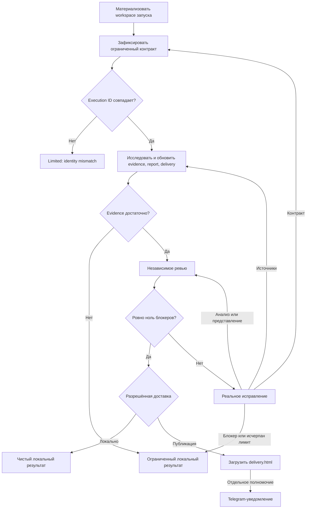

import { Aside } from '@astrojs/starlight/components';

`moira/iterative-research` предназначен для внешнего исследования, которому нужен долговечный набор доказательств и несколько циклов проверки и исправления. Workflow фиксирует ограниченный контракт, сохраняет результаты доступа к источникам и provenance, создаёт отчёт и автономный артефакт доставки и признаёт результат авторитетным только после того, как действительно независимый reviewer вернул ровно ноль блокирующих замечаний.

Используйте его, когда результату нужна повторная критика. Для ограниченной однопроходной проверки подходит [Verified Research](/ru/docs/reference/workflows/verified-research/), для corpus-first сбора — Deep Corpus Research, для переданных наборов данных — [Data Analysis](/ru/docs/reference/workflows/data-analysis/), а для изменений репозитория — workflow разработки ПО.

## Запуск

```bash
mcp__moira__start({ workflowId: "moira/iterative-research", parentExecutionId: "none" })
```

До исследования workflow определяет:

- ограниченный вопрос или тему, аудиторию, язык результата и требуемую глубину (`quick`, `normal`, `deep` или `scientific`);
- scope, исключения, ограничения, deliverable, ожидания от источников и критерии успеха;
- ограничения конфиденциальности, privacy, лицензирования, доступа и минимизации данных;
- интерактивный или автономный режим;
- локальную доставку, публикацию, публикацию с Telegram-уведомлением либо пока не принятое решение о доставке.

Глубина задаёт требуемую пригодность и стоимость. Она не устанавливает квоты источников, объём слов, formatting score или фиксированный набор инструментов и агентов.

## Workspace запуска

Workflow материализует шесть пустых файлов в `./moira-ws/iterative-research-<executionId>/`:

| Файл | Назначение |
| --- | --- |
| `research-contract.md` | Текущий вопрос, границы, критерии успеха и полномочия на доставку |
| `source-evidence.md` | Типизированные источники, очищенный provenance, результаты доступа, поддержка утверждений, противоречия, неопределённость и ограничения |
| `research-report.md` | Текущий ответ, основанный на доказательствах |
| `research-review.md` | Полный текущий набор независимых блокирующих замечаний |
| `repair-account.md` | Воспроизведённые замечания и изменённые артефакты либо фактический блокер исправления |
| `delivery.html` | Минимизированное автономное представление без исходных приватных данных |

Контракт возвращает UUID текущего запуска. До исследования engine-condition сравнивает его с системным ID, поэтому другой формально корректный UUID не может выбрать чужой workspace.

## Процесс


```mermaid
flowchart TD
    A[Материализовать workspace запуска] --> B[Зафиксировать ограниченный контракт]
    B --> C{Execution ID совпадает?}
    C -->|Нет| X[Limited: identity mismatch]
    C -->|Да| D[Исследовать и обновить evidence, report, delivery]
    D --> E{Evidence достаточно?}
    E -->|Нет| L[Ограниченный локальный результат]
    E -->|Да| F[Независимое ревью]
    F --> G{Ровно ноль блокеров?}
    G -->|Да| H{Разрешённая доставка}
    G -->|Нет| I[Реальное исправление]
    I -->|Контракт| B
    I -->|Источники| D
    I -->|Анализ или представление| F
    I -->|Блокер или исчерпан лимит| L
    H -->|Локально| J[Чистый локальный результат]
    H -->|Публикация| K[Загрузить delivery.html]
    K -->|Отдельное полномочие| N[Telegram-уведомление]
```

Независимый reviewer диагностирует, но не изменяет проверяемые артефакты. Ненулевое ревью должно привести к реальному изменению или фактическому blocked-результату. Исправление возвращается к самой ранней устаревшей границе: контракту, источникам, анализу или представлению. Engine допускает не более трёх ненулевых раундов ревью; исчерпание лимита нельзя превратить в успех или публикацию.

## Результаты и внешние полномочия

- `clean_local` означает, что шесть локальных артефактов прошли независимое ревью с ровно нулём замечаний и внешних действий не было.
- `published` требует явного полномочия на публикацию и наблюдаемого URL успешной загрузки статического артефакта. Загружается только `delivery.html`.
- `notified` дополнительно требует отдельного полномочия Telegram и наблюдаемой успешной отправки.
- `delivery_failed` и `notification_failed` сохраняют проверенный локальный результат и правдиво показывают сбой внешнего шага.
- `limited` означает недостаточное evidence, заблокированное исправление, исчерпанное ревью, недоступный workspace или несовпадение execution ID. Такой результат неавторитетен, его нельзя публиковать или отправлять.
- `aborted` фиксирует явный интерактивный отказ без ложного утверждения об успешной доставке.

<Aside type="caution">
Наличие или настройка инструмента не создаёт полномочий. В автономном режиме нерешённый способ доставки становится локальным; workflow никогда не выводит из конфигурации разрешение на публикацию или уведомление.
</Aside>

## Пересмотр процесса

Teleport `revise-process` применяется только при действительно неверном контракте или согласованном процессе. Он переписывает полный канонический контракт, сохраняет явные полномочия, повторно проверяет execution ID и возвращается в обычное исследование. Через него нельзя обойти недостаточное evidence, замечания ревью, исчерпание исправлений или сбой доставки.

## Связанные материалы

- [Verified Research](/ru/docs/reference/workflows/verified-research/) — ограниченная однопроходная проверка источников
- [Data Analysis](/ru/docs/reference/workflows/data-analysis/) — анализ переданных наборов данных по явному контракту источников
- [Content Creation](/ru/docs/reference/workflows/content-creation/) — подготовка и проверка контента вместо итеративного внешнего исследования
- [Готовые Workflows](/ru/docs/reference/workflows/) — обзор выбора workflow
