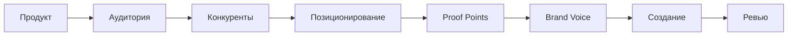

import { Aside } from '@astrojs/starlight/components';

Структурированный workflow для создания маркетинговых материалов с фокусом на дифференциацию и конверсию. Решает проблему generic AI copy через конкурентный анализ и обязательные proof points.

## Запуск

```bash
mcp__moira__start({ workflowId: "marketing-campaign" })
```

## Процесс



## Шаги

| Шаг | Действие | Результат |
|-----|----------|-----------|
| 1. Продукт | Понимание продукта, USPs, решаемая проблема | Бриф продукта |
| 2. Аудитория | Определение целевой аудитории, pain points, decision criteria, каналы | Профиль аудитории |
| 3. Конкуренты | Анализ конкурентов, их positioning, messages, weaknesses | Конкурентный анализ |
| 4. Позиционирование | Определение уникального angle, key messages, value proposition, differentiator | Positioning statement |
| 5. Proof Points | Сбор доказательств для каждого claim (data/testimonial/case study) | Библиотека evidence |
| 6. Brand Voice | Определение tone, style, banned phrases, примеры хорошего copy | Brand guidelines |
| 7. Создание | Создание материалов используя positioning, proofs, brand voice | Маркетинговые материалы |
| 8. Ревью | Проверка claims, brand fit, legal compliance | Одобренные материалы |

## Особенности

<Aside type="tip">
USPs должны быть конкретными, не buzzwords. "На 50% быстрее onboarding" лучше чем "streamlined experience".
</Aside>

### Решение проблемы generic AI copy

| Проблема | Решение |
|----------|---------|
| Размытые USPs | Требование конкретных, измеримых claims |
| Нет дифференциации | Обязательный конкурентный анализ |
| Необоснованные claims | Proof points обязательны для каждого claim |

### Типы Proof Points

| Тип | Пример | Сила |
|-----|--------|------|
| Data point | "Сокращает время на 50%" | Высокая - quantifiable |
| Testimonial | Цитата клиента | Средняя - social proof |
| Case study | Конкретный результат клиента | Высокая - detailed evidence |

<Aside type="caution">
Каждый claim требует минимум один proof point. Claims без доказательств должны быть удалены или переформулированы.
</Aside>

### Brand Voice Consistency

| Элемент | Назначение |
|---------|------------|
| Tone | Общий голос (professional, friendly, technical) |
| Style | Writing conventions и паттерны |
| Banned phrases | Слова и выражения для избегания |
| Good examples | Референсный copy для эмуляции |

### Legal Compliance Review

| Проверка | Описание |
|----------|----------|
| Misleading claims | Проверка точности всех утверждений |
| Disclaimers | Добавление required legal disclaimers |
| Testimonial permissions | Подтверждение согласия клиентов |
| Competitive claims | Проверка честности сравнений |

## Пример конфигурации ноды

```json
{
  "id": "competitive-analysis",
  "type": "agent-directive",
  "directive": "Проанализируй топ-3 конкурентов. Документируй их positioning, key messages и weaknesses. Определи gaps которые мы можем использовать.",
  "completionCondition": "Конкурентный анализ завершён с 3 проанализированными конкурентами и определёнными positioning gaps",
  "connections": {
    "next": "define-positioning"
  }
}
```

## Связанное

- [Content Creation](/ru/docs/reference/workflows/content-creation/) — Для постов в блог и статей
- [Verified Research Workflow](/ru/docs/reference/workflows/verified-research/) — Для market research
- [Обзор шаблонов](/ru/docs/reference/workflow-templates/) — Все доступные шаблоны
