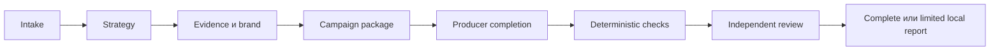

Marketing Campaign создаёт один channel-ready пакет кампании для разрешённого продукта или предложения. Он объединяет audience и competitive context, positioning, mapping доказательств или гипотез, brand/legal constraints, материалы, calls to action, limitations, deterministic reference checks и настоящее independent semantic review.

```bash
mcp__moira__start({ workflowId: "moira/marketing-campaign", parentExecutionId: "none" })
```

## Когда использовать

Выбирайте этот workflow, когда нужна система кампании: positioning, messages, proof mapping и channel materials. Для одного самостоятельного текста используйте [Content Creation](/ru/docs/reference/workflows/content-creation/), для discovery источников как результата — research workflow, для изменений репозитория — Software Development Flow.

## Долговечный процесс

Workflow материализует execution-correlated локальный workspace с неизменяемым campaign contract, strategy, evidence register, brand/legal constraints, campaign package, limitations, validation observations, independent findings, repair account, corrected-contract supplement и final report.


```mermaid
flowchart LR
  A[Intake] --> B[Strategy]
  B --> C[Evidence и brand]
  C --> D[Campaign package]
  D --> E[Producer completion]
  E --> F[Deterministic checks]
  F --> G[Independent review]
  G --> H[Complete или limited local report]
```

Материальный claim обозначается как supported evidence, переданное пользователем утверждение, hypothesis либо явный omission. Source-shaped текст и количество checklist items не доказывают audience fit, differentiation, provenance, brand coherence, legal safety или conversion usefulness — это остаётся независимым judgment.

## Repair и исходы

Package, evidence/provenance и strategy findings получают разные source-specific repair owners и повторно проходят все устаревшие downstream responsibilities. Ошибочный criterion исправляется cumulative corrected-contract supplement: предыдущие принятые corrections сохраняются, пока новая независимо проверенная correction явно их не заменит.

Autonomous mode пропускает только финальную пользовательскую приёмку. Interactive mode поддерживает accept, abort или один конкретный rework request владельцу strategy, evidence, package либо contract. Исходы различают complete, reviewed-limited, blocked до или после создания workspace, workspace failure и aborted.

## Полномочия

Результат локальный. Workflow не публикует, не уведомляет, не расходует рекламный бюджет, не связывается с клиентами, не запускает кампанию, не изменяет product code, не коммитит, не выпускает релиз и не деплоит.
