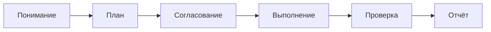

import { Aside } from '@astrojs/starlight/components';

Лёгкий workflow для быстрого выполнения задач без сложной инфраструктуры. План → Согласование → Выполнение → Проверка → Отчёт.

<Aside type="tip">
Это рекомендуемый workflow для большинства многошаговых задач. Используй [Robust Task](/ru/docs/reference/workflows/robust-task/) только для критичных задач, требующих полной инфраструктуры.
</Aside>

## Запуск

```bash
mcp__moira__start({ workflowId: "moira/quick-task", parentExecutionId: "none" })
```

## Процесс



## Шаги

| Шаг | Действие | Результат |
|-----|----------|-----------|
| 1. Понимание | Анализ задачи и сбор контекста | Чёткое определение задачи |
| 2. План | Создание плана из 3-10 шагов | Нумерованный список шагов |
| 3. Согласование | Пользователь подтверждает план | Согласованный план |
| 4. Выполнение | Выполнение всех шагов | Завершённая работа |
| 5. Проверка | Проверка всех критериев | Подтверждённое выполнение |
| 6. Отчёт | Итоговый отчёт с доказательствами | Финальный отчёт |

## Особенности

### Лёгкий процесс

- Без сложной настройки и конфигурации
- Быстрый старт с минимальными накладными расходами
- Фокус на выполнении работы

### Простая валидация

- Согласование плана перед выполнением
- Одна фаза проверки после завершения
- Чёткие критерии успеха

### Доказательства выполнения

Каждый завершённый шаг должен иметь проверяемый результат:
- Изменённые файлы
- Результаты тестов
- Скриншоты
- Описания

## Когда использовать

- Задачи из 2-10 конкретных шагов
- Стандартная разработка
- Создание контента
- Исследовательские задачи
- Любая задача, не требующая retry/эскалации

## Когда использовать Robust Task

- Критичные задачи, которые не могут провалиться
- Многочасовые или многодневные задачи
- Задачи, требующие восстановления сессии
- Задачи, требующие workflow эскалации

## Пример конфигурации ноды

```json
{
  "id": "execute-plan",
  "type": "agent-directive",
  "directive": "Выполни согласованный план шаг за шагом. Предоставь доказательства для каждого шага.",
  "completionCondition": "Все шаги выполнены с доказательствами",
  "connections": {
    "success": "review-results"
  }
}
```

## Связанное

- [Robust Task](/ru/docs/reference/workflows/robust-task/) — Для сложных задач, требующих полной инфраструктуры
- [Content Creation](/ru/docs/reference/workflows/content-creation/) — Для создания текстового контента
- [Обзор шаблонов](/ru/docs/reference/workflow-templates/) — Все доступные шаблоны
