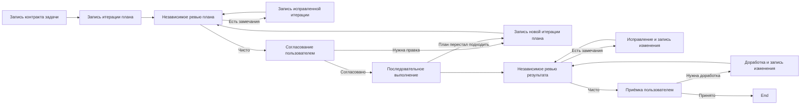

import { Aside } from '@astrojs/starlight/components';

Quick Task проводит ограниченную многошаговую задачу вне разработки по цепочке План → Согласование → Выполнение → Проверка → Приёмка. Полные записи задачи, плана, ревью, решений, изменений и доказательств хранятся в отдельном файловом workspace запуска. Через контекст workflow передаются только ограниченные ссылки на файлы, длина согласованного плана, курсор выполнения и короткие значения для маршрутизации.

<Aside type="tip">
Используйте Quick Task, когда у агента есть доступ к файловой системе, а ограниченная работа вне разработки помещается в план не более чем из десяти содержательных пунктов. Для реализации ПО, исправления дефектов, рефакторинга, миграций или rollout выбирайте [Software Development Flow Lite](./software-development-flow-lite/) для одного локального низкорискового результата либо [полный Software Development Flow](./software-development-flow/) при росте риска, неопределённости или масштаба. Выбирайте [Robust Task](/ru/docs/reference/workflows/robust-task/), если сложной общей задаче нужна более сильная политика восстановления после частичного выполнения или операционных сбоев.
</Aside>

## Запуск

```bash
mcp__moira__start({ workflowId: "moira/quick-task", parentExecutionId: "none" })
```

## Процесс


```mermaid
flowchart LR
    A[Запись контракта задачи] --> B[Запись итерации плана]
    B --> C[Независимое ревью плана]
    C -->|Есть замечания| D[Запись исправленной итерации]
    D --> C
    C -->|Чисто| E[Согласование пользователем]
    E -->|Нужна правка| F[Запись новой итерации плана]
    F --> C
    E -->|Согласовано| G[Последовательное выполнение]
    G -->|План перестал подходить| F
    G --> H[Независимое ревью результата]
    H -->|Есть замечания| I[Исправление и запись изменения]
    I --> H
    H -->|Чисто| J[Приёмка пользователем]
    J -->|Нужна доработка| K[Доработка и запись изменения]
    K --> H
    J -->|Принято| L[End]
```

## Контракт workspace

Входная нода восстанавливает полный контракт задачи из исходного диалога и спрашивает только о существенном факте, который нельзя выяснить самостоятельно. Она создаёт workspace, связанный с запуском Moira:

```text
./moira-ws/quick-task-<executionId>/
├── process-id.txt
├── task.md
├── execution.md
├── plans/
│   └── <iteration>/
│       ├── plan.md
│       ├── review.md
│       ├── decision.md
│       └── change.md
└── result-reviews/
    └── <iteration>/
        ├── review.md
        ├── decision.md
        └── change.md
```

Числовой каталог итерации публикуется только после завершения записи. Готовые итерации не перезаписываются. При возобновлении нода проверяет и повторно использует свою готовую текущую запись, не создавая дубликат.

JSON Schema ограничивает форму и длину возвращаемых путей. Существование, полнота и корректность файла остаются частью директивы и условия завершения создающей ноды: строка правильной формы сама по себе не доказывает выполнение.

## Планирование и согласование

Планировщик записывает от одного до десяти содержательных упорядоченных пунктов. Каждый пункт содержит действие, ожидаемый результат и подходящий способ проверки и фиксирует этот результат, а не несёт его сам: после утверждения плана остаётся работа, которую исполнителю ещё предстоит сделать. Важнее всего это там, где результат — проза: документ, задания другим агентам, ответ исследования, — потому что там план и результат делят одну среду. Нода исправления, предшествующая согласованию, отвечает за весь план; нода ревизии, работающая в том числе в середине прогона, — за пункты, которые формирует, потому что уже выполненные пункты остаются на своих позициях такими, какими были исполнены. Тело плана остаётся в `plan.md`; workflow получает только ограниченный путь и точное число пунктов.

Независимый рецензент напрямую читает `task.md` и текущий `plan.md`. Полный набор воспроизводимых блокирующих замечаний записывается в `review.md`, а нода возвращает только путь к отчёту и `issues_count`. Ненулевое значение ведёт в отдельную ноду исправления, которая создаёт новую неизменяемую итерацию плана и возвращает её тому же рецензенту. Нулевое число замечаний является нормальным результатом и ведёт к согласованию.

Точное решение и фидбек пользователя записываются в `decision.md`. В контекст попадают только путь к решению и значение `yes`/`no` для ветвления. Новая редакция читает точный фидбек с диска, создаёт следующую итерацию плана и снова проходит независимое ревью.

Длина плана становится авторитетной для выполнения только после чистого ревью текущего плана и явного согласия пользователя.

## Режим работы

На первом шаге определяется `operating_mode`: `autonomous` или `interactive`. Агент использует режим, который пользователь уже назвал, выводит однозначный сам — в том числе когда запуск дочерний для уже автономного процесса, — и спрашивает один раз только тогда, когда режим не назван и не выводится.

В режиме `interactive` ничего не меняется. В режиме `autonomous` гейт согласования плана обходится, а финальный шаг показывает результат, не спрашивая приёмку. Оба независимых ревью и их циклы исправлений одинаковы в обоих режимах, а выдача остаётся честной: незавершённое или непроверенное показывается как есть, а не считается принятым молча.

## Прогресс выполнения

Карточка запуска и экспортируемое изображение прогресса используют одно представление из пяти этапов: Scope → Plan → Execute → Verify → Result. Заметка запуска остаётся названием задачи. Каждая видимая ожидающая роль, включая доступную только через jump точку пересмотра плана, связана с одним из этих этапов; представление не добавляет маршрутов и не меняет исполняемый граф.

Каждый этап сразу показывает постоянное назначение, точную текущую роль, последний подтверждённый результат и следующее значимое действие. Нода-владелец семантического результата записывает одно ограниченное значение: intake кратко отражает согласованный контракт, роли планирования заменяют сводку текущего плана, выполнение заменяет результат последнего завершённого пункта, роли проверки заменяют текущий итог ревью, а показ или доработка заменяют итог результата. Значение заменяется целиком, а не дополняется историей.

Активная подпись и сводка описывают текущую работу, не скрывая последний подтверждённый результат. Когда исправление или пересмотр плана создаёт новую редакцию, её сводка атомарно заменяет устаревшее содержание текущих и будущих пунктов, сохраняя только всё ещё истинные завершённые результаты. Эти значения используются только для отображения: условия, связи, курсор плана, согласования и полномочия по-прежнему определяются основным состоянием workflow.

## Выполнение и доказательства

Движок владеет курсором с отсчётом от нуля. Для каждой позиции агент читает согласованный `plan.md`, выполняет только соответствующий пункт, применяет техническое суждение и проверяет фактический результат. Перед продвижением он записывает в `execution.md` ровно одну краткую запись доказательства длиной не более 500 символов для этой позиции.

Доказательство не возвращается через контекст workflow. Если работа не завершена или заблокирована, агент сообщает проверенную причину и остаётся на текущей директиве; workflow не превращает сбой в status code и не продвигает курсор. В Quick Task нет автоматического счётчика retry или ветки «пропустить как успешное».

### Пересмотр плана во время выполнения

Когда согласованный план перестаёт соответствовать реальности — появились новые факты, был упущен объём работы или результат выполненного пункта обесценил остаток плана, — агент переходит к точке пересмотра, вместо того чтобы доводить до конца план, о неверности которого уже знает:

```js
mcp__moira__step({ processId, teleportTo: "teleport-replan" })
```

В эту ноду не ведёт ни один шаг, поэтому пересмотр всегда осознанное решение, и это не обход остальных владельцев: блокирующее замечание ревью плана относится к циклу исправления плана, дефект полученного результата — к циклу исправления результата, отклонённый на согласовании план — к обычной ветке правки, а пункт, который просто сложен или заблокирован, — к правилу выше.

Переход фиксирует, почему план больше не подходит; ту же итерацию плана публикует существующая нода правки плана вместе с её `change.md`. Уже выполненные пункты сохраняют свои позиции — курсор не сбрасывается, поэтому сделанная работа не повторяется, а её записи доказательств остаются как есть. Новый план снова проходит независимое ревью плана и, в режиме `interactive`, ваше согласование, и только после этого выполнение продолжается.

## Ревью результата и приёмка

После выполнения всех согласованных пунктов независимый рецензент читает задачу, план, решение о плане, доказательства выполнения и реальные артефакты. Каждое состояние результата получает отдельную неизменяемую числовую запись ревью. Рецензент записывает все текущие блокирующие дефекты в `review.md` и возвращает только путь и `issues_count`.

Ненулевое значение ведёт в отдельную ноду исправления. Она читает полный отчёт, воспроизводит и устраняет подтверждённые дефекты и записывает `change.md`; изменённый результат снова проходит то же независимое ревью. Чистое ревью ведёт к показу результата пользователю.

Точное решение о приёмке или запрос доработки записывается в `decision.md`. Доработка читает этот файл, меняет результат, записывает `change.md` и возвращается через независимое ревью. Только явная приёмка ведёт в End.

## Гарантии и ограничения

- Полные планы, ревью, решения, фидбек, изменения и доказательства имеют один долговечный источник на диске вместо копий в контексте.
- Каждый динамический возвращаемый путь имеет типизированную схему и именованного потребителя.
- Ревью и мутация разделены; каждый изменённый план или результат снова проходит соответствующую независимую проверку.
- Автоматический цикл ревью продолжается только после появления нового артефакта или состояния результата. Невоспроизводимое или незавершённое исправление не вызывает `step()`.
- Механические проверки доказывают только непосредственно проверяемые свойства; исполняющий и проверяющий агенты всё равно оценивают фактический результат.
- End имеет пустую терминальную проекцию и не раскрывает внутренние файловые записи.
- Quick Task требует доступ к файловой системе и не предоставляет усиленную политику восстановления Robust Task.

## Связанное

- [Robust Task](/ru/docs/reference/workflows/robust-task/) — Долговечное выполнение с явной политикой восстановления
- [Обзор шаблонов](/ru/docs/reference/workflow-templates/) — Все встроенные workflow
