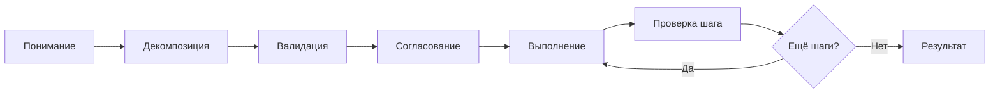

import { Aside } from '@astrojs/starlight/components';

Workflow для надёжного выполнения сложных многочасовых задач с полной инфраструктурой: сохранение контекста, retry с эскалацией, обязательные доказательства. Используй для критичных задач, требующих надёжности.

Для простых задач (2-10 шагов) рассмотри [Quick Task](/ru/docs/reference/workflows/quick-task/).

## Запуск

```bash
mcp__moira__start({ workflowId: "moira/robust-task", parentExecutionId: "none" })
```

## Процесс



## Шаги

| Шаг | Действие | Результат |
|-----|----------|-----------|
| 1. Понимание | Сбор требований: задача, deliverable, ограничения, success criteria | Чёткое определение задачи |
| 2. Декомпозиция | Разбивка на 3-10 конкретных шагов с expected_output | Самодостаточные шаги |
| 3. Валидация | Автоматическая проверка самодостаточности шагов | Проверенный план |
| 4. Согласование | Пользователь подтверждает план | Согласованный план |
| 5. Выполнение | Выполнение каждого шага с evidence | Артефакты шага |
| 6. Проверка | Проверка шага против expected_output | Подтверждённое выполнение |
| 7. Результат | Финальный результат со всеми доказательствами | Завершённый deliverable |

## Особенности

<Aside type="tip">
План сохраняется в `./claude-temp-files/plan-{timestamp}.md` для восстановления сессии.
</Aside>

### Самодостаточные шаги

Каждый шаг содержит всю информацию для выполнения без контекста полного плана:
- Пути к файлам и расположения
- Конкретные действия
- Формат ожидаемого результата

### Обязательные доказательства

| Тип доказательства | Пример |
|-------------------|--------|
| Скриншот | Проверка состояния UI |
| Файл | Созданные или изменённые файлы |
| Ссылка | URL опубликованного ресурса |
| Описание | Детальный отчёт о выполнении |

### Retry с эскалацией

- До 3 попыток на шаг
- При неудаче: пользователь выбирает `skip` / `escalate` / `revise_plan`
- `revise_plan` возвращает к планированию с контекстом проблемы

<Aside type="caution">
Если пользователь даёт замечания вместо согласования ("Да, но..." или "Хорошо, только измени..."), агент отвечает `plan_approved: нет` и workflow проводит через пересмотр плана.
</Aside>

### Точки согласования

- **Согласование плана**: Обязательно перед выполнением
- **Решения об эскалации**: Пользователь контролирует обработку неудач

## Пример конфигурации ноды

```json
{
  "id": "execute-step",
  "type": "agent-directive",
  "directive": "Выполни шаг {{current_step_number}}: {{current_step_description}}. Предоставь доказательство выполнения.",
  "completionCondition": "Шаг выполнен с проверяемым доказательством, соответствующим expected_output",
  "connections": {
    "next": "verify-step"
  }
}
```

## Примеры задач

- Написать и опубликовать статью
- Провести исследование с отчётом
- Реализовать feature с тестами
- Подготовить презентацию
- Любая задача из 3+ шагов с проверяемым выполнением

## Связанное

- [Quick Task](/ru/docs/reference/workflows/quick-task/) — Для простых задач (2-10 шагов)
- [Content Creation](/ru/docs/reference/workflows/content-creation/) — Для создания текстового контента
- [Verified Research](/ru/docs/reference/workflows/verified-research/) — Для исследования с верифицированными источниками
- [Обзор шаблонов](/ru/docs/reference/workflow-templates/) — Все доступные шаблоны
