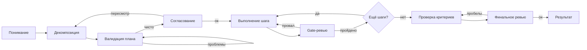

import { Aside, Steps } from '@astrojs/starlight/components';

Workflow для надёжного выполнения сложных многошаговых задач. Он сохраняет план и доказательства в workspace на диске для восстановления контекста, проверяет план и каждый шаг через **независимого ревьювера-субагента** и направляет неудачи через ограниченные циклы retry с эскалацией к пользователю. Используй для критичных задач, где важна надёжность.

Для простых задач рассмотри [Quick Task](/ru/docs/reference/workflows/quick-task/).

## Запуск

```bash
mcp__moira__start({ workflowId: "moira/robust-task", parentExecutionId: "none" })
```

## Процесс

Flow проходит семь фаз: UNDERSTAND → DECOMPOSE → VALIDATE → APPROVE → EXECUTE → VERIFY → DELIVER.



## Фазы

| Фаза | Действие | Результат |
|------|----------|-----------|
| Понимание | Сбор описания задачи, ожидаемого deliverable, ограничений, success criteria | Зафиксированные требования |
| Декомпозиция | Разбивка задачи на столько конкретных шагов, сколько ей реально нужно, каждый с `expected_output` | Самодостаточный план |
| Валидация | Независимый ревьювер-субагент проверяет самодостаточность плана, покрытие требований и стандарты | Проверенный план |
| Согласование | Пользователь явно подтверждает план перед выполнением | Согласованный план |
| Выполнение | Выполнение текущего шага, формирование доказательства | Артефакт шага |
| Проверка | Независимый gate-ревьювер оценивает каждый шаг; независимое финальное ревью заново выводит покрытие критериев | Подтверждённый результат |
| Результат | Сборка deliverable, summary и списка артефактов | Завершённый deliverable |

## Workspace по принципу file-mode-first

Первый шаг проверяет, есть ли у агента доступ к файловой системе (инструменты `Read`/`Write`/`Edit`). Остальной flow подстраивается под ответ.

**С доступом к файлам** (предпочтительно) workflow создаёт workspace и работает с диска:

- Папка workspace: `./moira-ws/{task-name}-{YYYYMMDD}-{HHMM}/` (путь заканчивается слешем, хранится в `workspace_path`).
- План живёт в `{{workspace_path}}plan.md` (один нумерованный пункт на шаг).
- Требования фиксируются в `{{workspace_path}}task-requirements.md`; стандарты планирования — в `{{workspace_path}}planning-standards.md`; process ID — в `{{workspace_path}}process-id.txt` для восстановления после архивации сессии.
- Доказательства по шагам пишутся в `{{workspace_path}}step-{{current_step}}/evidence.md`.
- Агент передаёт **пути, а не содержимое**: декомпозиция возвращает `total_steps` и `plan_saved_to_file` — она НЕ возвращает массив плана обратно. Ревьюверы получают пути к файлам и читают артефакты напрямую.

**Без доступа к файлам** flow откатывается к состоянию в контексте: план живёт только в памяти workflow. Декомпозиция должна вернуть полный массив `steps[]` плюс `current_step_action` и `current_step_expected_output` для шага 1, а каждый `complete-step` возвращает action и expected output следующего шага.

<Aside type="tip">
Сохранение process ID в `process-id.txt` позволяет новой сессии возобновить то же выполнение после архивации предыдущего контекста.
</Aside>

## Декомпозиция

Декомпозиция создаёт столько шагов, сколько задаче реально нужно — у маленьких задач их может быть несколько, у больших — много. План не раздувается и не обрезается под целевое число; решает реальный объём задачи.

### Стандарты планирования (S1–S11)

Шаги декомпозиции и валидации применяют единый канон стандартов планирования:

| # | Стандарт | Правило |
|---|----------|---------|
| S1 | Гранулярность шага | Один логический блок работы на шаг; без микро- и мега-шагов |
| S2 | Зависимости | Правильный порядок; выход каждого шага включает следующий; без циклов |
| S3 | Проверяемость | У каждого шага измеримый `expected_output` |
| S4 | Полнота | Покрыто каждое требование; каждый шаг называет производимые артефакты |
| S5 | Самодостаточность | Каждый шаг несёт всю информацию для выполнения; без «см. предыдущий шаг»; полные пути |
| S6 | Устойчивость | Шаг выполним изолированно, даже если контекст между шагами потерян |
| S7 | Структурированное рассуждение | Chain-of-thought для сложных шагов; явные методы и форматы вывода |
| S8 | Success criteria и human-in-the-loop | Критерии заданы заранее и измеримы; план показан пользователю; доступна эскалация |
| S9 | Атомарность и избыточность | Нет глобального scope — каждый пункт повторяет нужные нюансы и **дублирует** сквозные действия (progress report, тесты, commit) в каждый пункт |
| S10 | Структура пункта | Каждый пункт: имя, зачем, что делать с полными путями, сквозные действия, измеримый expected output |
| S11 | Без деградации хвоста | Последние пункты несут ту же детальность и качество, что и первые; объём контекста — не оправдание срезать углы |

## Двухуровневое независимое ревью

Проверка никогда не полагается на суждение самого выполняющего агента. Запускаются два слоя независимого ревью плюс лёгкий self-проход перед финальным.

### Per-step gate-ревью

После выполнения каждого шага `verify-step-execution` делегирует **gate-ревью** независимому ревьюверу-субагенту (исполнитель не ревьюит свою работу). Ревьювер:

- Читает полный план и доказательство шага напрямую — без доверия к summary.
- Оценивает шаг на **целостность плана**: корректно ли он опирается на предыдущие шаги и готовит будущие, без дрейфа, регрессий и деградации качества?
- Проверяет, что доказательство полностью соответствует `expected_output` шага (частичное соответствие, отсутствие конкретного доказательства или пропущенные элементы — всё считается НЕ подтверждено).
- Возвращает `step_verified` (`yes`/`no`), `issues_found` и `verification_details`.

Вердикт ревьювера авторитетен. При `no` (с доступом к файлам) проблемы записываются в `{{workspace_path}}step-{{current_step}}/verification-issues.md`.

### Финальное независимое ревью

Когда все шаги завершены, проверка завершённости проходит в два прохода:

1. `verify-criteria` — **лёгкий self-проход (pre-pass)**. Агент заново сверяет каждый success criterion с **реальным артефактом** (код, файлы, вывод команд, тесты), по одному критерию за раз, требуя конкретное доказательство на каждый. «Выглядит готовым» / «должно работать» / «описано как готовое» — это пробел, а не доказательство.
2. `final-review` — **независимое финальное ревью**. Ревьювер-субагент **заново выводит** покрытие success criteria из **зафиксированных требований** и **реальных артефактов** (не из заявлений исполнителя), по одной проверке на критерий, возвращая `final_issues_count` (`0` = полностью покрыто) и плоский список пробелов.

Если финальное ревью находит пробелы, flow направляется в `fix-gaps` и перепроверяет.

## Ограниченные циклы

Каждый цикл качества ограничен счётчиком раундов и эскалирует к пользователю, а не зацикливается. Директива каждого циклического шага сообщает, что повторный вход — это **ожидаемое поведение, а не баг** — агент не должен сообщать о застрявшем flow.

| Цикл | Счётчик | Лимит | По достижении лимита |
|------|---------|-------|----------------------|
| Валидация плана | `validation_round` | `max_validation_rounds` | Спросить пользователя: продолжить или идти дальше |
| Пробелы критериев | `criteria_round` | `max_criteria_rounds` | Спросить пользователя: продолжить или идти дальше |
| Retry шага | `step_retry` | `max_retries` | Эскалация (skip / escalate / revise_plan / reset) |

<Aside type="note">
Директива циклического шага начинается с «это нормальный цикл качества, ожидается сходимость» — повторное появление того же шага заложено в дизайне, это не сбой для отчёта.
</Aside>

## Retry и эскалация

Когда gate-ревью шага проваливается, цикл retry инкрементирует `step_retry` и повторяет с фидбеком ревьювера до `max_retries`. При исчерпании отправляется Telegram-уведомление, и пользователя просят выбрать:

| Решение | Эффект |
|---------|--------|
| `skip` | Пометить шаг пропущенным, продвинуть курсор |
| `escalate` | Пользователь выполняет шаг вручную, затем продолжаем |
| `revise_plan` | Пересмотреть план с учётом проблемы и начать заново с шага 1 |
| `reset` | Сбросить счётчик retry и попробовать шаг снова |

## Согласование и пересмотр плана

На точке согласования `present-plan` ждёт явного `yes`/`no` от пользователя. Всё, кроме чистого «да» — включая «Да, но…» или «Хорошо, только измени…» — трактуется как `plan_approved: no`, и flow направляется через **ветку revise-plan** (не teleport). Агент записывает замечания в `revision_feedback` и не исправляет план сам; пересмотром управляет workflow.

<Aside type="caution">
Отклонение плана использует ветку revise-plan. Переход `teleport-replan` предназначен только для пересмотра в середине выполнения, никогда — для отклонения плана до выполнения.
</Aside>

## Step-close replan (в середине выполнения)

Во время выполнения, если оставшийся план больше не соответствует уже построенному, агент использует переход `teleport-replan`. Он **не** начинает заново с шага 1:

<Steps>
1. Текущий шаг закрывается как есть — записывается честно, даже если частично.
2. Завершённые шаги (1..current) сохраняются нетронутыми.
3. Незавершённая часть текущего шага переносится вперёд в новый следующий шаг.
4. Переформируется или расширяется только хвост (шаги после текущего) под причину пересмотра.
5. Шаги пересчитываются, и `total_steps` обновляется.
6. Курсор продвигается, и пересмотренный план перепроверяется.
</Steps>

## Курсор шага на expression-нодах

Счётчиком шагов владеет движок. Expression-ноды продвигают `current_step` (`current_step = current_step + 1`) и сбрасывают `step_retry` в `0`; агент никогда не делает арифметику и не должен менять `current_step` сам. Условие `check-all-steps-done` сравнивает `current_step` с `total_steps`, чтобы решить, выполнять следующий шаг или переходить к проверке завершённости.

```json
{
  "type": "expression",
  "id": "expr-inc-current-step",
  "expressions": [
    "current_step = current_step + 1",
    "step_retry = 0"
  ],
  "connections": { "default": "check-all-steps-done" }
}
```

## Доказательства

Каждый шаг должен производить проверяемое доказательство, а не заявление «готово».

| Тип доказательства | Пример |
|--------------------|--------|
| Скриншот | Проверка состояния UI |
| Файл | Созданные или изменённые файлы |
| Ссылка | URL опубликованного ресурса |
| Описание | Детальный отчёт о том, что именно было сделано |

С доступом к файлам доказательство пишется в `{{workspace_path}}step-{{current_step}}/evidence.md`; ревьюверы читают его напрямую.

## Telegram-уведомления

Flow отправляет Telegram-уведомление в трёх точках (и продолжается, даже если отправка не удалась):

- **План готов** — проверенный план готов к подтверждению пользователем.
- **Эскалация** — шаг провалился после `max_retries`, требуется решение.
- **Завершение** — задача выполнена, deliverable готов.

## Примеры задач

- Реализовать feature с тестами и проверкой
- Написать и опубликовать статью
- Провести исследование и подготовить отчёт
- Любая многошаговая задача с проверяемым выполнением и восстановлением после потери контекста

## Связанное

- [Quick Task](/ru/docs/reference/workflows/quick-task/) — Для простых задач
- [Content Creation](/ru/docs/reference/workflows/content-creation/) — Для создания текстового контента
- [Verified Research](/ru/docs/reference/workflows/verified-research/) — Для исследования с верифицированными источниками
- [Обзор шаблонов](/ru/docs/reference/workflow-templates/) — Все доступные шаблоны
