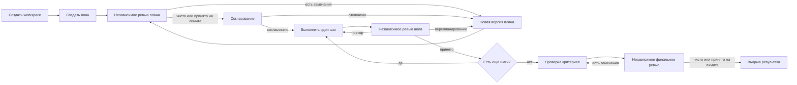

import { Aside, Steps } from '@astrojs/starlight/components';

Robust Task выполняет сложную многошаговую работу через долговечный workspace в файловой системе. Он сохраняет каждую версию плана и попытку выполнения, проводит независимые ревью до согласования и после работы и запрашивает решение пользователя, когда исчерпан бюджет автоматических исправлений или повторов.

Workflow требует агента с доступом к файловой системе. Для небольших ограниченных задач используй [Quick Task](/ru/docs/reference/workflows/quick-task/).

## Запуск

```bash
mcp__moira__start({ workflowId: "moira/robust-task", parentExecutionId: "none" })
```

## Процесс


```mermaid
flowchart LR
    A[Создать workspace] --> B[Создать план]
    B --> C[Независимое ревью плана]
    C -->|есть замечания| D[Новая версия плана]
    D --> C
    C -->|чисто или принято на лимите| E[Согласование]
    E -->|отклонено| D
    E -->|согласовано| F[Выполнить один шаг]
    F --> G[Независимое ревью шага]
    G -->|повтор| F
    G -->|перепланирование| D
    G -->|принято| H{Есть ещё шаги?}
    H -->|да| F
    H -->|нет| I[Проверка критериев]
    I --> J[Независимое финальное ревью]
    J -->|есть замечания| I
    J -->|чисто или принято на лимите| K[Выдача результата]
```

## Долговечный workspace

Первая директива создаёт или возобновляет один workspace с путём вида:

```text
./moira-ws/<task-name>-<YYYYMMDD>-<HHMM>/
```

Workspace связан с выполнением через `process-id.txt`. В нём также находятся:

- `task-requirements.md` — зафиксированный активный запрос;
- `workflow-guide.md` — краткие правила восстановления, планирования, доказательств и ревью;
- `plans/NNN/plan.md` — полные неизменяемые версии плана;
- `plans/NNN/review.md` — текущее независимое ревью этой версии плана;
- `plans/NNN/decision.md` — точное согласование или отклонение пользователя;
- `steps/<step>/plans/<plan-version>/attempts/<attempt>/evidence.md` — доказательства одной точной попытки;
- `verdict.md` рядом с каждым evidence-файлом — независимое gate-ревью попытки;
- `final/criteria/` и `final/reviews/` — версионированные проверки завершённости и записи исправлений;
- `final/delivery.md` — правдивый итоговый результат.

Через контекст workflow передаются пути и небольшие значения для маршрутизации, а не содержимое файлов, которое агент может прочитать из workspace. Если директива ссылается на только что записанный файл, авторитетным остаётся путь: агент может использовать текущий контекст либо перечитать файл после восстановления контекста.

<Aside type="tip">
`process-id.txt` и долговечные артефакты позволяют новой сессии агента возобновить то же выполнение через `session({ action: "current_step", executionId })`.
</Aside>

## Планирование и согласование

План строится от цели и содержит столько содержательных шагов, сколько требует задача. Каждый шаг сообщает исполнителю назначение, релевантный контекст, ожидаемый результат и подходящий критерий приёмки, не превращая интеллектуальную работу в механический сценарий.

Независимый коллега проверяет полный текущий план против зафиксированных требований и реального контекста проекта. Учитываются только воспроизводимые блокирующие дефекты. Исправление не перезаписывает проверенный план: оно создаёт следующий `plans/NNN/plan.md`, после чего новая версия снова проходит ревью.

Автоматический цикл ревью плана ограничен `max_review_rounds` (по умолчанию `5`). На лимите пользователь явно выбирает: продолжить исправления или принять проверенный план для отдельного согласования. Выполнение начинается только после безусловного согласия с точным планом. Отклонение создаёт новую версию и возвращает её на ревью.

## Режим работы

На первом шаге определяется `operating_mode`: `autonomous` или `interactive`. Агент использует режим, который пользователь уже назвал, выводит однозначный сам — в том числе когда запуск дочерний для уже автономного процесса, — и спрашивает один раз только тогда, когда режим не назван и не выводится.

В режиме `interactive` всё описанное выше не меняется. В режиме `autonomous` гейт согласования плана обходится, а каждое ограниченное решение агент принимает по доказательствам: ещё один проход исправлений — только для воспроизводимых и исправимых сейчас находок, `retry` — только когда что-то существенно изменилось, `replan` — когда сбой обесценивает план, а не попытку, иначе фиксируется incomplete. Независимые ревью, лимиты retry и ревью, маршруты реплана и долговечные записи одинаковы в обоих режимах, а принятые пробелы остаются видимыми в delivery: автономность убирает ожидание, а не честность.

## Выполнение и ревью шага

Движок владеет однобазовым курсором `current_step`. Для каждого шага плана:

<Steps>
1. Исполнитель читает текущий план, зафиксированные требования и релевантные предыдущие доказательства или решения.
2. Он выполняет только текущий шаг и записывает новый `evidence.md`, привязанный к версии плана; прежние попытки сохраняются.
3. Независимый коллега читает доказательства, реальный артефакт, требования и план, затем записывает `verdict.md` рядом с evidence-файлом.
4. Принятый вердикт продвигает курсор. Отклонённый вердикт приводит к повтору того же шага либо требует нового плана, если повтор не может устранить дефект.
</Steps>

`step_retry` управляет бюджетом эскалации и не является номером долговечной директории попытки. После `max_retries` неуспешных gate-ревью (по умолчанию `3`) пользователь выбирает один из трёх исходов:

| Решение | Эффект |
|---------|--------|
| `retry` | Повтор только с изменёнными входными данными, новой гипотезой, изменившимся внешним состоянием либо новой конкретной работой или доказательством |
| `replan` | Сохранить завершённые шаги и перестроить открытый шаг и невыполненный хвост |
| `finish_incomplete` | Остановить дальнейшее выполнение и автоматические исправления, затем выдать точный нерешённый объём как incomplete |

Решение сохраняется в `steps/<step>/decisions/NNN.md`. Перепланирование может изменить зафиксированные требования только тогда, когда то же решение пользователя явно называет и разрешает конкретное изменение и его причину.

Узел `teleport-replan` также доступен, если во время выполнения агент обнаружил, что текущий план больше не соответствует реальной работе. Он сохраняет завершённые шаги и отправляет новый полный план на ревью и согласование.

## Проверки завершённости

После закрытия всех шагов Robust Task выполняет две разные проверки:

1. `verify-criteria` сверяет каждый активный критерий успеха и грань цели с реальным результатом, используя механические проверки только для тех свойств, которые они действительно доказывают. Результат записывается в следующий `final/criteria/NNN-review.md`.
2. `final-review` делегирует независимый повторный вывод полноты из требований, согласованного плана, реального результата, записей шагов и последнего criteria-review. Результат записывается в следующий `final/reviews/NNN-review.md`.

Подтверждённые замечания исправляются в реальном артефакте и фиксируются новым fix-файлом. Перед следующим независимым финальным ревью критерии проверяются заново, поэтому delivery не опирается на отчёт, созданный до последнего исправления.

Циклы исправлений criteria-review и final-review используют тот же лимит `max_review_rounds`. На лимите пользователь явно выбирает продолжение исправлений либо принятие точного оставшегося объёма как incomplete. Принятые пробелы остаются видимыми в последующих отчётах и delivery.

## Результат

`final/delivery.md` выводится из зафиксированных требований, текущего согласованного плана, долговечных записей шагов, ревью, разрешённых изменений требований и решений о принятии неполноты. `delivery_status` равен `complete` только когда не осталось нерешённых активных обязательств; иначе он равен `incomplete`, а нерешённый объём раскрывается.

End node возвращает ровно:

```json
{
  "workspace_path": "./moira-ws/.../",
  "delivery_file": "final/delivery.md",
  "delivery_status": "complete | incomplete",
  "summary": "Краткое правдивое итоговое резюме"
}
```

Telegram-уведомления сообщают о готовности плана, исчерпании повторов шага и завершении. Ошибка уведомления не останавливает workflow.

## Примеры задач

- сложная реализация или рефакторинг из нескольких зависимых стадий;
- работа, которая должна переживать потерю контекста агента;
- задачи с долговечными доказательствами каждой попытки и независимыми gates;
- критичная работа, где нерешённые обязательства нельзя молча считать завершёнными.

## Связанное

- [Quick Task](/ru/docs/reference/workflows/quick-task/) — небольшие ограниченные задачи
- [Обзор шаблонов](/ru/docs/reference/workflow-templates/) — все встроенные workflow
