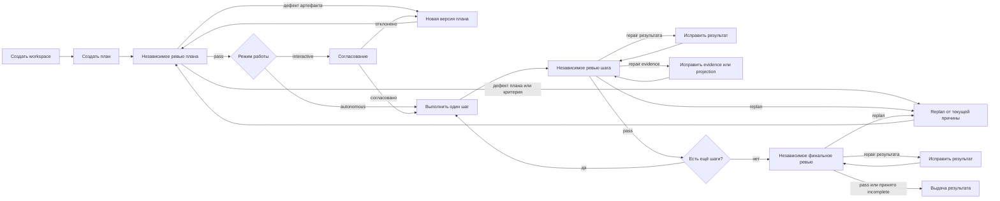

import { Aside, Steps } from '@astrojs/starlight/components';

Robust Task выполняет сложную многошаговую работу через долговечный workspace в файловой системе. Исполнитель отвечает за полный согласованный результат, а независимые ревьюеры классифицируют блокирующие замечания по их ранней причине и направляют их в repair или replanning. Неизменяемые планы, попытки, решения и ревью позволяют восстановить выполнение после потери контекста, а ограниченный repair не даёт выдать незакрытую работу за завершённую.

Workflow требует агента с доступом к файловой системе. Для небольших ограниченных задач используй [Quick Task](/ru/docs/reference/workflows/quick-task/).

## Запуск

```bash
mcp__moira__start({ workflowId: "moira/robust-task", parentExecutionId: "none" })
```

## Процесс


```mermaid
flowchart LR
    A[Создать workspace] --> B[Создать план]
    B --> C[Независимое ревью плана]
    C -->|дефект артефакта| D[Новая версия плана]
    C -->|дефект плана или критерия| R[Replan от текущей причины]
    D --> C
    R --> C
    C -->|pass| M{Режим работы}
    M -->|interactive| E[Согласование]
    M -->|autonomous| F
    E -->|отклонено| D
    E -->|согласовано| F[Выполнить один шаг]
    F --> G[Независимое ревью шага]
    G -->|repair результата| Q[Исправить результат]
    G -->|repair evidence| P[Исправить evidence или projection]
    Q --> G
    P --> G
    G -->|replan| R
    G -->|pass| H{Есть ещё шаги?}
    H -->|да| F
    H -->|нет| J[Независимое финальное ревью]
    J -->|repair результата| L[Исправить результат]
    J -->|replan| R
    L --> J
    J -->|pass или принято incomplete| K[Выдача результата]
```

## Долговечный workspace

Первая директива создаёт или возобновляет один workspace с путём вида:

```text
./moira-ws/<task-name>-<YYYYMMDD>-<HHMM>/
```

Workspace связан с выполнением через `process-id.txt`. В нём также находятся:

- `task-requirements.md` — зафиксированный активный запрос;
- `workflow-guide.md` — краткие правила восстановления, планирования, доказательств и ревью;
- `plans/NNN/plan.md` — полные неизменяемые версии плана;
- `plans/NNN/review.md` — независимое ревью этой точной версии плана;
- `plans/NNN/repair.md` — reassessment владельца исправления, когда причина не исправляется локально;
- `plans/NNN/decision.md` — точное согласование или отклонение пользователя;
- `steps/<step>/plans/<plan-version>/attempts/<attempt>/evidence.md` — доказательства одной точной попытки;
- `verdict.md` рядом с каждым evidence-файлом — независимое gate-ревью попытки;
- `repair.md` рядом с неуспешной попыткой — точная запись repair или reassessment;
- `final/reviews/` — неизменяемые финальные ревью, evidence исправлений и reassessment;
- `final/delivery.md` — правдивый итоговый результат.

Через контекст workflow передаются пути и небольшие значения для маршрутизации, а не содержимое файлов, которое агент может прочитать из workspace. Если директива ссылается на только что записанный файл, авторитетным остаётся путь: агент может использовать текущий контекст либо перечитать файл после восстановления контекста.

<Aside type="tip">
`process-id.txt` и долговечные артефакты позволяют новой сессии агента возобновить то же выполнение через `session({ action: "current_step", executionId })`.
</Aside>

## Планирование и согласование

План строится от цели и содержит столько содержательных шагов, сколько требует задача. Каждый шаг сообщает исполнителю назначение, релевантный контекст, ожидаемый результат и подходящий критерий приёмки, не превращая интеллектуальную работу в механический сценарий, и фиксирует этот результат, а не несёт его сам: после утверждения плана остаётся работа, которую исполнителю ещё предстоит сделать. Важнее всего это там, где результат — проза: документ, задания другим агентам, ответ исследования, — потому что там план и результат делят одну среду и ничто не разделяет их по построению. Нода исправления, предшествующая согласованию, отвечает за весь план; четыре ноды, перестраивающие план в середине прогона, — за шаги, которые формируют, потому что уже выполненные шаги остаются такими, какими были исполнены.

Независимый коллега проверяет полный текущий план против зафиксированных требований, первичных источников и реального контекста проекта. Для каждого блокера он определяет раннюю причину: артефакт workflow, validation или test, недостаточное evidence, документация или projection, ошибочный или недоказуемый критерий либо вышестоящий план или процесс. Результат — `pass`, `repair` или `replan`. Локальный repair разрешён, только если сам план владеет всеми блокерами; иные или смешанные причины возвращаются в планирование.

Repair не перезаписывает проверенный план. Сначала он воспроизводит проблему, затем возвращает `changed` с новым `plans/NNN/plan.md` либо `reassess` с `plans/NNN/repair.md`, если замечание нельзя честно исправить локально. У прямого review и reassessment владельца repair разные потребители replan, поэтому исторический reassessment не становится причиной более позднего перехода только из-за того, что его файл всё ещё существует.

Автоматический цикл ревью плана ограничен `max_review_rounds` (по умолчанию `5`). На лимите пользователь или автономный агент явно выбирает ещё один обоснованный repair либо правдивую incomplete-выдачу; исчерпание счётчика не продвигает заблокированный план. В интерактивном режиме выполнение начинается только после безусловного согласия с точным планом. Отклонение создаёт новую версию и возвращает её на ревью.

## Режим работы

На первом шаге определяется `operating_mode`: `autonomous` или `interactive`. Агент использует режим, который пользователь уже назвал, выводит однозначный сам — в том числе когда запуск дочерний для уже автономного процесса, — и спрашивает один раз только тогда, когда режим не назван и не выводится.

В режиме `interactive` всё описанное выше не меняется. В режиме `autonomous` гейт согласования плана обходится, а каждое ограниченное решение агент принимает по доказательствам: ещё один проход исправлений — только для воспроизводимых и исправимых сейчас находок, `retry` — только когда что-то существенно изменилось, `replan` — когда сбой обесценивает план, а не попытку, иначе фиксируется incomplete. Независимые ревью, лимиты retry и ревью, маршруты реплана и долговечные записи одинаковы в обоих режимах, а принятые пробелы остаются видимыми в delivery: автономность убирает ожидание, а не честность.

## Выполнение и ревью шага

Движок владеет однобазовым курсором `current_step`. Для каждого шага плана:

<Steps>
1. Исполнитель читает текущий план, зафиксированные требования и релевантные предыдущие доказательства или решения.
2. Он выполняет только текущий шаг и записывает новый `evidence.md`, привязанный к версии плана; прежние попытки сохраняются.
3. Независимый коллега читает первичный результат, evidence, требования и план, затем записывает `verdict.md` рядом с evidence-файлом. Он возвращает `pass`, `repair` или `replan`; для repair также указывает владельца: `result` или `evidence_projection`.
4. Repair результата воспроизводит дефект до изменения и расходует retry-бюджет только после содержательно изменённой попытки. Repair evidence или projection сохраняет уже правильный результат и сразу возвращается к тому же reviewer, не расходуя продуктовый retry.
5. Если repair обнаруживает дефект плана, критерия, владельца или метода доказательства, он возвращает `reassess` и перепланирует работу от этой точной текущей причины. Повтор того же корня требует нового знания или replanning, а не следующего слоя того же механизма.
6. Вердикт `pass` продвигает курсор.
</Steps>

`step_retry` управляет бюджетом содержательных исправлений результата, не является номером долговечной директории попытки и не увеличивается для исправлений evidence или projection. Когда израсходовано `max_retries` изменённых result-repair (по умолчанию `3`), пользователь или автономный агент выбирает один из трёх исходов:

| Решение | Эффект |
|---------|--------|
| `retry` | Повтор только с изменёнными входными данными, новой гипотезой, изменившимся внешним состоянием либо новой конкретной работой или доказательством |
| `replan` | Сохранить завершённые шаги и перестроить открытый шаг и невыполненный хвост |
| `finish_incomplete` | Остановить дальнейшее выполнение и автоматические исправления, затем выдать точный нерешённый объём как incomplete |

Решение сохраняется в `steps/<step>/decisions/NNN.md`. Перепланирование может изменить зафиксированные требования только тогда, когда то же решение пользователя явно называет и разрешает конкретное изменение и его причину.

Узел `teleport-replan` также доступен, если во время выполнения агент обнаружил, что текущий план больше не соответствует реальной работе. Он сохраняет завершённые шаги и отправляет новый полный план на ревью и согласование.

## Финальное ревью

После закрытия всех шагов одно независимое `final-review` заново выводит активные обязательства из зафиксированных требований, согласованного плана, реального результата, первичных артефактов, принятых записей шагов и разрешённых решений. Оно не полагается на заявление исполнителя о полноте и не дублирует тот же семантический gate. Механические проверки подтверждают только различимые ими свойства; семантическая полнота и архитектура требуют суждения по реальным артефактам.

Reviewer возвращает `pass`, `repair` или `replan`. Для локального repair он назначает владельца `deliverable` или `evidence_projection`. Владелец воспроизводит текущее замечание до изменения и возвращает `changed` тому же reviewer либо `reassess`, если нужно изменить план, критерий, метод evidence или ownership. Прямой replan финального review и replan reassessment используют отдельные пути текущей причины.

Цикл ограничен `max_review_rounds`. На лимите пользователь или автономный агент может разрешить ещё один обоснованный repair либо явно принять точный оставшийся объём как incomplete. Исчерпание счётчика никогда не превращает нерешённое замечание в `pass`.

## Результат

`final/delivery.md` выводится из зафиксированных требований, текущего согласованного плана, долговечных записей шагов, ревью, разрешённых изменений требований и решений о принятии неполноты. `delivery_status` равен `complete` только когда не осталось нерешённых активных обязательств; иначе он равен `incomplete`, а нерешённый объём раскрывается.

End node возвращает ровно:

```json
{
  "workspace_path": "./moira-ws/.../",
  "delivery_file": "final/delivery.md",
  "delivery_status": "complete | incomplete",
  "summary": "Краткое правдивое итоговое резюме"
}
```

Telegram-уведомления сообщают о готовности плана, исчерпании повторов шага и завершении. Ошибка уведомления не останавливает workflow.

## Примеры задач

- сложная реализация или рефакторинг из нескольких зависимых стадий;
- работа, которая должна переживать потерю контекста агента;
- задачи с долговечными доказательствами каждой попытки и независимыми gates;
- критичная работа, где нерешённые обязательства нельзя молча считать завершёнными.

## Связанное

- [Quick Task](/ru/docs/reference/workflows/quick-task/) — небольшие ограниченные задачи
- [Обзор шаблонов](/ru/docs/reference/workflow-templates/) — все встроенные workflow
