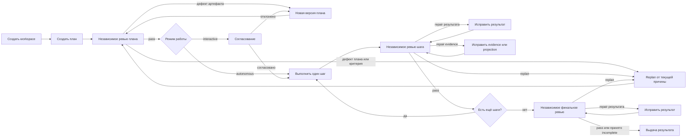

import { Aside, Steps } from '@astrojs/starlight/components';

Robust Task выполняет сложную многошаговую работу через долговечный workspace в файловой системе. Исполнитель отвечает за полный согласованный результат, а независимые ревьюеры классифицируют блокирующие замечания по их ранней причине и направляют их в repair или replanning. Неизменяемые планы, попытки, решения и ревью позволяют восстановить выполнение после потери контекста, а ограниченный repair не даёт выдать незакрытую работу за завершённую.

Workflow требует агента с доступом к файловой системе. Для небольших ограниченных задач используй [Quick Task](/ru/docs/reference/workflows/quick-task/).

## Запуск

```bash
mcp__moira__start({ action: "prepare", workflowId: "moira/robust-task", parentExecutionId: "none" })
mcp__moira__start({ action: "execute", startAttemptId: "<ID попытки запуска из prepare>" })
```

## Процесс


```mermaid
flowchart LR
    A[Создать workspace] --> B[Создать план]
    B --> C[Независимое ревью плана]
    C -->|дефект артефакта| D[Новая версия плана]
    C -->|дефект плана или критерия| R[Replan от текущей причины]
    D --> C
    R --> C
    C -->|pass| M{Режим работы}
    M -->|interactive| E[Согласование]
    M -->|autonomous| F
    E -->|отклонено| D
    E -->|согласовано| F[Выполнить один шаг]
    F --> G[Независимое ревью шага]
    G -->|repair результата| Q[Исправить результат]
    G -->|repair evidence| P[Исправить evidence или projection]
    Q --> G
    P --> G
    G -->|replan| R
    G -->|pass| H{Есть ещё шаги?}
    H -->|да| F
    H -->|нет| J[Независимое финальное ревью]
    J -->|repair результата| L[Исправить результат]
    J -->|replan| R
    L --> J
    J -->|pass или принято incomplete| K[Выдача результата]
```

## Долговечный workspace

Первая директива создаёт или возобновляет один workspace с путём вида:

```text
./moira-ws/<task-name>-<YYYYMMDD>-<HHMM>/
```

Workspace связан с выполнением через `process-id.txt`. В нём также находятся:

- `task-requirements.md` — зафиксированный активный запрос;
- `workflow-guide.md` — краткие правила восстановления, планирования, доказательств и ревью;
- `plans/NNN/plan.md` — полные неизменяемые версии плана;
- `plans/NNN/review.md` — независимое ревью этой точной версии плана;
- `plans/NNN/repair.md` — reassessment владельца исправления, когда причина не исправляется локально;
- `plans/NNN/decision.md` — точное согласование или отклонение пользователя;
- `steps/<step>/plans/<plan-version>/attempts/<attempt>/evidence.md` — доказательства одной точной попытки;
- `verdict.md` рядом с каждым evidence-файлом — независимое gate-ревью попытки;
- `repair.md` рядом с неуспешной попыткой — точная запись repair или reassessment;
- `final/reviews/` — неизменяемые финальные ревью, evidence исправлений и reassessment;
- `final/delivery.md` — правдивый итоговый результат.

Через контекст workflow передаются пути и небольшие значения для маршрутизации, а не содержимое файлов, которое агент может прочитать из workspace. Если директива ссылается на только что записанный файл, авторитетным остаётся путь: агент может использовать текущий контекст либо перечитать файл после восстановления контекста.

<Aside type="tip">
`process-id.txt` и долговечные артефакты позволяют новой сессии агента возобновить то же выполнение через `session({ action: "current_step", executionId })`.
</Aside>

## Планирование и согласование

План строится от цели и содержит столько содержательных шагов, сколько требует задача. Каждый шаг сообщает исполнителю назначение, релевантный контекст, ожидаемый результат и подходящий критерий приёмки, не превращая интеллектуальную работу в механический сценарий, и фиксирует этот результат, а не несёт его сам: после утверждения плана остаётся работа, которую исполнителю ещё предстоит сделать. Важнее всего это там, где результат — проза: документ, задания другим агентам, ответ исследования, — потому что там план и результат делят одну среду и ничто не разделяет их по построению. Нода исправления, предшествующая согласованию, отвечает за весь план; четыре ноды, перестраивающие план в середине прогона, — за шаги, которые формируют, потому что уже выполненные шаги остаются такими, какими были исполнены.

Независимый коллега проверяет полный текущий план против зафиксированных требований, первичных источников и реального контекста проекта. Для каждого блокера он определяет раннюю причину: артефакт workflow, validation или test, недостаточное evidence, документация или projection, ошибочный или недоказуемый критерий либо вышестоящий план или процесс. Результат — `pass`, `repair` или `replan`. Локальный repair разрешён, только если сам план владеет всеми блокерами; иные или смешанные причины возвращаются в планирование.

Тело плана остаётся в `plan.md`; каждая нода, которая пишет план, возвращает и `plan_steps` — короткое название каждого шага в порядке плана, не больше 30, — из которых workflow выводит `total_steps`. Эти названия — список плана, который люди видят в уведомлениях и на странице прогона.

Repair не перезаписывает проверенный план. Сначала он воспроизводит проблему, затем возвращает `changed` с новым `plans/NNN/plan.md` либо `reassess` с `plans/NNN/repair.md`, если замечание нельзя честно исправить локально. У прямого review и reassessment владельца repair разные потребители replan, поэтому исторический reassessment не становится причиной более позднего перехода только из-за того, что его файл всё ещё существует.

Автоматический цикл ревью плана ограничен `max_review_rounds` (по умолчанию `5`). На лимите пользователь или автономный агент явно выбирает ещё один обоснованный repair либо правдивую incomplete-выдачу; исчерпание счётчика не продвигает заблокированный план. В интерактивном режиме выполнение начинается только после безусловного согласия с точным планом. Отклонение создаёт новую версию и возвращает её на ревью.

## Режим работы

На первом шаге определяется `operating_mode`: `autonomous` или `interactive`. Агент использует режим, который пользователь уже назвал, выводит однозначный сам — в том числе когда запуск дочерний для уже автономного процесса, — и спрашивает один раз только тогда, когда режим не назван и не выводится. Тот же шаг возвращает `execution_note` — задачу в нескольких словах (до 120 символов, заметку вызывающей стороны, если она была); она стоит в заголовке каждого уведомления прогона. Он же возвращает `goal_summary` — результат, которого должна достичь задача, одним предложением; его показывают сообщения о плане.

В режиме `interactive` всё описанное выше не меняется. В режиме `autonomous` гейт согласования плана обходится, а каждое ограниченное решение агент принимает по доказательствам: ещё один проход исправлений — только для воспроизводимых и исправимых сейчас находок, `retry` — только когда что-то существенно изменилось, `replan` — когда сбой обесценивает план, а не попытку, иначе фиксируется incomplete. Независимые ревью, лимиты retry и ревью, маршруты реплана и долговечные записи одинаковы в обоих режимах, а принятые пробелы остаются видимыми в delivery: автономность убирает ожидание, а не честность.

## Прогресс выполнения

Карточка запуска и экспортируемое изображение прогресса используют одно представление из шести этапов: Intake → Plan → Execute → Step Review → Final Review → Deliver. Каждая нода, включая ноды маршрутизации, доступную только через jump точку пересмотра плана и каждую роль repair, recovery и replan, принадлежит одному этапу; каждая связь, выходящая из этапа, подписана, а каждый возврат объясняет причину и условие выхода, поэтому представление процесса выводится из исполняемого графа. Представление не добавляет исполняемых маршрутов, счётчиков, решений о полномочиях или механизмов доказательства.

Этап Execute привязан к самому плану: `plan_steps` — шаги с их `title`, `current_step` — выполняемый шаг, отсчитываемый от `1`, `total_steps` — общее число. Поэтому прогон и его уведомления показывают каждый шаг, какие выполнены и какой в работе.

Каждый этап показывает постоянное назначение, точную текущую ответственность, последний подтверждённый семантический результат и следующее значимое действие. Владелец результата целиком заменяет одно ограниченное значение, а не накапливает историю: intake владеет согласованным контрактом, роли плана — сводкой и состоянием текущего плана, выполнение — последней привязанной к плану попыткой, каждая группа ревью — своим текущим решением, а delivery — правдивым итогом. Активные подписи описывают текущую работу, не скрывая последний подтверждённый результат.

Каждая директива, которая рассуждает о плане, читает авторитетный путь `{{workspace_path}}{{current_plan_file}}`. Когда repair, пользовательская правка, teleport или причинно-ориентированный replan создаёт замену плана, этот writer атомарно заменяет проекции Plan, Execute, Step Review и Final Review, сохраняя только всё ещё истинный завершённый префикс либо состояние pending. Поэтому результаты разных редакций плана не смешиваются. Значения прогресса используются только для отображения; основные условия, связи, retry-бюджеты, курсор выполнения, согласования и полномочия на побочные эффекты по-прежнему определяются обычным состоянием workflow.

## Выполнение и ревью шага

Движок владеет однобазовым курсором `current_step`. Для каждого шага плана:

<Steps>
1. Исполнитель читает текущий план, зафиксированные требования и релевантные предыдущие доказательства или решения.
2. Он выполняет только текущий шаг и записывает новый `evidence.md`, привязанный к версии плана; прежние попытки сохраняются.
3. Независимый коллега читает первичный результат, evidence, требования и план, затем записывает `verdict.md` рядом с evidence-файлом. Он возвращает `pass`, `repair` или `replan`; для repair также указывает владельца: `result` или `evidence_projection`.
4. Repair результата воспроизводит дефект до изменения и расходует retry-бюджет только после содержательно изменённой попытки. Repair evidence или projection сохраняет уже правильный результат и сразу возвращается к тому же reviewer, не расходуя продуктовый retry.
5. Если repair обнаруживает дефект плана, критерия, владельца или метода доказательства, он возвращает `reassess` и перепланирует работу от этой точной текущей причины. Повтор того же корня требует нового знания или replanning, а не следующего слоя того же механизма.
6. Вердикт `pass` продвигает курсор.
</Steps>

`step_retry` управляет бюджетом содержательных исправлений результата, не является номером долговечной директории попытки и не увеличивается для исправлений evidence или projection. Когда израсходовано `max_retries` изменённых result-repair (по умолчанию `3`), пользователь или автономный агент выбирает один из трёх исходов:

| Решение | Эффект |
|---------|--------|
| `retry` | Повтор только с изменёнными входными данными, новой гипотезой, изменившимся внешним состоянием либо новой конкретной работой или доказательством |
| `replan` | Сохранить завершённые шаги и перестроить открытый шаг и невыполненный хвост |
| `finish_incomplete` | Остановить дальнейшее выполнение и автоматические исправления, затем выдать точный нерешённый объём как incomplete |

Решение сохраняется в `steps/<step>/decisions/NNN.md`. Перепланирование может изменить зафиксированные требования только тогда, когда то же решение пользователя явно называет и разрешает конкретное изменение и его причину.

Узел `teleport-replan` также доступен, если во время выполнения агент обнаружил, что текущий план больше не соответствует реальной работе. Он сохраняет завершённые шаги и отправляет новый полный план на ревью и согласование.

## Финальное ревью

После закрытия всех шагов одно независимое `final-review` заново выводит активные обязательства из зафиксированных требований, согласованного плана, реального результата, первичных артефактов, принятых записей шагов и разрешённых решений. Оно не полагается на заявление исполнителя о полноте и не дублирует тот же семантический gate. Механические проверки подтверждают только различимые ими свойства; семантическая полнота и архитектура требуют суждения по реальным артефактам.

Reviewer возвращает `pass`, `repair` или `replan`. Для локального repair он назначает владельца `deliverable` или `evidence_projection`. Владелец воспроизводит текущее замечание до изменения и возвращает `changed` тому же reviewer либо `reassess`, если нужно изменить план, критерий, метод evidence или ownership. Прямой replan финального review и replan reassessment используют отдельные пути текущей причины.

Цикл ограничен `max_review_rounds`. На лимите пользователь или автономный агент может разрешить ещё один обоснованный repair либо явно принять точный оставшийся объём как incomplete. Исчерпание счётчика никогда не превращает нерешённое замечание в `pass`.

## Результат

`final/delivery.md` выводится из зафиксированных требований, текущего согласованного плана, долговечных записей шагов, ревью, разрешённых изменений требований и решений о принятии неполноты. `delivery_status` равен `complete` только когда не осталось нерешённых активных обязательств; иначе он равен `incomplete`, а нерешённый объём раскрывается.

End node возвращает ровно:

```json
{
  "workspace_path": "./moira-ws/.../",
  "delivery_file": "final/delivery.md",
  "delivery_status": "complete | incomplete",
  "summary": "Краткое правдивое итоговое резюме"
}
```

## Уведомления

Robust Task отправляет уведомления в настроенные каналы пользователя. У каждого сообщения заголовок —
название флоу и задача прогона, ссылкой на страницу прогона; картинок сообщения не несут. Каждая
строка, написанная из значений самого прогона, берётся из поля в одно предложение, которое шаг пишет
для человека, без имён файлов и внутренних значений: цель задачи, почему ревью не проходит, что
решено и почему, и результат. Тексты сообщений — на английском.

| Когда | Interactive | Autonomous |
| --- | --- | --- |
| Проверенный план готов | «Plan ready for your approval» (план ждёт согласования) с целью, всем планом и вариантами: согласовать — и работа идёт дальше, или отклонить с фидбеком, чтобы план исправили | «Plan approved — the work goes ahead» (план согласован, работа идёт) с целью и всем планом |
| Шаг исчерпал исправления | «Step needs your decision» (шагу нужно ваше решение): номер и название шага, почему его ревью не проходит, и варианты — повторить, изменить план или завершить со шагом невыполненным | «Decided for you» (решено за вас) после принятия решения: шаг, что решено и почему |
| Ревью плана дошло до лимита | «The plan keeps failing review» (план не проходит ревью): почему, и варианты — исправить план ещё раз или завершить с неполным планом | «Decided for you» после принятия решения: что решено и почему |
| Финальное ревью дошло до лимита | «The result keeps failing the final review» (результат не проходит финальное ревью): почему, и варианты — исправить результат ещё раз или принять его с открытыми пунктами | «Decided for you» после принятия решения: что решено и почему |
| Прогон завершён | «Completed» (готово) или, если delivery неполная, «Completed with open items» (готово с открытыми пунктами): результат одним предложением и каждый шаг, отмеченный `✓` (сделан) или `○` (открыт): прогон завершён, поэтому ни один не отмечен как идущий | то же |

Три ревью возвращают `failure_summary`, когда не проходят, — что мешает работе пройти, одним
предложением, — и сообщение на лимите ревью приводит последнее из них. Каждое из трёх решений
возвращает `decision_summary` — что решено и почему, одним предложением; автономное сообщение несёт
его. Выдача результата возвращает `result_summary` — результат одним предложением — для сообщения о
завершении. План, исправленный после перепланирования, приходит снова в
исправленном виде, а уже выполненные шаги остаются отмеченными. Ничто из отправленного в автономном
прогоне не просит решения. Поскольку флоу отправляет уведомления, его запуск для пользователя без
настроенного канала отклоняется с инструкцией; агент, который хочет работать без уведомлений, заново
готовит запуск с `skipNotificationCheck: true`. Ошибка уведомления не останавливает workflow.

### Ждёт вас

Согласование плана и три решения выше — шаг, исчерпавший исправления, и пределы ревью плана и
финального ревью — помечены как шаги, которые ждут вас. Пока интерактивный запуск стоит на одном из
них, страница запуска и его прогресс говорят **ждёт вас** и что от вас нужно, а сообщение с вопросом
заканчивается строкой `🙋 waiting for you`. Первое уведомление об ожидании — сообщение самого флоу;
если ответа нет сутки, Moira один раз напоминает со ссылкой на запуск. Автономный запуск принимает три
решения сам, поэтому на этих шагах он ждущим вас не показан.

## Примеры задач

- сложная реализация или рефакторинг из нескольких зависимых стадий;
- работа, которая должна переживать потерю контекста агента;
- задачи с долговечными доказательствами каждой попытки и независимыми gates;
- критичная работа, где нерешённые обязательства нельзя молча считать завершёнными.

## Связанное

- [Quick Task](/ru/docs/reference/workflows/quick-task/) — небольшие ограниченные задачи
- [Обзор шаблонов](/ru/docs/reference/workflow-templates/) — все встроенные workflow
