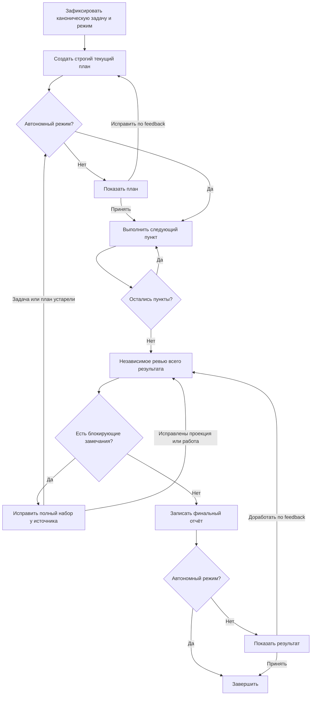

import { Aside } from '@astrojs/starlight/components';

`moira/simple-plan-execution` выполняет ограниченную универсальную задачу по одному строгому текущему плану. Это минимальный публичный флоу, который объединяет создание плана, опциональное согласование, последовательную работу с доказательствами, независимую проверку всего результата, обязательное исправление замечаний и финальный отчёт, но не навязывает жизненный цикл разработки ПО.

## Запуск

```js
mcp__moira__start({
  workflowId: "moira/simple-plan-execution",
  parentExecutionId: "none"
})
```

Из исходного диалога флоу определяет четыре входа:

- полное ограниченное описание задачи;
- наблюдаемый ожидаемый результат всей задачи;
- режим `autonomous` или `interactive`;
- безопасный workspace, производный от ID запуска.

Уже предоставленные факты используются повторно. Агент спрашивает только о существенном неизвестном факте, который нельзя найти самостоятельно. Режим фиксируется один раз на весь запуск.

## Когда выбирать этот флоу

Выбирайте Simple Plan Execution, когда нужен универсальный исполнитель с предварительным планом и достаточно хранить только текущее принятое состояние.

| Потребность | Флоу |
| --- | --- |
| Создать и выполнить один текущий план с доказательствами и независимым ревью | **Simple Plan Execution** |
| Выполнить checklist, уже предоставленный вызывающей стороной | [Todo List](./todo-list/) |
| Сохранить неизменяемые версии планов, ревью и решений | [Quick Task](./quick-task/) |
| Добавить долговечные попытки, checkpoints, retries и recovery | [Robust Task](./robust-task/) |
| Реализовать изменение ПО вместе с тестами, документацией, ревью и локальным VCS-завершением в пределах полномочий | [Software Development Flow](/ru/docs/reference/workflow-templates/#разработка-по) |

<Aside type="note">
Не разбивайте один жизненный цикл разработки на отдельные запуски Simple Plan Execution для реализации, тестов, документации и доставки. Используйте флоу разработки, который отвечает за все связанные этапы и итоговую гарантию.
</Aside>

## Процесс



План содержит от 1 до 100 упорядоченных пунктов. У каждого есть попарно уникальный стабильный ID, ограниченное действие и наблюдаемый ожидаемый результат. `plan.json` — точная долговечная проекция канонического runtime-плана; длину вычисляет движок, он же владеет курсором следующего пункта с нулевой индексацией.

Для каждого пункта исполнитель:

- работает только с текущим пунктом;
- выбирает инструменты и проверки по реальной задаче и проекту;
- проверяет ожидаемый результат доказательством, отличающим успех от похожего сбоя;
- добавляет одну полную запись evidence до возврата успеха;
- не может вернуть schema-valid ответ «сбой, но перейти дальше».

Движок увеличивает курсор ровно один раз после закрытого успешного ответа. Заблокированный или неподтверждённый пункт остаётся текущим.

## Режимы работы

Оба режима сохраняют одинаковые гарантии планирования, выполнения, ревью, исправления, отчёта, блокеров и полномочий.

| Режим | Ожидания пользователя |
| --- | --- |
| `autonomous` | Пропускает показ плана и финальный вопрос о приёмке |
| `interactive` | Требует явного принятия плана и результата; для revision или rework нужен непустой feedback |

Автономный режим не ослабляет ревью и не расширяет полномочия на побочные действия.

## Долговечные артефакты текущего состояния

Один безопасный workspace `./moira-ws/simple-plan-execution-<execution-id>` содержит фиксированные файлы:

| Файл | Назначение |
| --- | --- |
| `task.md` | Точная долговечная проекция канонического описания задачи и ожидаемого результата |
| `plan.json` | Точная JSON-проекция текущего строгого упорядоченного плана |
| `execution-evidence.md` | Текущее однозначное evidence пунктов: действие, ожидаемый и фактический результат, проверка и конкретные доказательства |
| `review.md` | Полный текущий набор блокирующих замечаний независимого ревью |
| `final-report.md` | Правдивый zero-reviewed результат, пути проверки и реальные ограничения |

Это артефакты текущего состояния. Флоу не хранит неизменяемую историю планов и решений; если она нужна, выбирайте Quick Task.

## Безопасный пересмотр плана во время выполнения

Guarded teleport доступен только когда план во время выполнения доказанно стал неверным, неполным или устаревшим. Он принимает полный новый план и существующий resume cursor. Каждый завершённый пункт до курсора обязан сохранить тот же ID, содержимое, порядок и соответствие evidence; менять можно только оставшийся suffix. Новый план возвращается через mode gate до продолжения выполнения.

Teleport нельзя использовать для обхода сбоя обычного пункта, замечания ревью, отсутствующего evidence, согласования или полномочий. Замечания ревью исправляет отдельный владелец ниже.

## Независимое ревью и обязательное исправление

После всех текущих пунктов ревьюер в отдельном поддерживаемом хостом контексте напрямую читает канонический execution context, текущие файлы, фактический результат задачи или состояние проекта, исходный запрос и применимые первичные инструкции. Блокируются:

- расхождение проекции задачи или плана;
- повторяющиеся ID плана или неоднозначная связь ID с evidence;
- неполное покрытие задачи;
- отсутствующие, устаревшие, нарушающие порядок или неразличающие доказательства;
- недостигнутый ожидаемый результат пункта или всей задачи;
- расширение полномочий.

К отчёту ведёт только точный ноль замечаний. Ненулевой результат попадает к одному changed-repair owner, который сначала исправляет полный текущий набор и лишь затем сообщает фактический reach:

- `projection` приводит файлы к неизменённым каноническим значениям и сразу возвращается к ревью;
- `work` меняет фактическую работу и текущее evidence, исправляет сопутствующую проекцию и возвращается к ревью;
- `plan` меняет канонический план и его проекцию, удаляет устаревшее evidence от самого раннего затронутого пункта, переносит туда курсор и повторно выполняет затронутый suffix;
- `task` исправляет канонический захват неизменённого исходного запроса, заново строит план, инвалидирует затронутое evidence, переносит курсор и повторно проходит plan/execution gates.

Нет фиксированного лимита проходов ревью и пути, превращающего известные замечания в успешную доставку. Неизменённое, невоспроизводимое или неавторизованное исправление обязано остановиться с фактическим блокером.

## Результат и ограничения полномочий

После нулевого ревью `final-report.md` фиксирует проверенный результат, пути проверки и ограничения. Terminal projection содержит только:

- `workspace_path` — расположение пяти текущих артефактов;
- `result_summary` — ограниченное краткое описание для обнаружения результата.

Флоу наследует полномочия из исходного запроса и применимых инструкций. Принятие плана и автономный режим не разрешают разрушительные, внешние, production-, publication-, administrative-, financial-, privacy-sensitive- или существенно отличающиеся действия. Коммиты, тесты, публикация, деплой и конкретные инструменты используются только когда они требуются реальной авторизованной задачей и проектом.

## Связанные материалы

- [Todo List](./todo-list/) — выполнение checklist от вызывающей стороны
- [Quick Task](./quick-task/) — неизменяемая история планов и решений
- [Robust Task](./robust-task/) — retries, checkpoints и recovery
- [Software Development Flow](/ru/docs/reference/workflow-templates/#разработка-по) — полный жизненный цикл реализации
- [Готовые workflows](./) — сравнение публичных флоу
