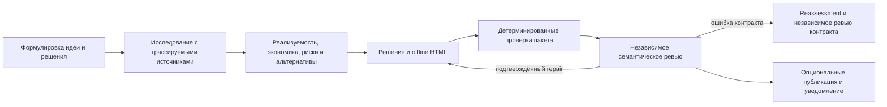

Startup Idea Validation превращает свободное описание стартап-идеи в долговечный пакет принятия решения. Workflow формулирует проверяемое решение, исследует актуальные доказательства, оценивает реализуемость и альтернативы, создаёт self-contained offline HTML, проверяет наблюдаемые свойства пакета и требует действительно независимого семантического ревью.

Выбирайте его, когда результатом должно стать решение об идее, а не реализация или общий исследовательский отчёт. Рекомендация может предлагать продолжить, продолжить при условиях, провести эксперимент, изменить формулировку или pivot, приостановить либо остановить работу.

## Запуск

```bash
mcp__moira__start({ workflowId: "moira/startup-idea-validation", parentExecutionId: "none" })
```

На вход передаётся идея в свободной форме. Первый шаг повторно использует уже заданные scope, ограничения, режим и полномочия на публикацию или уведомление. Вопрос задаётся только тогда, когда отсутствующий факт существенно меняет анализ и его нельзя безопасно выяснить.

## Процесс



Исследование охватывает проблему и спрос, рынок, альтернативы и конкурентов, техническую реализуемость, стоимость разработки и эксплуатации, необходимые компетенции, существенные регуляторные вопросы и риски, альтернативные бизнес-модели и практические эксперименты. Scope определяется идеей и доступным evidence; workflow не навязывает число конкурентов, пороги рынка, универсальные ставки, бюджеты, сроки или confidence score.

Актуальные утверждения получают ссылки и даты. Расчёты и оценки показывают входные данные, метод, диапазон, релевантные географию/валюту/дату и неопределённость. Отсутствующее или противоречивое evidence остаётся ограничением или блокером, а не превращается в выдуманную точность. Высокорисковые вопросы означают поиск риска и возможную необходимость квалифицированной проверки, а не профессиональное заключение.

## Workspace и результат

Каждый запуск материализует `./moira-ws/startup-idea-validation-<executionId>/` с каноническими файлами framing, реестра источников, исследования, feasibility/options, решения, validation, независимого ревью, repair, HTML и финального отчёта. Подробные тела остаются на диске и не дублируются в workflow context.

`report.html` содержит все ресурсы внутри себя и не требует CDN, сетевого запроса, отправки формы или скрытого локального runtime. Он разделяет факты с источниками, расчёты, оценки, гипотезы, предположения, неопределённость, противоречия, ограничения, риски, блокеры и следующие эксперименты.

## Ревью и repair

Детерминированные проверки охватывают только наблюдаемые свойства: обязательные файлы, форму реестра источников, парсинг HTML и отсутствие внешних runtime-зависимостей. Они не доказывают происхождение бизнес-смысла, реализуемость, полноту или качество рекомендации.

Независимый reviewer читает полный пакет и первичное evidence. Findings классифицируются до мутации. Package repair возвращается через completion и все устаревшие gates; evidence repair повторяет весь зависящий анализ. Ошибочные критерии и смешанные причины проходят contract reassessment и независимое ревью исправленного контракта. Если genuine independence недоступна, запуск завершается blocked без ложного утверждения о проведённом ревью.

## Режимы и полномочия

- `autonomous` пропускает только ожидания уточнения и финальной приёмки.
- `interactive` позволяет запросить существенное уточнение и направляет feedback к самому раннему устаревшему владельцу.
- Публикация и Telegram-уведомление — отдельные опциональные effects. Наличие инструмента не даёт полномочий.
- Автономный запуск без решения остаётся локальным и не отправляет уведомление.
- Сбой upload или уведомления сохраняет принятый локальный пакет и сообщается отдельно.

## Исходы

- `complete`: локальный пакет прошёл применимые проверки и независимое ревью; состояния optional effects указаны правдиво.
- `blocked`: входные данные, evidence, validation, review или другая предпосылка не позволяют ответственно завершить работу.
- `aborted`: пользователь интерактивного режима явно остановил запуск.

## Связанные workflows

- [Verified Research](./verified-research/) — ограниченный отчёт с проверенными источниками без синтеза решения по стартапу.
- [PRD Creation](./prd-creation/) — требования к продукту после решения его определить.
- [Robust Task](./robust-task/) — сложная общая работа с долговечным recovery.
