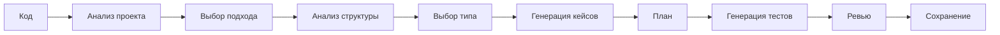

import { Aside } from '@astrojs/starlight/components';

Workflow для генерации кода автотестов включая unit, integration и e2e тесты. Анализирует существующие паттерны проекта и генерирует тесты по установленным conventions.

## Запуск

```bash
mcp__moira__start({ workflowId: "test-generation" })
```

## Процесс



## Шаги

| Шаг | Действие | Результат |
|-----|----------|-----------|
| 1. Код | Получение кода для тестирования | Целевой код |
| 2. Анализ проекта | Изучение существующих тестов и паттернов | Анализ проекта |
| 3. Выбор подхода | Использовать существующие паттерны или создать новые | Решение по подходу |
| 4. Анализ структуры | Определение testable units (функции, классы, методы) | Инвентарь units |
| 5. Выбор типа | Выбор unit, integration или e2e | Тип тестов |
| 6. Генерация кейсов | Генерация тест-кейсов (happy path, edge, error) | Список кейсов |
| 7. План | Финальный план тестирования | Согласованный план |
| 8. Генерация | Генерация кода тестов | Файлы тестов |
| 9. Ревью | Ревью пользователем | Одобренные тесты |
| 10. Сохранение | Сохранение тестов в проект | Сохранённые тесты |

## Особенности

<Aside type="tip">
Workflow ищет существующие тесты в директориях `tests/`, `__tests__/` и `spec/` для соответствия conventions проекта.
</Aside>

### Анализ проекта

| Элемент | Детекция |
|---------|----------|
| Директории тестов | `tests/`, `__tests__/`, `spec/` |
| Фреймворки | Jest, Playwright, pytest, Vitest |
| Conventions | Паттерны именования, использование helpers |

### Типы тестов

| Тип | Описание |
|-----|----------|
| `unit` | Изолированное тестирование функций/методов |
| `integration` | Тестирование взаимодействия компонентов |
| `e2e` | Тестирование полных user flows |

### Категории тест-кейсов

| Категория | Фокус |
|-----------|-------|
| Happy path | Нормальное ожидаемое поведение |
| Edge cases | Граничные условия, лимиты |
| Error cases | Невалидный input, обработка ошибок |

### Циклы валидации

- **Анализ проекта**: Проверка полноты понимания
- **Анализ структуры**: Подтверждение определённых testable units
- **Покрытие кейсов**: Обеспечение адекватного покрытия
- **Валидация синтаксиса**: Проверка валидности сгенерированного кода

<Aside type="caution">
До 3 попыток retry для генерации тестов. При повторных неудачах workflow эскалирует к пользователю.
</Aside>

### Точки согласования

- **Подтверждение подхода**: Согласование стратегии тестирования
- **Подтверждение типа**: Одобрение выбора типа тестов
- **Подтверждение плана**: Одобрение финального плана
- **Ревью**: Одобрение сгенерированных тестов

## Пример конфигурации ноды

```json
{
  "id": "generate-tests",
  "type": "agent-directive",
  "directive": "Сгенерируй код тестов по утверждённому плану. Используй conventions проекта для именования, структуры и helpers.",
  "completionCondition": "Файлы тестов сгенерированы с валидным синтаксисом, покрывающие все запланированные тест-кейсы",
  "connections": {
    "next": "review-tests"
  }
}
```

## Связанное

- [Test Planning](/ru/docs/reference/workflows/test-planning/) — Для создания тест-планов без генерации кода
- [Robust Task](/ru/docs/reference/workflows/robust-task/) — Для сложных задач тестирования
- [Обзор шаблонов](/ru/docs/reference/workflow-templates/) — Все доступные шаблоны
