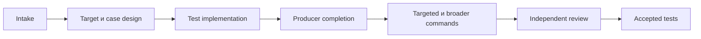

Test Generation добавляет или обновляет executable tests для одной разрешённой цели в существующем проекте.

```bash
mcp__moira__start({ workflowId: "moira/test-generation", parentExecutionId: "none" })
```

Используйте его, когда результатом является test code. Для стратегии без реализации выбирайте [Test Planning](/ru/docs/reference/workflows/test-planning/), для аудита существующего suite — Test Suite Audit, а при необходимости менять production code — Software Development Flow.

Workflow материализует durable workspace, изучает реальное target behavior и project test patterns, проектирует behavioral/risk/boundary cases, записывает принятые tests и необходимые test-side fixtures/configuration в разрешённые project paths, выполняет producer completion до команд, запускает targeted и broader gates и получает настоящее independent semantic review.


```mermaid
flowchart LR
  A[Intake] --> B[Target и case design]
  B --> C[Test implementation]
  C --> D[Producer completion]
  D --> E[Targeted и broader commands]
  E --> F[Independent review]
  F --> G[Accepted tests]
```

Tests должны защищать observable behavior и правдоподобные regressions. Существующий project mutation tooling можно использовать при наличии разрешения; его отсутствие не является дефектом. Workflow не меняет production code и не создаёт proof-only proxies, guards, metatests, adapters или mutation harnesses только ради демонстрации failure sensitivity.

Test-code и evidence defects получают разных repair owners. Необходимость production/testability implementation создаёт durable Software Development Flow handoff. Ошибочные criteria проходят cumulative independently reviewed contract correction с typed target, design, tests, evidence или completion re-entry.

Autonomous mode пропускает только финальную приёмку. Commit и push требуют раздельного originating authority и возвращают отдельные outcomes. Workflow не публикует, не уведомляет, не выпускает релиз, не деплоит и не ослабляет project checks.
