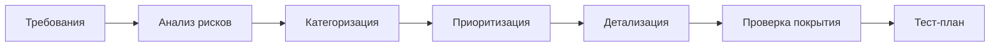

import { Aside } from '@astrojs/starlight/components';

Workflow для создания структурированных тест-планов с risk-based приоритизацией. Обеспечивает комплексное покрытие по категориям тестов с чёткими определениями приоритетов.

## Запуск

```bash
mcp__moira__start({ workflowId: "test-planning" })
```

## Процесс



## Шаги

| Шаг | Действие | Результат |
|-----|----------|-----------|
| 1. Требования | Сбор feature, acceptance criteria, user stories | Документ требований |
| 2. Анализ рисков | Анализ что может сломаться, impact, likelihood | Оценка рисков |
| 3. Категоризация | Распределение тестов по категориям | Категоризированные тесты |
| 4. Приоритизация | Назначение P0-P3 с обоснованием | Приоритизированные тесты |
| 5. Детализация | Написание title, preconditions, steps, expected result | Детальные тест-кейсы |
| 6. Проверка покрытия | Проверка покрытия AC и рисков, выявление gaps | Отчёт о покрытии |
| 7. Тест-план | Финальный тест-план | Готовый план |

## Особенности

<Aside type="tip">
Минимум 2 теста на категорию обеспечивает сбалансированное покрытие по всем типам тестов.
</Aside>

### Обязательные категории тестов

| Категория | Фокус | Минимум |
|-----------|-------|---------|
| Positive | Happy path сценарии | 2 теста |
| Negative | Невалидный input, обработка ошибок | 2 теста |
| Edge cases | Границы, лимиты | 2 теста |
| Security | Auth, injection, access control | 2 теста |
| Performance | Нагрузка, время ответа (если применимо) | 2 теста |

### Определения приоритетов

| Приоритет | Название | Описание | Влияние на релиз |
|-----------|----------|----------|------------------|
| P0 | Blocker | Критическая функциональность | Нельзя релизить |
| P1 | Critical | Core features | Должен пройти перед релизом |
| P2 | Major | Важные features | Желательно проверить |
| P3 | Minor | Nice to have | Опционально |

<Aside type="caution">
Все P0 и P1 тесты должны проходить перед релизом. P0 failures блокируют релиз полностью.
</Aside>

### Проверка покрытия

| Проверка | Вопрос |
|----------|--------|
| Покрытие AC | Все acceptance criteria покрыты тестами? |
| Покрытие рисков | Все high-impact риски покрыты P0/P1? |
| Анализ gaps | Какие области не имеют test coverage? |

### Шаблон тест-кейса

| Поле | Описание |
|------|----------|
| Title | Чёткое, описательное название теста |
| Priority | P0-P3 с обоснованием |
| Preconditions | Требуемое начальное состояние |
| Steps | Нумерованная последовательность действий |
| Expected result | Конкретный, проверяемый результат |

## Пример конфигурации ноды

```json
{
  "id": "prioritize-tests",
  "type": "agent-directive",
  "directive": "Назначь приоритет P0-P3 каждому тест-кейсу. P0 для blockers, P1 для critical, P2 для major, P3 для minor. Обоснуй каждое назначение.",
  "completionCondition": "Всем тест-кейсам назначен приоритет с обоснованием",
  "connections": {
    "next": "detail-tests"
  }
}
```

## Связанное

- [Test Generation](/ru/docs/reference/workflows/test-generation/) — Для генерации кода тестов из планов
- [PRD Creation](/ru/docs/reference/workflows/prd-creation/) — Для определения требований для тестирования
- [Обзор шаблонов](/ru/docs/reference/workflow-templates/) — Все доступные шаблоны
