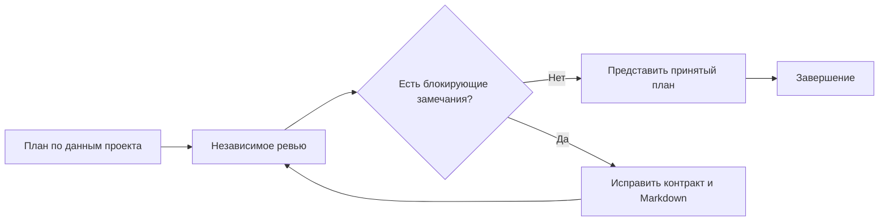

import { Aside } from '@astrojs/starlight/components';

`moira/test-planning` создаёт независимо проверенную стратегию тестирования и подробный план тест-кейсов. Флоу не реализует и не запускает тесты. Выбирайте его, когда нужно определить, что и почему проверять, какой результат считать корректным и покрывает ли план известные требования и риски.

## Запуск

```js
mcp__moira__start({
  workflowId: "moira/test-planning",
  parentExecutionId: "none"
})
```

Флоу принимает описание функции, изменения, API, страницы, модуля или системы, а также доступные критерии приёмки, пользовательские сценарии, ограничения и известные риски. Сначала агент изучает текст задачи, спецификации, документацию проекта и код. Он задаёт вопрос только тогда, когда отсутствующий факт существенно меняет стратегию и его нельзя найти самостоятельно.

## Когда выбирать этот флоу

Выбирайте Test Planning, если результатом должен быть проверенный тест-план, а не тестовый код или изменение продукта.

| Потребность | Флоу |
| --- | --- |
| Определить покрытие, риски, приоритеты, кейсы и ожидаемые результаты | **Test Planning** |
| Реализовать или сгенерировать исполняемые тесты по известным требованиям или плану | [Test Generation](/ru/docs/reference/workflows/test-generation/) |
| Реализовать изменение продукта вместе с тестами, документацией, ревью и доказательствами результата | [Software Development Flow](/ru/docs/reference/workflow-templates/#software-development-flow) |

<Aside type="note">
Не разбивайте одну задачу разработки на отдельные запуски реализации, тестирования и документации, когда полный флоу разработки уже отвечает за все эти связанные части. Запускайте Test Planning отдельно, если долговечный тест-план сам является требуемым результатом или явно нужен как вход для последующей работы.
</Aside>

## Процесс


```mermaid
flowchart LR
    A[План по данным проекта] --> B[Независимое ревью]
    B --> C{Есть блокирующие замечания?}
    C -->|Нет| D[Представить принятый план]
    C -->|Да| E[Исправить контракт и Markdown]
    E --> B
    D --> F[Завершение]
```

Этап планирования выполняет связанную работу как одну ответственность:

- фиксирует проверяемый объём, источники, стабильные идентификаторы критериев приёмки, сценарии, ограничения, допущения и неизвестные факты;
- определяет применимые технические, бизнес-, security-, data-integrity-, compatibility- и operational-риски с impact и likelihood;
- выбирает категории по реальному объёму и объясняет исключение релевантных категорий;
- назначает каждому кейсу приоритет P0–P3 и обоснование;
- задаёт исполняемые шаги, наблюдаемый ожидаемый результат и ссылки на критерии приёмки или риски;
- рекомендует автоматизацию, но не запускает тесты.

## Долговечные артефакты

Все файлы находятся по фиксированным дочерним путям одного безопасного локального workspace `./moira-ws/test-planning-<suffix>`:

| Файл | Назначение |
| --- | --- |
| `requirements.md` | Проверяемый объём, источники, критерии приёмки, сценарии, ограничения, допущения и неизвестные факты |
| `test-plan.contract.json` | Канонические риски и поля кейсов, проверенные JSON Schema |
| `test-plan.md` | Готовая Markdown-проекция с описанием покрытия, исключений, ограничений и рекомендаций по автоматизации |
| `review.md` | Полный текущий набор блокирующих замечаний независимого ревью |

`test-plan.contract.json` — источник истины для полей, общих с Markdown-планом. Runtime проверяет канонический объект при создании и после каждого исправления. Риск без impact или likelihood, кейс без обязательных проверяемых полей, неверный приоритет, пустые шаги или кейс без ссылки на критерий/риск отклоняются до перехода дальше.

## Категории и приоритеты

Категории выбираются условно, а не как универсальный список. Positive, negative, boundary, security, integration, performance, accessibility, compatibility, recovery и compliance включаются, когда этого требует проверяемый объём. Для релевантного исключения нужна причина; неприменимая категория не добавляется ради формального количества тестов.

| Приоритет | Значение в плане |
| --- | --- |
| P0 | Release-blocking поведение, потеря данных, критическая security-проблема или другой сбой, с которым релиз недопустим |
| P1 | Критический для релиза основной сценарий или high-impact риск, который нужно покрыть до релиза |
| P2 | Важное вторичное поведение, которое следует проверить |
| P3 | Менее существенное, косметическое или редкое поведение, которое полезно зафиксировать |

P0/P1 должны быть связаны с критическим для релиза поведением или high-impact риском. Флоу планирует проверки, но не утверждает, что они прошли: он не исполняет тесты.

## Гарантия независимого ревью и исправления

Ревьюер работает в отдельном поддерживаемом клиентом контексте и напрямую читает текущие файлы и первичные данные проекта. Он проверяет:

- покрытие каждого критерия приёмки и выявленного риска;
- обоснованные P0/P1 для high-impact и критических для релиза рисков;
- исполнимость шагов и наблюдаемость ожидаемых результатов;
- обоснованность исключений категорий и приоритетов;
- корректность идентификаторов и ссылок;
- соответствие Markdown-проекции каноническому JSON-контракту;
- соблюдение локальной области полномочий.

Ненулевое число замечаний может перейти только к исправлению. Исправление меняет канонический контракт или описательные данные, заново формирует Markdown и возвращается к тому же ревью. Представление результата достижимо только после ревью с нулём замечаний. Обходного пути для известного пробела нет.

## Ограничения полномочий

Флоу может изучать данные проекта и создавать четыре локальных файла планирования. Он не запускает тесты, не меняет код продукта, не выполняет commit/push, не публикует, не отправляет уведомления и не деплоит. Запуск тестов можно только рекомендовать отдельно авторизованному вызывающему процессу или флоу.

## Актуальный синтаксис связей

Agent-directive использует именованную связь `success`, а гейт ревью — ветки `true` и `false`:

```json
{
  "id": "review-gate",
  "type": "condition",
  "condition": {
    "operator": "eq",
    "left": { "contextPath": "issues_count" },
    "right": 0
  },
  "connections": {
    "true": "present",
    "false": "repair"
  }
}
```

## Связанные материалы

- [Test Generation](/ru/docs/reference/workflows/test-generation/) — реализация тестового кода
- [Software Development Flow](/ru/docs/reference/workflow-templates/#software-development-flow) — реализация и проверка полного изменения ПО
- [PRD Creation](/ru/docs/reference/workflows/prd-creation/) — требования продукта и критерии приёмки
- [Обзор шаблонов](/ru/docs/reference/workflow-templates/) — сравнение публичных флоу
