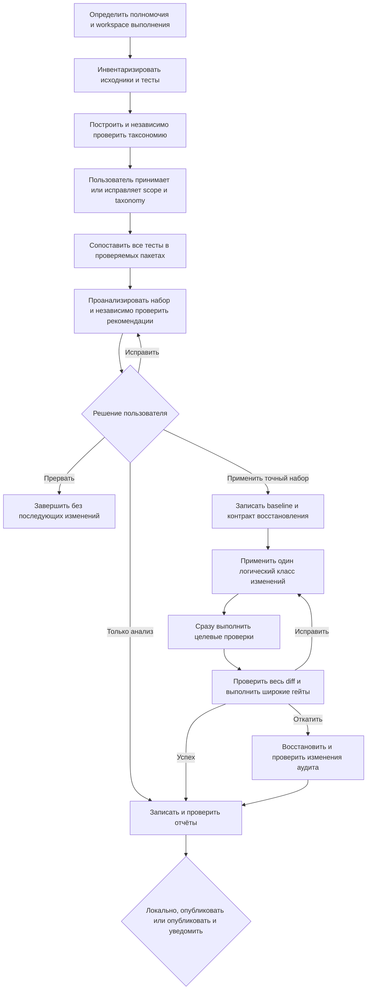

import { Aside } from '@astrojs/starlight/components';

`moira/test-suite-audit` оценивает существующий набор тестов относительно реального поведения production-кода. Флоу инвентаризирует весь разрешённый корпус исходников и тестов, строит основанную на production-коде функциональную таксономию, сопоставляет каждый тест и assertion в независимо проверяемых пакетах и формирует доказательные выводы о покрытии, дублировании, пробелах, слабых assertions, неверно расположенных тестах, инфраструктуре и конкретных улучшениях.

Сначала выполняется анализ. Репозиторий изменяется только после явного разрешения пользователя на точный набор рекомендаций, прошедший независимое ревью.

## Запуск

```js
mcp__moira__start({
  workflowId: "moira/test-suite-audit",
  parentExecutionId: "none"
})
```

В исходном запросе следует указать проект и желаемые границы аудита. Флоу самостоятельно находит применимые инструкции проекта, языки, фреймворки, test runners, каталоги исходников и тестов, исключения, границы незакоммиченной работы, доступные команды и разрешённые операции. Он спрашивает только о существенном факте или решении, которое нельзя безопасно обнаружить.

## Когда выбирать этот флоу

| Потребность | Флоу |
| --- | --- |
| Оценить и при необходимости рефакторить существующий набор тестов относительно production-поведения | **Test Suite Audit** |
| Спроектировать тестовую стратегию до реализации без запуска тестов | [Test Planning](./test-planning/) |
| Добавить тесты для определённой цели | [Test Generation](./test-generation/) |
| Проанализировать предоставленные наборы данных, а не код и тесты | [Data Analysis](./data-analysis/) |
| Поставить полное изменение репозитория с реализацией, тестами, документацией, review и локальным VCS-завершением в пределах полномочий | [Software Development Flow](/ru/docs/reference/workflow-templates/#разработка-по) |

<Aside type="caution">
Test Suite Audit не заменяет полный жизненный цикл разработки. Он может применить только точный проверенный набор рекомендаций по тестовому набору. Более широкое изменение продукта следует выполнять через Software Development Flow.
</Aside>

## Процесс



Фаза анализа не изменяет проверяемый репозиторий:

- `scope.md` фиксирует полномочия, инструкции проекта, границы, исключения, команды и несвязанные изменения, которые нужно сохранить;
- `inventory.md` фиксирует полный корпус production-кода и тестов в scope;
- `taxonomy.md` выводит из production-источников функции, аспекты, границы, инфраструктуру, orphan-кандидатов, multi-behavior tests, incidental coverage и параметризованные пути;
- `batch-plan.md` назначает каждый тест из инвентаря ровно одному детерминированному пакету;
- `mappings.md` хранит сопоставления каждого теста или case и его assertions с production-поведением и ограничениями;
- `analysis.md` содержит проверенные выводы и точный упорядоченный набор рекомендаций.

Таксономия, каждый пакет сопоставлений, анализ, фактический diff и итоговый отчёт проходят независимые циклы review и repair. Ненулевой review не может перейти прямо к успеху. Если исправление меняет scope или taxonomy, все устаревшие производные артефакты создаются заново.

## Решения пользователя и полномочия

Флоу требует явных закрытых решений на существенных границах:

- принять или исправить найденные scope и taxonomy; исправление указывает `scope` или `taxonomy` и содержит feedback;
- выбрать `analysis_only`, `apply`, `revise` или `abort` для текущих рекомендаций с нулевым review;
- при неустранимо неполных evidence или небезопасном baseline выбрать ограниченный неизменяющий отчёт либо abort;
- после вызванного аудитом падения тестов выбрать ограниченный repair или scoped revert;
- после независимой приёмки локальных отчётов выбрать локальную выдачу, статическую публикацию либо публикацию с Telegram-уведомлением.

Молчание не считается согласием или полномочием на изменение. `apply` разрешает только точный текущий проверенный набор. Оно не разрешает credentials, расширение scope проекта, разрушительные несвязанные действия, деплой или отдельно не выбранную внешнюю доставку.

## Опциональные изменения, тесты и восстановление

До первой мутации флоу фиксирует точное dirty-состояние, несвязанные изменения, результаты релевантных существующих тестов, разрешённые файлы и логические классы изменений, а также способ восстановления. Если последствия аудита нельзя отличить или безопасно восстановить, мутации запрещаются и пользователь может выбрать только ограниченный отчёт.

Разрешённая работа выполняется по одному логическому классу. Релевантные целевые проверки запускаются сразу после каждого класса и до продвижения cursor. После всех классов независимый reviewer сверяет полный фактический diff с разрешённым набором рекомендаций, инструкциями проекта, обязанностями по документации и coverage и сохранностью несвязанной работы. Затем выполняются все применимые affected, package, integration, browser или full-project гейты в порядке, заданном проектом, риском и стоимостью.

Неразрешённое падение целевых или широких проверок нельзя объявить успехом. Пользователь может разрешить ограниченный repair с повторным review и verification либо scoped revert. Revert успешен только тогда, когда project-native diff, status и релевантные проверки доказывают отсутствие изменений аудита и сохранность несвязанной работы. Неудачное восстановление завершается исходом `recovery_blocked`.

## Артефакты и исходы

Каждое выполнение получает отдельный workspace:

```text
./moira-ws/test-suite-audit-<executionId>/
```

Каталог содержит неизменяемый стандарт аудита из registry, промежуточные evidence, отчёты review, baseline и verification при наличии изменений, `final-report.md` и автономный `report.html`. Это локальные артефакты проекта, которые подчиняются правилам хранения хоста или проекта; флоу не удаляет их автоматически.

Исходы с отчётом различаются явно:

- `analysis_only` — проверенный анализ без изменения репозитория;
- `limited_analysis` — явно неполный неизменяющий анализ без неподтверждённых выводов;
- `no_changes` — в проверенном наборе нет логических классов изменений;
- `changes_applied` — точный разрешённый diff прошёл целевые и широкие проверки;
- `changes_reverted` — изменения аудита восстановлены, и восстановление проверено.

`aborted` завершает выполнение без дальнейшей записи файлов, изменения репозитория, публикации или уведомления. `recovery_blocked` — отдельный терминальный сбой, а не успешный исход отчёта.

## Публикация и приватность

Локальная выдача не имеет внешних эффектов. При публикации через разрешённый API файловых или архивных статических артефактов Moira загружается только независимо проверенный автономный `report.html`. Исходники, рабочие evidence и чувствительные записи не публикуются. URL возвращается только после наблюдаемой успешной загрузки; при ошибке URL остаётся пустым, а сбой виден в результате.

Telegram-уведомление выполняется только после явного выбора `publish_notify` и получения реального URL отчёта. Сообщение содержит фактический исход, ограничения и точную сводку тестов. Ошибка уведомления не отменяет проверенный локальный отчёт или успешную публикацию, но остаётся видимой в `notification_state`.

Итоговый review проверяет приватность, лицензирование, минимизацию данных, безопасность публикации, устаревшие evidence и неподтверждённый язык успеха. Флоу не ищет credentials и не расширяет доступ.

## Связанные материалы

- [Test Planning](./test-planning/) — проектирование тестовой стратегии без выполнения тестов
- [Test Generation](./test-generation/) — добавление тестов для определённой цели
- [Data Analysis](./data-analysis/) — анализ предоставленных наборов данных
- [Software Development Flow](/ru/docs/reference/workflow-templates/#разработка-по) — полный цикл поставки ПО
- [Готовые workflows](./) — сравнение публичных флоу
