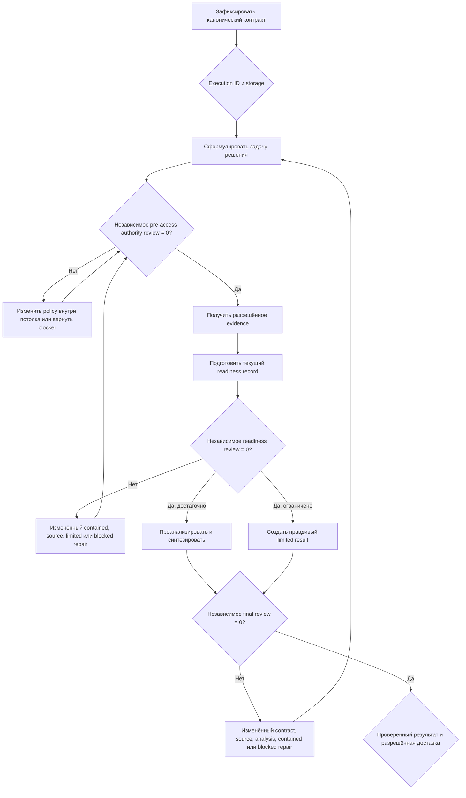

import { Aside } from '@astrojs/starlight/components';

`moira/universal-research-workflow` — переносимый исследовательский workflow для заданного вопроса или решения, когда источники, метод и структура результата должны адаптироваться к задаче. Он может сохранять шесть долговечных файлов текущего запуска либо работать с ограниченным самодостаточным memory-состоянием, если файловая система недоступна. В обоих режимах действуют одинаковые границы полномочий, evidence, review, repair и доставки.

Выбирайте его, если доступность файлового хранения неизвестна, вопрос может потребовать разных исследовательских методов или до доступа к источникам нужны явные privacy- и authority-границы. Для ограниченной преимущественно линейной проверки используйте [Verified Research](/ru/docs/reference/workflows/verified-research/), для filesystem-first исследования с повторными review-циклами — [Iterative Research](/ru/docs/reference/workflows/iterative-research/), для отдельно разрешённой работы с большим корпусом — Deep Corpus Research, для переданных наборов данных — [Data Analysis](/ru/docs/reference/workflows/data-analysis/), а для изменений репозитория — workflow разработки ПО.

## Запуск

```bash
mcp__moira__start({ workflowId: "moira/universal-research-workflow", parentExecutionId: "none" })
```

На входе фиксируется один канонический контракт:

- вопрос, контекст решения, включённый и исключённый scope, аудитория, язык, ориентировочная глубина, ограничения, критерии успеха и deliverables;
- интерактивный или автономный режим и файловое либо memory-хранение;
- неизменяемый потолок конфиденциальности и полномочий, который определяет разрешённый доступ, privacy, consent, retention, licensing и минимизацию;
- текущие ожидания от источников и политика данных, которые можно исправлять только внутри этого потолка;
- локальная доставка, публикация, публикация с уведомлением либо пока не принятое решение;
- отдельные явные полномочия на статическую публикацию и Telegram-уведомление.

Глубина (`quick`, `normal`, `deep` или `scientific`) задаёт требуемую пригодность и стоимость. Она не является квотой источников, слов, методов, инструментов, агентов или форматирования.

## Режимы хранения и артефакты

Файловый режим материализует шесть пустых файлов в `./moira-ws/universal-research-<executionId>/`:

| Файл | Назначение |
| --- | --- |
| `research-contract.md` | Текущий канонический вопрос, границы, политика, критерии успеха и полномочия на доставку |
| `source-evidence.json` | Типизированные очищенные provenance, результаты доступа, поддержка утверждений, противоречия, неопределённость, актуальность и ограничения |
| `research-report.md` | Текущий ответ, основанный на evidence |
| `research-review.md` | Точный текущий набор независимых блокирующих замечаний |
| `repair-account.md` | Воспроизведённое замечание, фактически изменённый reach либо фактический блокер исправления |
| `delivery.html` | Минимизированное автономное внешнее представление без исходного приватного evidence |

Возвращённый execution UUID сравнивается с системным ID текущего запуска до использования workspace. Пути фиксированы и защищены от traversal. Если материализация не удалась, workflow переходит в memory-режим и фиксирует ограничение хранения, а не утверждает, что долговечные файлы существуют.

Memory-режим хранит типизированные и ограниченные по размеру evidence, readiness, repair и result текущего запуска. Отчёт самодостаточен, но не обещает долговечного восстановления и не может быть опубликован внешне: для публикации нужен проверенный файловый `delivery.html`.

## Процесс и гарантии



Pre-access reviewer не доверяет меткам «equal» и «narrower», а независимо сравнивает текущую policy с неизменяемым потолком входного контракта. Ни одна ветка acquisition не достижима до нулевого числа замечаний.

Для каждого источника сохраняются исходная и наблюдаемая доступность, фактический результат доступа, очищенный provenance, классификация, релевантность, поддержанные утверждения, противоречия, неопределённость, актуальность и ограничения. Недоступный, неразрешённый или ошибочный доступ нельзя переписать как usable evidence. Достаточность определяется вопросом и deliverable контракта, а не произвольным количеством источников.

Readiness- и final-review выполняются в отдельном поддерживаемом хостом контексте, диагностируют без мутаций и принимают только ровно ноль текущих блокеров. Ненулевой результат требует реального изменения на самой ранней устаревшей границе либо правдивого recovery blocker. Contract- и source-repair повторяют pre-access gate, data-repair повторяет readiness, result-repair повторяет final review. Защищённый teleport пересмотра процесса сохраняет неизменяемые mode- и authority-поля и не обходит acquisition, evidence, review, repair или delivery gates.

## Результаты и полномочия

- `accepted_local` возвращает полный независимо проверенный локальный или memory-результат без внешнего действия.
- `limited` проходит независимое ревью, называет неподдержанные выводы и недостающее evidence или authority и никогда не публикуется и не отправляется.
- `published` требует файлового режима, явного полномочия на публикацию и наблюдаемого HTTPS URL успешной загрузки.
- `published_and_notified` дополнительно требует отдельного полномочия на уведомление и наблюдаемой успешной отправки Telegram.
- Недоступная, неразрешённая или неуспешная публикация и неразрешённое, неотправленное или ошибочное Telegram-уведомление имеют разные терминальные исходы и сохраняют принятый локальный результат.
- `recovery_blocker`, несовпадение execution ID и явный интерактивный abort остаются различимыми и не заявляют ложный успех исследования или доставки.

<Aside type="caution">
Доступные credentials, инструменты или конфигурация сервера не создают полномочий. Автономный режим пропускает только ожидание человека и выбирает локальную доставку при нерешённом способе; он не может сам расширить доступ к источникам, опубликовать результат или отправить уведомление.
</Aside>

## Связанные материалы

- [Verified Research](/ru/docs/reference/workflows/verified-research/) — ограниченная преимущественно линейная проверка источников
- [Iterative Research](/ru/docs/reference/workflows/iterative-research/) — filesystem-first исследование с повторными ограниченными review-циклами
- [Data Analysis](/ru/docs/reference/workflows/data-analysis/) — анализ переданных наборов данных по явному контракту источников
- [Content Creation](/ru/docs/reference/workflows/content-creation/) — подготовка и проверка контента вместо адаптивного исследования
- [Готовые Workflows](/ru/docs/reference/workflows/) — обзор выбора workflow
