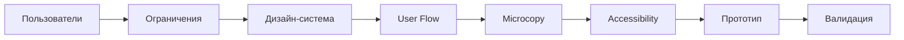

import { Aside } from '@astrojs/starlight/components';

Структурированный процесс UX/UI дизайна с обязательной проверкой accessibility. Обеспечивает user-centered дизайн с документированным rationale и соответствием WCAG AA.

## Запуск

```bash
mcp__moira__start({ workflowId: "ux-design" })
```

## Процесс



## Шаги

| Шаг | Действие | Результат |
|-----|----------|-----------|
| 1. Пользователи | Сбор информации о целевых пользователях: personas, JTBD, pain points | User personas |
| 2. Ограничения | Документирование технических и бизнес ограничений | Список ограничений |
| 3. Дизайн-система | Проверка существующей дизайн-системы, компоненты для переиспользования | Инвентарь компонентов |
| 4. User Flow | Проектирование flow с rationale для каждого решения | Документированный user flow |
| 5. Microcopy | Написание UX copy с проверкой clarity | Проверенный copy |
| 6. Accessibility | Проверка по WCAG AA чеклисту | Отчёт о соответствии |
| 7. Прототип | Описание экранов screen-by-screen | Спецификация прототипа |
| 8. Валидация | План тестирования с пользователями | Тест-план |

## Особенности

<Aside type="tip">
Определи primary persona в начале. Все design decisions должны быть связаны с потребностями пользователей.
</Aside>

### User-Centered Design

| Элемент | Описание |
|---------|----------|
| Primary persona | Определяется до начала дизайна |
| Связь с решениями | Все выборы привязаны к user needs |
| Планирование валидации | Тесты связаны с personas |

### Design Rationale

Каждое design decision документирует:
- **Почему**: Rationale для решения
- **Альтернативы**: Рассмотренные варианты
- **Причины отказа**: Почему альтернативы не выбраны

### WCAG AA Checklist

<Aside type="caution">
Проверка accessibility обязательна. Все пункты должны пройти до фазы прототипа.
</Aside>

| Критерий | Требование |
|----------|------------|
| Color contrast | Минимум 4.5:1 для текста |
| Keyboard navigation | Полная keyboard accessibility |
| Screen reader | Правильные ARIA labels и структура |
| Touch targets | Минимум 44x44px |
| Focus states | Видимые индикаторы фокуса |
| Alt text | Описательный альтернативный текст |
| Form labels | Связанные labels для всех input |

### Microcopy Guidelines

| Принцип | Описание |
|---------|----------|
| Ясность важнее креативности | Clear beats creative |
| Длина предложений | Максимум 15-20 слов |
| Залог | Предпочтительно активный |
| CTA | Конкретные, action-oriented |
| Сообщения об ошибках | Дружелюбные, solution-focused |

## Пример конфигурации ноды

```json
{
  "id": "accessibility-check",
  "type": "agent-directive",
  "directive": "Проверь дизайн по WCAG AA чеклисту. Проверь color contrast, keyboard navigation, screen reader support, touch targets, focus states, alt text и form labels.",
  "completionCondition": "Все критерии WCAG AA проверены со статусом pass/fail для каждого пункта",
  "connections": {
    "next": "create-prototype"
  }
}
```

## Связанное

- [PRD Creation](/ru/docs/reference/workflows/prd-creation/) — Для определения требований к продукту
- [Test Planning](/ru/docs/reference/workflows/test-planning/) — Для тестирования реализации UX
- [Обзор шаблонов](/ru/docs/reference/workflow-templates/) — Все доступные шаблоны
