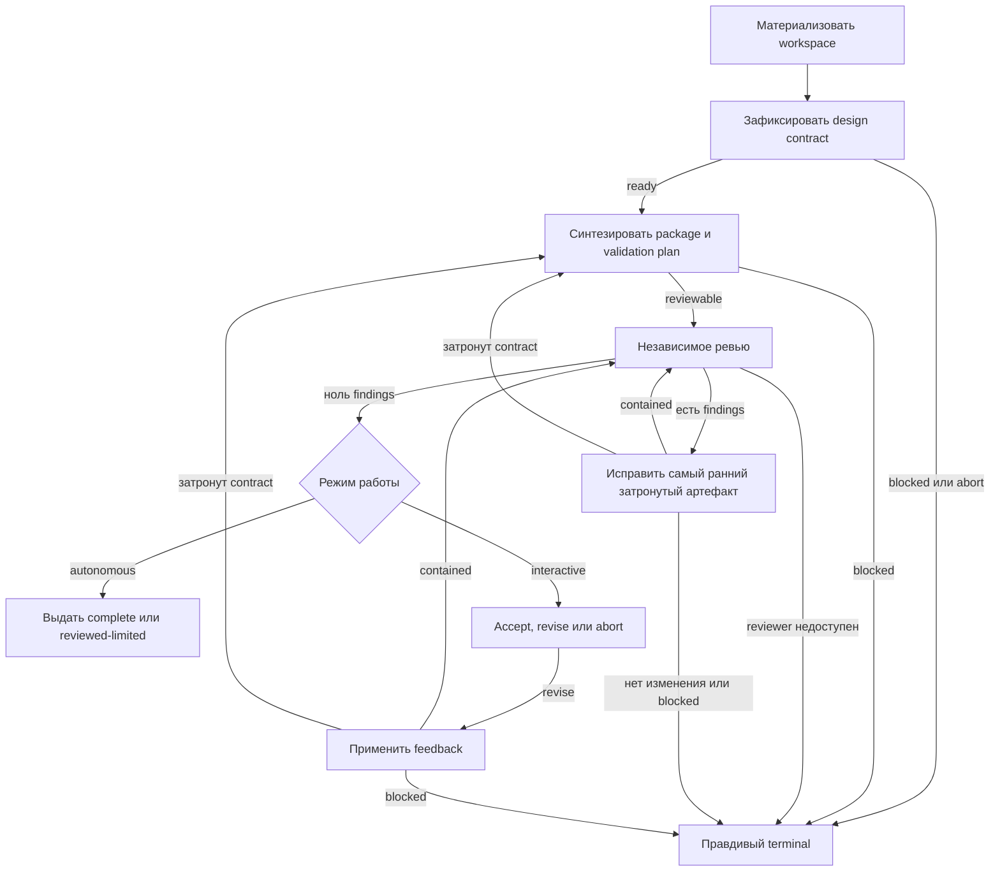

import { Aside } from '@astrojs/starlight/components';

UX Design превращает переданные требования и разрешённые проектные источники в готовую для
реализации спецификацию взаимодействия и интерфейса. Design contract, package, план будущей
валидации, независимое ревью и repair record сохраняются в одном локальном workspace текущего
запуска.

<Aside type="caution">
  Этот workflow специфицирует UX, но не реализует UI, не создаёт графический прототип, не проводит
  исследования или usability tests, не сертифицирует соответствие WCAG, не изменяет Git, не
  публикует, не отправляет уведомления и не выполняет deploy.
</Aside>

## Запуск

```bash
mcp__moira__start({ workflowId: "moira/ux-design", parentExecutionId: "none" })
```

Если UX Design запускает оркестрационный workflow, вместо `none` передайте execution ID родителя.

## Когда выбирать этот workflow

Выбирайте UX Design, когда нужен результат в виде проверенной UX/UI-спецификации: user flows,
информационная архитектура, поведение экранов и состояний, иерархия layout, взаимодействия,
microcopy, responsive behavior, accessibility intent и спецификация прототипа.

Если основной результат другой, выберите соседний workflow:

| Потребность | Workflow |
| --- | --- |
| Определить scope продукта и требования | [PRD Creation](./prd-creation/) |
| Найти или проверить внешние данные | [Universal Research Workflow](./universal-research-workflow/) или [Iterative Research](./iterative-research/) |
| Подготовить самостоятельный контент | [Content Creation](./content-creation/) |
| Спланировать исполняемые тесты продукта | [Test Planning](./test-planning/) |
| Реализовать, протестировать, документировать, провести review или разрешённое локальное VCS-завершение | Software Development Flow |

## Входные данные и контракт

Workflow формирует ограниченный design contract из исходного запроса и разрешённых первичных
источников проекта. В нём фиксируются:

- цель дизайна, scope, исключения, deliverables и наблюдаемые критерии успеха;
- основные пользователи и контекст использования, jobs to be done, pain points и значимые edge
  cases;
- технические, бизнес-, brand-, content-, privacy-, platform-, localization- и accessibility-
  ограничения;
- переданные evidence и provenance, гипотезы, допущения, неизвестные и ограничения результата;
- известные компоненты и паттерны дизайн-системы, а также граница полномочий workflow;
- режим работы `autonomous` или `interactive`.

Агент задаёт вопрос только о существенной неизвестности, которую нельзя установить из разрешённого
контекста. Запуск даёт право записи только в собственный workspace; доступность инструмента не
расширяет полномочия.

## Процесс и quality gates


```mermaid
flowchart TD
    A[Материализовать workspace] --> B[Зафиксировать design contract]
    B -->|ready| C[Синтезировать package и validation plan]
    B -->|blocked или abort| T[Правдивый terminal]
    C -->|reviewable| D[Независимое ревью]
    C -->|blocked| T
    D -->|ноль findings| E{Режим работы}
    D -->|есть findings| F[Исправить самый ранний затронутый артефакт]
    D -->|reviewer недоступен| T
    F -->|contained| D
    F -->|затронут contract| C
    F -->|нет изменения или blocked| T
    E -->|autonomous| G[Выдать complete или reviewed-limited]
    E -->|interactive| H[Accept, revise или abort]
    H -->|revise| I[Применить feedback]
    I -->|contained| D
    I -->|затронут contract| C
    I -->|blocked| T
```

Синтез охватывает каждое применимое семейство состояний: entry, success, empty, loading,
validation, error, recovery, permission и responsive behavior. Исключить семейство можно только с
обоснованием его неприменимости на основе evidence. Каждое существенное решение связывается с
потребностью пользователя, ограничением, evidence item или явной гипотезой и содержит значимые
альтернативы.

Приоритет имеют существующие компоненты дизайн-системы и универсальные примитивы проекта. Для
каждого нового компонента или паттерна нужно зафиксировать доказанную потребность, рассмотренные
альтернативы, последствия интеграции и причину, по которой существующих примитивов недостаточно.

Один действительно независимый reviewer context записывается и повторно используется для первого
и всех последующих ревью. К выдаче ведёт только точный ноль текущих блокирующих findings.
Подтверждённый finding исправляется в самом раннем затронутом источнике: contained-правка package
возвращается тому же reviewer, а изменение contract повторяет синтез. Неизменяемая, неразрешённая
или невозможная правка завершается правдиво и не образует бесконечный цикл.

## Долговечные артефакты

Workspace имеет путь `./moira-ws/ux-design-<execution-id>` и содержит ровно эти файлы:

| Файл | Назначение |
| --- | --- |
| `process-id.txt` | Связывает каталог с текущим Moira execution |
| `design-standard.md` | Стабильные правила evidence, полноты, ревью, полномочий и выдачи |
| `design-contract.md` | Единственный подробный источник цели и ограничений дизайна |
| `design-package.md` | Текущая полная UX-спецификация и downstream handoff |
| `validation-plan.md` | Будущие методы оценки, сигналы, decision criteria и ограничения |
| `design-review.md` | Стабильный адрес reviewer и полный текущий набор блокирующих findings |
| `repair-account.md` | Воспроизведённые findings или feedback, реальные изменения, проверки и repair reach |

Terminal output ограничен путём workspace, правдивым outcome, точными путями текущего запуска к
`design-package.md` и `validation-plan.md` и коротким summary. Engine отклоняет внешне корректные
пути, если они относятся к другому execution.

## Режимы и результаты

Режим `autonomous` пропускает только финальное ожидание приёмки человеком. Capture contract,
синтез, независимое exact-zero ревью, repair, ограничения и гейты полномочий остаются обязательными.

Режим `interactive` показывает чистый проверенный package и ждёт явного решения `accept`, `revise`
или `abort`. Применённый feedback всегда возвращается тому же reviewer. Уже выполненный,
неподтверждённый, неразрешённый или небезопасный feedback завершается как `feedback-blocked` без
ложного заявления об изменении.

Успешная выдача различает `accepted` и `reviewed-limited`. Ограниченный результат пригоден только
тогда, когда все оставшиеся ограничения явны, ограничены, совместимы с contract и прошли
независимое ревью. Ошибки workspace, intake, синтеза, reviewer context, repair и feedback имеют
разные blocker outcomes; явная отмена остаётся `aborted`.

## Граница validation plan

`validation-plan.md` связывает реальные риски и гипотезы package с будущими методами, участниками
или данными, задачами, наблюдаемыми сигналами, decision criteria и ограничениями. Он не утверждает,
что исследование, тест, реализация, графический прототип, accessibility verification или
сертификация уже выполнены.

## Связанные материалы

- [Готовые workflows](./) — сравнить все публичные workflows
- [Обзор шаблонов](/ru/docs/reference/workflow-templates/) — справочник каталога
