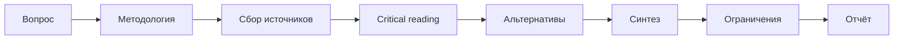

import { Aside } from '@astrojs/starlight/components';

Workflow для исследования с верифицированными и воспроизводимыми источниками. Решает проблему AI галлюцинаций и фейковых источников через обязательную проверку URL и требование альтернативных точек зрения.

## Запуск

```bash
mcp__moira__start({ workflowId: "moira/verified-research", parentExecutionId: "none" })
```

## Процесс



## Шаги

| Шаг | Действие | Результат |
|-----|----------|-----------|
| 1. Вопрос | Формулировка research question, критерии успеха, scope | Чёткий исследовательский вопрос |
| 2. Методология | Типы источников, период, keywords, критерии качества | Методология исследования |
| 3. Сбор | Сбор источников с верификацией URL | Верифицированный список источников |
| 4. Чтение | Critical reading с цитатами, findings, методологией | Анализ источников |
| 5. Альтернативы | Поиск противоположных viewpoints (мин. 2) | Контраргументы |
| 6. Синтез | Синтез findings, связь выводов с источниками | Evidence-based синтез |
| 7. Ограничения | Документирование gaps, biases, ограничений методологии | Явные ограничения |
| 8. Отчёт | Финальный research report с verified sources | Полный отчёт |

## Особенности

<Aside type="caution">
Каждый URL должен быть проверен и работать. Выдуманные источники недопустимы.
</Aside>

### Verified Sources

| Требование | Описание |
|------------|----------|
| Верификация URL | Каждый URL должен быть доступен |
| Метаданные | Title, author, date, type обязательны |
| Без выдумок | Источники должны существовать и быть проверяемы |

### Обязательные альтернативы

- Минимум 2 противоположных мнения
- Защита от confirmation bias
- Документирование controversies в области

### Требования к цитированию

| Элемент | Формат |
|---------|--------|
| Прямые цитаты | В кавычках со ссылкой на источник |
| Выводы | Привязаны к конкретному источнику [1], [2], [3] |
| Библиография | Нумерованный список в конце |

### Явные ограничения

- **Gaps**: Какие темы не покрыты
- **Source biases**: Потенциальные biases в источниках
- **Methodology biases**: Ограничения подхода к исследованию
- **Future research**: Рекомендации для дальнейшего изучения

## Пример конфигурации ноды

```json
{
  "id": "gather-sources",
  "type": "agent-directive",
  "directive": "Собери источники по критериям методологии. Проверь доступность каждого URL. Запиши title, author, date и type.",
  "completionCondition": "Минимум 5 верифицированных источников с полными метаданными",
  "connections": {
    "next": "critical-reading"
  }
}
```

## Отличие от Iterative Research

| Workflow | Фокус |
|----------|-------|
| `moira/verified-research` | Линейный 8-шаговый, верификация источников, anti-hallucination |
| `moira/iterative-research` | Итеративный с critique/improve циклом, quality gates |

Используй `verified-research` когда важны воспроизводимость и verified sources.

## Связанное

- [Iterative Research](/ru/docs/reference/workflows/iterative-research/) — Для исследования с циклами улучшения качества
- [Content Creation](/ru/docs/reference/workflows/content-creation/) — Для создания контента на основе исследования
- [Data Analysis](/ru/docs/reference/workflows/data-analysis/) — Для data-driven исследований
- [Обзор шаблонов](/ru/docs/reference/workflow-templates/) — Все доступные шаблоны
