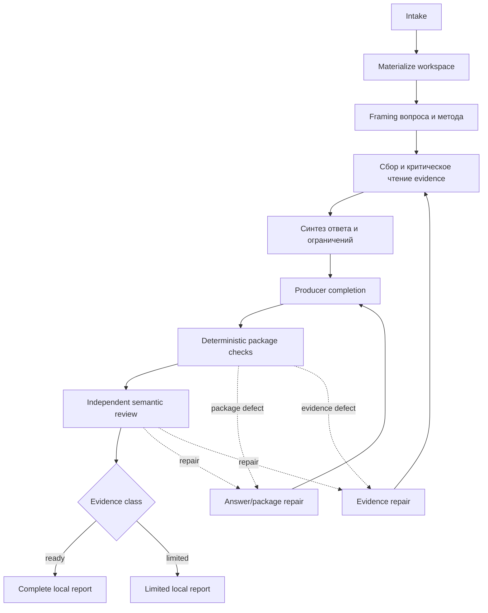

import { Aside } from '@astrojs/starlight/components';

Verified Research отвечает на один конкретный вопрос с помощью пропорционального набора внешних источников и создаёт один долговечный локальный отчёт. Workflow фиксирует, что подтверждают источники, что является выводом, где свидетельства расходятся и какие ограничения могут изменить ответ. Открытие URL или вызов поискового инструмента не считается доказательством качества источника: независимый reviewer читает и evidence, и ответ.

## Запуск

```bash
mcp__moira__start({ workflowId: "moira/verified-research", parentExecutionId: "none" })
```

Workflow переиспользует явно заданный operating mode. В режиме `autonomous` пропускаются только ожидания пользователя; существенная неоднозначность становится blocked prerequisite, а не выдуманным вопросом. В режиме `interactive` workflow может запросить одно необходимое уточнение, а затем предложить принять результат, выбрать ограниченную доработку или прервать запуск.

## Что создаётся

В execution-correlated workspace хранится канонический пакет:

- framing вопроса и метод работы с evidence;
- source register с разрешимыми ссылками, оценкой авторитетности и применимости, а также релевантными датами публикации и получения;
- критические readings и значимые альтернативные позиции;
- ограниченный ответ, разделяющий sourced facts и цитаты, расчёты, inference, assumptions, разногласия, неопределённость и gaps;
- явные ограничения;
- наблюдения deterministic validation;
- findings независимого semantic review;
- findings corrected-contract review и repair notes, когда эти маршруты применялись;
- `final-report.md`.

Финальный результат содержит только путь к локальному отчёту, краткие summaries ответа и ограничений и честный terminal status. Подробные источники и findings остаются в workspace, а не копируются через workflow context.

## Процесс


```mermaid
flowchart TD
    A[Intake] --> B[Materialize workspace]
    B --> C[Framing вопроса и метода]
    C --> D[Сбор и критическое чтение evidence]
    D --> E[Синтез ответа и ограничений]
    E --> F[Producer completion]
    F --> G[Deterministic package checks]
    G --> H[Independent semantic review]
    H --> I{Evidence class}
    I -->|ready| J[Complete local report]
    I -->|limited| K[Limited local report]
    G -. package defect .-> L[Answer/package repair]
    G -. evidence defect .-> M[Evidence repair]
    H -. repair .-> L
    H -. repair .-> M
    L --> F
    M --> D
```

Repair возвращается через все gates, доказательства которых могли устареть. Ошибочный или недоказуемый критерий поступает в contract reassessment и independent corrected-contract review; retry limit не может превратить blocker в success.

## Семантика evidence и результата

`evidence_status` — единственная классификация исследования:

| Статус | Значение |
| --- | --- |
| `ready` | Текущие evidence поддерживают полный независимо проверенный ответ. |
| `limited` | Оставшиеся evidence поддерживают полезный проверенный ответ только с явными ограничениями и их влиянием на решение. |
| `replan` | Интерпретация, критерий или evidence method ошибочны и требуют reassessment. |
| `blocked` | Необходимый prerequisite или настоящий independent review недоступны. |

Та же наблюдавшаяся независимым reviewer классификация управляет финальным complete- или limited-маршрутом. Дублирующие и способные противоречить друг другу статусы не используются.

<Aside type="caution">
Рабочий URL необходим, но не доказывает авторитетность, актуальность, независимость, применимость источника или поддержку конкретного утверждения. Эти свойства требуют прямого чтения и semantic judgment.
</Aside>

## Граница полномочий

Результат остаётся локальным. Verified Research не загружает artifact, не отправляет уведомления, не коммитит код, не выполняет deploy и не изменяет production. Для внешней публикации или доставки запускайте отдельную явно авторизованную задачу.

## Выбор research workflow

| Потребность | Workflow |
| --- | --- |
| Один ограниченный вопрос и один независимо проверенный source-linked ответ | `moira/verified-research` |
| Повторяющиеся filesystem-first critique и improvement | `moira/iterative-research` |
| Адаптивная работа через filesystem или memory и явные source/privacy authority | `moira/universal-research-workflow` |
| Отдельно авторизованная исчерпывающая работа с большим корпусом | Deep Corpus Research |
| Анализ уже переданных или разрешённых datasets | [Data Analysis](/ru/docs/reference/workflows/data-analysis/) |

## Связанные страницы

- [Iterative Research](/ru/docs/reference/workflows/iterative-research/)
- [Universal Research Workflow](/ru/docs/reference/workflows/universal-research-workflow/)
- [Data Analysis](/ru/docs/reference/workflows/data-analysis/)
- [Обзор шаблонов](/ru/docs/reference/workflow-templates/)
