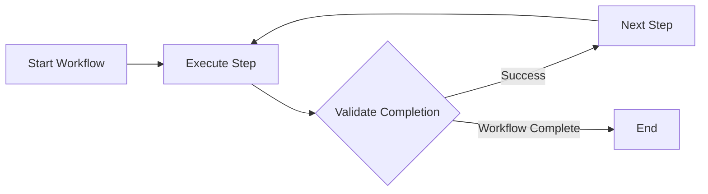

Moira is an Agent Workflow Engine designed specifically for AI agents. It guides agents through multi-step processes using structured workflows with clear directives and success criteria.

## The Problem

AI agents are powerful but need structure. Without guidance, they can:

- Lose focus on complex multi-step tasks
- Skip important steps or prerequisites
- Produce inconsistent results
- Miss quality checks and validation

:::caution
Even the most capable AI agents benefit from structured workflows. Moira ensures consistent
execution and verifiable results.
:::

## The Solution

Moira provides a node-graph workflow system where each step has:

### Directive

Clear instruction on what needs to be done

### Completion Condition

Success criteria that must be met

### Input Schema

Expected structure of the response (optional)

### Connections

Links to next steps in the workflow

The agent executes each step, validates completion, and moves to the next node based on the workflow graph.

## How It Works



### Execution Flow

1. Agent starts a workflow via MCP tool
2. Receives current step directive and completion condition
3. Executes the directive
4. Returns result via `step()` tool
5. Engine validates and advances to next step
6. Repeat until workflow completes

:::tip
The workflow state persists on the server. If a session is interrupted, the agent can resume from
the exact same step using the process ID.
:::

## Key Concepts

### Workflows

A workflow is a directed graph of nodes. Each node represents a step in the process. Nodes can branch conditionally, loop, or delegate to subgraphs.

```json
{
  "id": "my-workflow",
  "metadata": {
    "name": "My Workflow",
    "version": "1.0.0",
    "description": "Example workflow"
  },
  "nodes": [
    { "id": "start", "type": "start", "connections": { "default": "task-1" } },
    {
      "id": "task-1",
      "type": "agent-directive",
      "directive": "...",
      "connections": { "success": "end" }
    },
    { "id": "end", "type": "end" }
  ]
}
```

### Node Types

Common node types are shown below. This table is representative, not exhaustive; see
[Nodes](/docs/concepts/nodes/) for every supported type and its current contract.

| Type                    | Purpose                                                |
| ----------------------- | ------------------------------------------------------ |
| `start`                 | Entry point for workflow execution                     |
| `end`                   | Terminal node marking completion                       |
| `agent-directive`       | Task for agent with directive and completion condition |
| `condition`             | Branch execution based on structured conditions        |
| `expression`            | Compute values using arithmetic expressions            |
| `subgraph`              | Delegate to another workflow                           |
| `telegram-notification` | Send notifications via Telegram                        |

### Templates

Templates allow dynamic content in directives and conditions using `{{variable}}` syntax:

```json
{
  "directive": "Analyze {{projectName}} and create {{reportType}} report"
}
```

Variables can reference:

- Initial data from start node
- Results from previous steps
- Workflow parameters

### Executions

An execution is a running instance of a workflow. It maintains:

- **Current position** - Which node is active
- **Context** - Variables and step results
- **History** - Completed steps and outcomes

## MCP Integration

Moira connects to AI agents via [Model Context Protocol](https://modelcontextprotocol.io/). The MCP server provides tools for:

| Tool      | Purpose                              |
| --------- | ------------------------------------ |
| `list`    | Browse available workflows           |
| `start`   | Begin workflow execution             |
| `step`    | Execute current step and advance     |
| `manage`  | Create, edit, and retrieve workflows |
| `session` | Get user info and active executions  |

:::note
MCP is an open protocol. Moira works with any MCP-compatible client: Claude Code, Cursor, and
others.
:::

## Self-host or Cloud

Moira is open source (Apache-2.0). The engine, node types, and MCP tools are identical whether you host it yourself or use the managed cloud:

### Self-host

Run the full engine, Web UI, and MCP server in a single Docker container on your own
infrastructure — free, single-tenant, your data stays with you. Private-team accounts register
behind administrator approval. This is the default (`DEPLOYMENT_MODE=self-host`). See the
[Self-hosting guide](/docs/getting-started/self-hosting/).

### Moira Cloud

A managed instance with nothing to operate, at [moira-mcp.com](https://moira-mcp.com). Adds
SaaS-only social login, legal-consent and email-verification policy, and the broader multi-user
administration surface.

:::note
Self-host opens registration behind administrator approval. SaaS-only email verification,
legal-consent, and social-login behavior remains off by default. See
[Self-hosting](/docs/getting-started/self-hosting/) for the deployment-mode details.
:::

## Next Steps

- [Quick Start](/docs/getting-started/quickstart/) - Connect Moira to your AI client
- [Workflows](/docs/concepts/workflows/) - Deep dive into workflow structure
- [Nodes](/docs/concepts/nodes/) - Understanding node types
