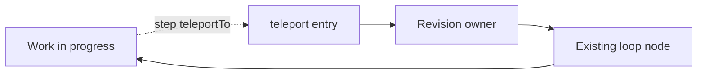

A workflow often carries a contract for its own process: a plan it will execute, a checklist it will
walk, a corpus it will study, the criteria it will accept. Reality argues with that contract halfway
through — an item turns out obsolete, a requirement appears that invalidates the agreed approach, an
executed step makes the remaining work wrong. This pattern gives the executing agent a legitimate way
to change the contract from inside the run, at the moment it sees the problem, instead of finishing a
process it already knows is wrong. Changing a plan is the best-known case, not the whole pattern.

## Structure



The three parts are an entry, an owner, and a re-entry.

## 1. The entry is a teleport

A `teleport` node has no ordinary incoming connections, so no route walks into it: an agent reaches
it only with `step({ processId, teleportTo: "..." })`. Its `hint` is appended to every step of the
run, which makes the hint the place to state both when the jump is legitimate and when it is abuse.
The abuse boundary is the important half — a failing check, a flaky test, an unwelcome review
finding or a task that is merely hard belong to their repair owners, not to a process change.

```json
{
  "id": "teleport-revise-tasks",
  "type": "teleport",
  "hint": "Jump here when the checklist itself no longer describes the work that must happen: remaining tasks turned out wrong, obsolete, missing, or in the wrong order. Not for a task that is merely hard, blocked, or failing — report that blocker to the user and stay on the task.",
  "directive": "You jumped here because the checklist no longer matches the work that must happen. Return the complete corrected checklist and the position to continue from.",
  "completionCondition": "The complete corrected checklist preserves already executed tasks in their original positions, and the position to continue from is returned",
  "inputSchema": {
    "type": "object",
    "additionalProperties": false,
    "properties": {},
    "required": ["tasks", "resume_from_task"],
    "globalInputs": ["tasks", "resume_from_task"]
  },
  "connections": { "success": "derive-revised-plan-state" }
}
```

## 2. The owner re-collects the contract as typed globals

The revision is submitted as declared registry globals, so the engine validates the new state against
the same schema that guarded the original. Because a teleport carries its own directive and validated
`inputSchema`, the owner is the teleport itself when the revision is a single typed submission — the
example above, from `moira/todo-list`. When the revision is substantive work with its own artifact,
the owner is the node the teleport lands on, and the teleport only justifies the change. That is the
shape in `moira/quick-task`, where `teleport-replan` states why the approved plan no longer fits and
lands on the existing `revise-plan`, which publishes the next immutable plan iteration.

:::caution
Do not pass `input` when jumping. The teleport presents its own directive once the jump lands, and
the execution context is preserved across it.
:::

## 3. The re-entry is an existing node

After the revision, control returns to a node the flow already has — its cursor check, its
independent review — not to a private copy of that logic. One revision contract then serves every
route that needs it. In `moira/todo-list` the derivation continues into the existing
`check-tasks-remaining`; in `moira/quick-task` the republished plan re-enters `plan-review` and, in
interactive mode, the user's approval, so a revised plan is never executed unreviewed.

## Two invariants

**Derived state is recomputed by the engine, never supplied beside its source.** If the agent
returns both a new list and its length, the two can disagree and nothing notices. Let the agent
return the source of truth and let an `expression` node derive the rest:

```json
{
  "id": "derive-revised-plan-state",
  "type": "expression",
  "expressions": ["total_tasks = tasks.length", "current_task = resume_from_task"],
  "connections": { "default": "check-tasks-remaining" }
}
```

**Completed work survives and the resume position is explicit.** A revision must say what happens to
progress, or the run either repeats finished work or loses its place. Where position is identity — a
numbered checklist, an ordered plan — the revision keeps completed items in their original positions
and returns the position to continue from, and the engine validates that position against the bounds
declared in `variableRegistry`.

## Why not an API that sets variables directly

A call that writes any execution variable looks universal and costs three guarantees at once: it
bypasses the registry and the node schema, which are the only places state is validated; it erases
the authority boundary, because the same call that fixes a task list can raise a commit-authority
flag or switch the operating mode; and it detaches a state change from any node transition, so the
execution history stops explaining why the run behaves as it does. Everything legitimate is
expressible as a teleport plus an owner, and that form keeps validation, authority, and the audit
trail intact.

## When a workflow needs this

A workflow needs the pattern when it carries a contract for its own process that the agent can
discover to be wrong while executing it. A workflow whose only state is the current step does not.

## Related

- [Replan Pattern](/docs/patterns/replan/) - the plan-shaped case with its concrete routes
- [Operating Mode](/docs/patterns/operating-mode/) - what a revision must still pass through in each mode
- [Validation Loop](/docs/patterns/validation-loop/) - the ordinary review a revision re-enters
- [Anti-Patterns](/docs/patterns/anti-patterns/) - state and machinery a revision must not add
