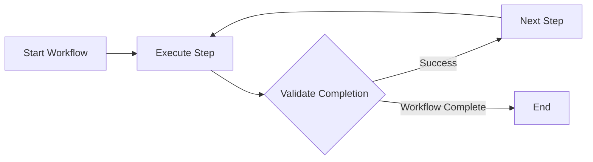

Moira keeps an AI agent on track. It gives the agent one clear step at a time and checks each
result before the agent may move on, so a multi-step task is done completely and in order. The
steps come from a **flow** (a workflow): a process written once and run the same way every time.

## You do not have to build flows

Moira is an agent-first tool. You work with your agent the way you always do: describe the task in
plain words. The agent does the rest:

1. **It picks a ready flow** when one fits — for example Quick Task, Robust Task or Todo List for a
   clear task without special logic, or Software Development Flow for a change to a code
   repository.
2. **Or it builds a new flow for your task** through the Workflow Management Flow, Moira's own flow
   for creating and editing flows. A flow can be as simple as a few steps in a row or as complex as
   a process with reviews and repair loops; the agent works out the structure the task needs.

Everything else — the diagrams in the web app, variables, node types, editing a flow by hand — is
optional. It is there for when you want to look inside a flow, not something you must learn first.

## A gradual path

Start at the top and stop wherever you have what you need:

1. [Quick Start](/docs/getting-started/quickstart/) — connect Moira to your AI client and run a
   first flow.
2. [Tutorial: your first flows](/docs/getting-started/tutorial/) — three tiny learning flows: plain
   steps, one choice, several paths. They show how Moira runs a flow, one idea at a time.
3. [Which ready flow to use](/docs/getting-started/ready-flows/) — Quick Task, Robust Task and Todo
   List for everyday tasks, and when to ask your agent for a new flow instead.
4. [Concepts](/docs/concepts/workflows/) and [Patterns](/docs/patterns/) — how flows are built,
   for when you want to read or shape one yourself.

## What goes wrong without structure

AI agents are powerful, but on a long task they can:

- Lose focus on complex multi-step tasks
- Skip important steps or prerequisites
- Produce inconsistent results
- Miss quality checks and validation

A flow gives each step:

- a **directive** — what to do;
- a **completion condition** — when it counts as done;
- an **input schema** — the evidence the agent must return (optional);
- **connections** — where the process goes next, including a choice by the agent's answer.

The agent executes each step, returns its evidence, and Moira validates it and moves to the next
step of the flow.

## How It Works

The rest of this page is for the curious, and for agents that execute flows.



### Execution Flow

1. Agent starts a workflow via MCP tool
2. Receives current step directive and completion condition
3. Executes the directive
4. Returns result via `step()` tool
5. Engine validates and advances to next step
6. Repeat until workflow completes

:::tip
The workflow state persists on the server. If a session is interrupted, the agent can resume from
the exact same step using the process ID.
:::

## Key Concepts

### Workflows

A workflow is a directed graph of nodes. Each node represents a step in the process. Nodes can branch conditionally, loop, or delegate to subgraphs.

```json
{
  "id": "my-workflow",
  "metadata": {
    "name": "My Workflow",
    "version": "1.0.0",
    "description": "Example workflow"
  },
  "nodes": [
    { "id": "start", "type": "start", "connections": { "default": "task-1" } },
    {
      "id": "task-1",
      "type": "agent-directive",
      "directive": "...",
      "connections": { "success": "end" }
    },
    { "id": "end", "type": "end" }
  ]
}
```

### Node Types

Common node types are shown below. This table is representative, not exhaustive; see
[Nodes](/docs/concepts/nodes/) for every supported type and its current contract.

| Type                | Purpose                                                |
| ------------------- | ------------------------------------------------------ |
| `start`             | Entry point for workflow execution                     |
| `end`               | Terminal node marking completion                       |
| `agent-directive`   | Task for agent with directive and completion condition |
| `condition`         | Branch execution to one of several outputs by cases    |
| `expression`        | Compute values using arithmetic expressions            |
| `subgraph`          | Delegate to another workflow                           |
| `user-notification` | Notify through the current user's configured channels  |

### Templates

Templates allow dynamic content in directives and conditions using `{{variable}}` syntax:

```json
{
  "directive": "Analyze {{projectName}} and create {{reportType}} report"
}
```

Variables can reference:

- Initial data from start node
- Results from previous steps
- Workflow parameters

### Executions

An execution is a running instance of a workflow. It maintains:

- **Current position** - Which node is active
- **Context** - Variables and step results
- **History** - Completed steps and outcomes

## MCP Integration

Moira connects to AI agents via [Model Context Protocol](https://modelcontextprotocol.io/). The MCP server provides tools for:

| Tool      | Purpose                              |
| --------- | ------------------------------------ |
| `list`    | Browse available workflows           |
| `start`   | Prepare or execute a workflow start  |
| `step`    | Execute current step and advance     |
| `manage`  | Create, edit, and retrieve workflows |
| `session` | Get user info and active executions  |

:::note
MCP is an open protocol. Moira works with any MCP-compatible client: Claude Code, Cursor, and
others.
:::

## Self-host or Cloud

Moira is open source (Apache-2.0). The engine, node types, and MCP tools are identical whether you host it yourself or use the managed cloud:

### Self-host

Run the full engine, Web UI, and MCP server in a single Docker container on your own
infrastructure — free, single-tenant, your data stays with you. Private-team accounts register
behind administrator approval. This is the default (`DEPLOYMENT_MODE=self-host`). See the
[Self-hosting guide](/docs/getting-started/self-hosting/).

### Moira Cloud

A managed instance with nothing to operate, at [moira-mcp.com](https://moira-mcp.com). Adds
SaaS-only social login, legal-consent and email-verification policy, and the broader multi-user
administration surface.

:::note
Self-host opens registration behind administrator approval. SaaS-only email verification,
legal-consent, and social-login behavior remains off by default. See
[Self-hosting](/docs/getting-started/self-hosting/) for the deployment-mode details.
:::

## Next Steps

- [Quick Start](/docs/getting-started/quickstart/) - Connect Moira to your AI client
- [Tutorial: your first flows](/docs/getting-started/tutorial/) - Three tiny learning flows
- [Which ready flow to use](/docs/getting-started/ready-flows/) - Everyday tasks without building a flow
- [Workflows](/docs/concepts/workflows/) - Deep dive into workflow structure
