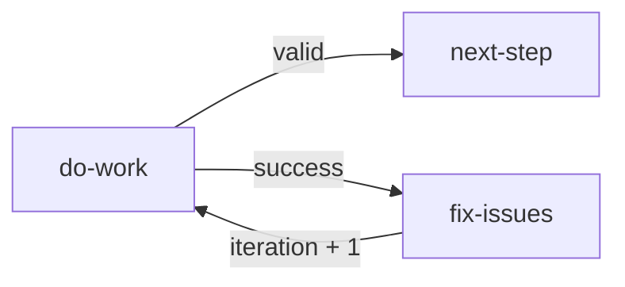
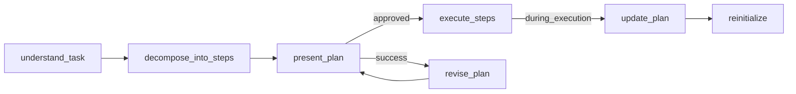
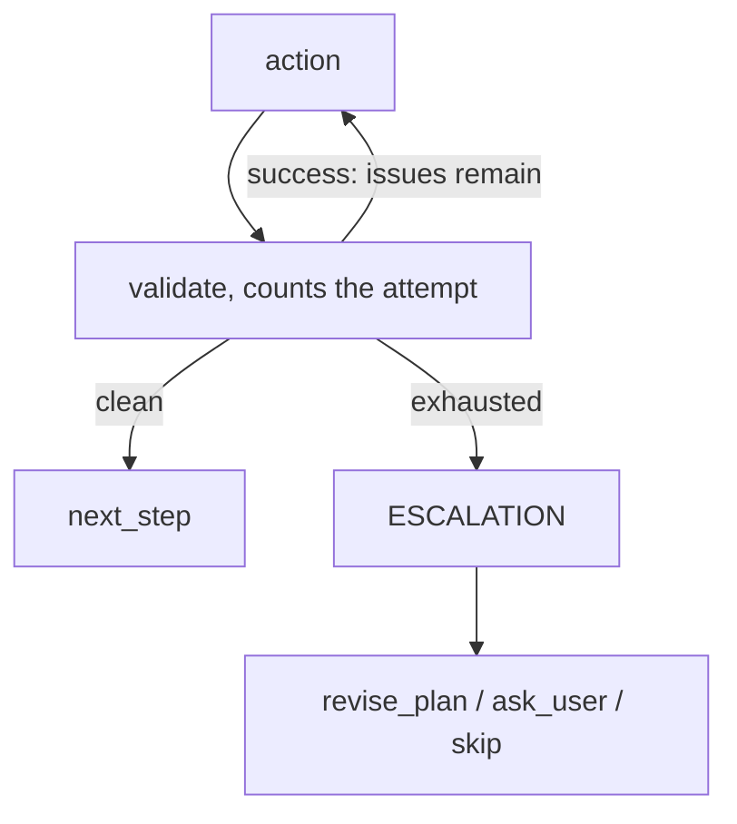
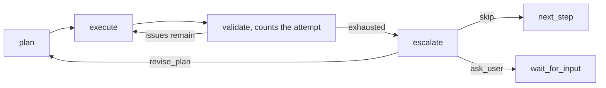

This guide covers workflow creation from scratch, including common patterns, validation loops, and best practices.

## Quick Start

1. Define the workflow goal and main stages 2. Design the node graph structure 3. Create JSON with
   proper node definitions 4. Validate connections and reachability 5. Save via MCP tools

## Workflow Structure

Every workflow needs:

```json
{
  "id": "my-workflow",
  "metadata": {
    "name": "Human Readable Name",
    "version": "1.0.0",
    "description": "What this workflow does"
  },
  "nodes": [
    // start node (exactly one)
    // action nodes — the node that has the evidence carries the cases that route it
    // condition nodes — for a decision several nodes share, or one that stands on its own
    // end node (at least one)
  ]
}
```

## Common Patterns

### Validation Loop

Use when you need to verify results and retry on failure. The node that produced the result reports
whether it holds and routes on that answer; the fix node counts the attempt on its way back:



```json
{
  "id": "do-work",
  "type": "agent-directive",
  "directive": "Complete the task",
  "completionCondition": "Task completed",
  "inputSchema": {
    "type": "object",
    "properties": {
      "result_valid": { "type": "string", "enum": ["yes", "no"] }
    },
    "required": ["result_valid"]
  },
  "cases": [
    {
      "when": {
        "operator": "eq",
        "left": { "contextPath": "do-work.result_valid" },
        "right": "yes"
      },
      "output": "valid"
    }
  ],
  "connections": {
    "success": "fix-issues",
    "valid": "next-step"
  }
},
{
  "id": "fix-issues",
  "type": "agent-directive",
  "directive": "Fix the issues found",
  "completionCondition": "Every issue reported by the previous attempt is fixed",
  "expressions": ["iteration = iteration + 1"],
  "connections": { "success": "do-work" }
}
```

`iteration` is declared in the workflow `variableRegistry`, because an expression may only assign a
declared global. Counting the attempt needs nothing else: a node whose whole job is `iteration + 1`
is one more hop for the reader and one more place to forget.

:::tip
Separate responsibilities: action nodes DO the work and report their own verdict, fix nodes ONLY
repair. Keep the iteration counter on a node the loop already passes through, and route on it to
prevent infinite loops.
:::

### Branching by Action Type

Use when the workflow has different paths for different scenarios. The answer that selects the
branch is the one this step just produced, so the case belongs on the step itself:

```json
{
  "id": "get-action",
  "type": "agent-directive",
  "directive": "Ask user: create new or edit existing?",
  "completionCondition": "The user stated create or edit",
  "inputSchema": {
    "type": "object",
    "properties": {
      "action": { "type": "string", "enum": ["create", "edit"] }
    },
    "required": ["action"]
  },
  "cases": [
    {
      "when": {
        "operator": "eq",
        "left": { "contextPath": "get-action.action" },
        "right": "create"
      },
      "output": "create"
    }
  ],
  "connections": {
    "success": "edit-branch",
    "create": "create-branch"
  }
}
```

The cases are evaluated against the context after the node's answer has been merged, so the answer
is readable by bare name when it is a declared global (`{{action}}`) and as `<node-id>.field` when
it is a node-local output (`get-action.action`). `success` is the fallback: a run whose answer
matches no case takes the edit branch.

**Decide on the node that has the evidence.** Every extra node is a hop the reader must follow and
another place where the decision and the evidence can drift apart — a graph that decides where it
knows is shorter to read and cannot route on a stale copy. The same holds for a single-purpose
arithmetic step: a counter or a derived total is an `expressions` entry on the node that already
runs there rather than a node of its own.

Keep a separate `condition` or `expression` node when it reads better alone — when several producers
share one decision, when the condition reads state no single node produced, when a named decision
point helps the reader of the process view, or when the computation deserves its own place in the
route. Written that way, the same branch is two nodes: `get-action` keeps only
`"connections": { "success": "route-action" }`, and the decision moves to its own node.

```json
{
  "id": "route-action",
  "type": "condition",
  "cases": [
    {
      "when": {
        "operator": "eq",
        "left": { "contextPath": "get-action.action" },
        "right": "create"
      },
      "output": "create"
    }
  ],
  "connections": {
    "create": "create-branch",
    "default": "edit-branch"
  }
}
```

A `condition` or `expression` node whose only job is to route or count what the preceding node
already knows is avoidable routing scaffolding — fold it into that node.

### User Approval Gate

Use for critical actions that need confirmation. The node that asks holds the answer, so it also
routes on it — and a run that was not approved falls through `success` to the revision:

```json
{
  "id": "show-plan",
  "type": "agent-directive",
  "directive": "Present plan to user and ask for approval",
  "completionCondition": "The user answered yes or no",
  "inputSchema": {
    "type": "object",
    "properties": {
      "approved": { "type": "string", "enum": ["yes", "no"] },
      "feedback": { "type": "string" }
    },
    "required": ["approved"]
  },
  "cases": [
    {
      "when": {
        "operator": "eq",
        "left": { "contextPath": "show-plan.approved" },
        "right": "yes"
      },
      "output": "approved"
    }
  ],
  "connections": {
    "success": "revise-plan",
    "approved": "proceed"
  }
}
```

## Input Schema Patterns

### Yes/No Response

```json
{
  "inputSchema": {
    "type": "object",
    "properties": {
      "result": { "type": "string", "enum": ["yes", "no"] },
      "details": { "type": "string" }
    },
    "required": ["result"]
  }
}
```

### Numeric Count

```json
{
  "inputSchema": {
    "type": "object",
    "properties": {
      "count": { "type": "number", "minimum": 0 },
      "total": { "type": "number", "minimum": 1 }
    },
    "required": ["count", "total"]
  }
}
```

### Array of Items

```json
{
  "inputSchema": {
    "type": "object",
    "properties": {
      "items": {
        "type": "array",
        "items": { "type": "string" },
        "minItems": 1
      }
    },
    "required": ["items"]
  }
}
```

### Enum Choice (Multiple Options)

```json
{
  "inputSchema": {
    "type": "object",
    "properties": {
      "action": {
        "type": "string",
        "enum": ["create", "edit", "delete", "cancel"]
      },
      "reason": { "type": "string" }
    },
    "required": ["action"]
  }
}
```

### File Path with Pattern

```json
{
  "inputSchema": {
    "type": "object",
    "properties": {
      "file_path": {
        "type": "string",
        "pattern": "^[a-zA-Z0-9/_.-]+\\.(json|yaml|yml)$"
      }
    },
    "required": ["file_path"]
  }
}
```

## Condition Operators

A condition node's `cases` each pair one of these condition objects with the connection key it
selects.

| Operator   | Description         | Example                        |
| ---------- | ------------------- | ------------------------------ |
| `eq`       | Equal               | `"right": "value"`             |
| `neq`      | Not equal           | `"right": "value"`             |
| `lt`       | Less than           | `"right": 10`                  |
| `gt`       | Greater than        | `"right": 0`                   |
| `lte`      | Less or equal       | `"right": 100`                 |
| `gte`      | Greater or equal    | `"right": 1`                   |
| `contains` | String/array member | `"right": "urgent"`            |
| `and`      | Logical AND         | `"conditions": [...]`          |
| `or`       | Logical OR          | `"conditions": [...]`          |
| `not`      | Negation            | `"condition": {...}`           |
| `exists`   | Variable exists     | `"value": { "contextPath": …}` |

### Complex Condition Example

```json
{
  "id": "check-ready",
  "type": "condition",
  "cases": [
    {
      "when": {
        "operator": "and",
        "conditions": [
          {
            "operator": "eq",
            "left": { "contextPath": "status" },
            "right": "ready"
          },
          {
            "operator": "gt",
            "left": { "contextPath": "count" },
            "right": 0
          }
        ]
      },
      "output": "ready"
    }
  ],
  "connections": {
    "ready": "process-items",
    "default": "wait"
  }
}
```

## Declaring Knowledge as Globals

Declare reusable knowledge as global variables in the workflow `variableRegistry` with a `default` value:

```json
{
  "variableRegistry": {
    "quality_rules": {
      "type": "string",
      "description": "Reusable quality rules the agent applies across steps",
      "default": "Rule 1: ... Rule 2: ..."
    },
    "validation_checklist": {
      "type": "string",
      "description": "Checklist the agent verifies before completing a step",
      "default": "Check 1: ... Check 2: ..."
    }
  }
}
```

Reference in directives:

```json
{
  "directive": "Follow these rules: {{quality_rules}}"
}
```

:::tip
This makes workflows self-documenting. All knowledge is embedded, no external docs needed.
:::

## Validation Checklist

Before saving, verify:

1. **Structure**
   - Exactly one start node
   - At least one end node
   - All node IDs unique
   - All connections point to existing nodes

2. **Reachability**
   - All nodes reachable from start
   - No orphan nodes
   - All paths lead to end

3. **Node Definitions**
   - `directive` not empty
   - `completionCondition` defined
   - `connections.success` specified — it is the output a directive takes when no case holds
   - `inputSchema` is valid JSON Schema
   - A directive's `cases` and `expressions` obey the rules below: each case names a connection key
     that is not `success`, `error` or `timeout`, and each expression assigns a declared global

4. **Routing**
   - A `condition` node has at least one case and a `connections.default`
   - Every case names a key of `connections`, and never `error` or `timeout`
   - Every authored output is named by a case — the default output and the control outputs
     `error`/`timeout` need none
   - Operator is valid
   - Each expression assigns a variable declared in `variableRegistry`

## Saving Workflows

### Create New

```typescript
mcp__moira__manage({
  action: "create",
  workflow: {
    id: "my-workflow",
    metadata: { name: "...", version: "1.0.0", description: "..." },
    nodes: [...]
  }
})
```

### Edit Existing

```typescript
mcp__moira__manage({
  action: "edit",
  workflowId: "my-workflow",
  changes: {
    metadata: { version: "1.1.0" },
    updateNodes: [{ nodeId: "step-1", changes: { directive: "New text" } }],
  },
});
```

### File Upload

```typescript
// For agents with file system access
const { uploadUrl } = await mcp__moira__token({ action: "upload" });
// Upload JSON file to uploadUrl
```

## Agent Capabilities Detection

Different agents have different capabilities. Design workflows to detect and adapt:

### Capability Categories

| Capability  | Examples                  | Detection Method             |
| ----------- | ------------------------- | ---------------------------- |
| File System | Read, Write, Create files | Ask agent to confirm access  |
| Web Access  | Fetch URLs, Search        | Check if agent has web tools |
| MCP Only    | Moira tools only          | Default assumption           |

### Detection Pattern

```json
{
  "id": "detect-capabilities",
  "type": "agent-directive",
  "directive": "Report your capabilities: can you access the file system? can you fetch URLs?",
  "inputSchema": {
    "type": "object",
    "properties": {
      "has_file_access": { "type": "boolean" },
      "has_web_access": { "type": "boolean" }
    },
    "required": ["has_file_access", "has_web_access"]
  },
  "connections": { "success": "route-by-capabilities" }
}
```

### Conditional Branching

Capability routing is the case for a node of its own. Several steps reach the same decision — every
branch that needs a file or a URL asks the same question — so one named `route-by-capabilities` node
holds it once instead of repeating the same case on each node that arrives there, and the reader of
the process view sees where the flow splits:

```json
{
  "id": "route-by-capabilities",
  "type": "condition",
  "cases": [
    {
      "when": {
        "operator": "eq",
        "left": { "contextPath": "detect-capabilities.has_file_access" },
        "right": true
      },
      "output": "file-access"
    }
  ],
  "connections": {
    "file-access": "file-based-flow",
    "default": "mcp-only-flow"
  }
}
```

:::tip
Always provide fallback paths for agents with limited capabilities. MCP tools are always
available.
:::

## Planning Pattern

Use when workflow needs to create and execute a plan with user approval and revision capability.

### The Problem

Workflows often need a planning phase, but:

- Plans are created once and never revised
- Requirements for plan quality are not formalized
- No ability to adapt the plan during execution
- Agent loses context in long sessions

### Pattern Structure



### Key Components

1. **variableRegistry.plan_writing_requirements** — rules for writing plans (agent sees when creating)
2. **decompose_into_steps** — directive with `{{plan_writing_requirements}}` for plan creation
3. **user_approval_branch** — `present_plan` routes on the answer it collected: approved → execute,
   otherwise revise_plan → present_plan
4. **update_during_execution** — ability to adapt plan during execution

### Plan Writing Requirements

The main problem: agent loses context (session archival, simple forgetting). Plans must be written so any step can be given to an agent WITHOUT the rest of the plan — and it can execute.

| Requirement                 | Why Important                         | Example                                                                    |
| --------------------------- | ------------------------------------- | -------------------------------------------------------------------------- |
| Flat linear list            | Easier to track without hierarchy     | 1, 2, 3... not 1.1, 1.2, 1.2.1                                             |
| Self-sufficient steps       | Any step executable without context   | "Step 3: Create file X.ts with function Y" not "Continue work"             |
| Explicit actions            | Not "as usual", but specifically      | "Make commit" in every step where needed                                   |
| Measurable result           | Easy to verify completion             | "expected_output: file X.ts created and contains function Y"               |
| Independence                | Minimal dependencies between steps    | Step 4 shouldn't require knowledge of step 2 details                       |
| Full file paths             | Agent shouldn't guess                 | `/full/path/to/file.json`, not "in appropriate folder"                     |
| Redundancy where it applies | Repeat what this item genuinely needs | "Make commit" repeated in an item that ends in a commit, not in every item |

### Item Atomicity (S9)

Each plan or task item must be self-contained. An agent often receives ONE item's directive in isolation — without the rest of the plan — so the item must carry everything needed to execute it:

- Restate the nuances the item depends on.
- Repeat the relevant original requirement inside the item.
- Repeat a cross-cutting action (progress report, run tests, commit) in the items it genuinely applies to.

There is no shared or global scope across items, so an item that leans on "as above" is unexecutable. The answer is what the executor needs when it is alone, judged item by item — not unconditional duplication: repeated text becomes a second source of truth that drifts, and an item required to carry everything grows until it carries the deliverable itself. See [Redundancy Required in Every Plan Item](/docs/patterns/anti-patterns/).

```json
{
  "id": "execute-plan-item",
  "type": "agent-directive",
  "directive": "Execute one plan item.\n\nThe item text is self-contained: it states the original requirement, the files to read/modify with full paths, and the cross-cutting actions (run tests, make commit) that apply to THIS item.\n\nDo NOT assume any context from other items.",
  "completionCondition": "Item executed, tests run, and commit made as stated in the item",
  "connections": { "success": "next-item" }
}
```

:::tip
Two related patterns build on this guide: the [Replan Pattern](/docs/patterns/replan/) revises a
multi-step plan mid-execution, and the [Completeness Self-Review
Pattern](/docs/patterns/self-review/) verifies every requirement against the real artifact before
delivery.
:::

### Implementation Example

```json
{
  "variableRegistry": {
    "plan_writing_requirements": {
      "type": "string",
      "description": "Rules the agent follows when writing the plan",
      "default": "PLAN WRITING REQUIREMENTS:\n\n- Flat linear list — no hierarchy, no nested sub-items, just 1, 2, 3...\n- One item = one task — not micro-step ('download file'), but complete task ('update workflow to v2.1.0')\n- Full self-sufficiency — contains EVERYTHING for execution: why do it, what to do, which files to read/modify, where to save, what to commit\n- NO separate 'global rules' — everything needed for item must be IN the item\n- Explicit actions — not 'as usual', but specifically: 'upload to moira-local via token', 'make commit'\n- Redundancy allowed — better repeat 'make commit' in each item than forget\n- Full file paths — not 'in appropriate folder', but /full/path/to/file.json\n- Measurable result — easy to verify item completion"
    }
  },
  "nodes": [
    {
      "type": "start",
      "id": "start",
      "connections": { "default": "analyze-task" }
    },
    {
      "id": "decompose-into-steps",
      "type": "agent-directive",
      "directive": "Create a plan for task execution.\n\nFollow requirements: {{plan_writing_requirements}}\n\nFor each step provide:\n- What to do (action)\n- Expected output (measurable result)",
      "inputSchema": {
        "type": "object",
        "properties": {
          "steps": {
            "type": "array",
            "items": {
              "type": "object",
              "properties": {
                "action": { "type": "string" },
                "expected_output": { "type": "string" }
              },
              "required": ["action", "expected_output"]
            }
          }
        },
        "required": ["steps"]
      },
      "connections": { "success": "present-plan" }
    },
    {
      "id": "present-plan",
      "type": "agent-directive",
      "directive": "Present the plan and ask whether it is approved. `approved` records the user's own answer; without one there is nothing to record.",
      "inputSchema": {
        "type": "object",
        "properties": {
          "plan_approved": { "type": "string", "enum": ["yes", "no"] },
          "user_feedback": { "type": "string" }
        },
        "required": ["plan_approved"]
      },
      "cases": [
        {
          "when": {
            "operator": "eq",
            "left": { "contextPath": "present-plan.plan_approved" },
            "right": "yes"
          },
          "output": "approved"
        }
      ],
      "connections": {
        "success": "revise-plan",
        "approved": "execute-steps"
      }
    },
    {
      "id": "revise-plan",
      "type": "agent-directive",
      "directive": "User didn't approve plan. Feedback: {{present-plan.user_feedback}}\n\nRevise plan based on feedback.\nFollow: {{plan_writing_requirements}}",
      "connections": { "success": "present-plan" }
    }
  ]
}
```

### Showing the Plan as Progress

A plan or checklist kept in variables is invisible to whoever is watching the run unless the process
view is told where it lives. Bind the list on the block whose steps work through it: `list` names the
paths of the array (`items`), the title inside one item (`title`), the index in progress (`current`,
counted from `indexBase`), the finished count (`done`) and the total (`total`), and the run then
reports done/total and the item being worked on.

```json
{
  "id": "execute",
  "label": "Execute",
  "content": { "summary": "Work through the approved plan, one item at a time" },
  "list": {
    "items": "decompose-into-steps.steps",
    "title": "action",
    "current": "current_step_index",
    "total": "total_steps"
  }
}
```

At least one of `items`, `current` and `total` is required; `total` defaults to the length of
`items` and `done` to `current − indexBase`. See [Workflows](/docs/concepts/workflows/) for the
complete field reference.

### Update Plan During Execution

For long workflows, add ability to update plan mid-execution:

```json
{
  "id": "update-plan-during-execution",
  "type": "agent-directive",
  "directive": "Update plan during execution.\n\nCurrent step: {{current_step_index}}\nReason for update: {{update_reason}}\n\n1. Analyze current progress\n2. Update remaining steps (don't change completed ones)\n3. Save history to ./plan-changes-history.md\n\nFollow: {{plan_writing_requirements}}",
  "connections": { "success": "reinitialize-tracking" }
},
{
  "id": "reinitialize-tracking",
  "type": "agent-directive",
  "directive": "Reinitialize tracking after plan update.\n\n1. Update tracking.json with new total_steps\n2. Adjust current_step_index if needed\n3. Continue execution",
  "connections": { "success": "execute-current-step" }
}
```

:::tip
Store plan in a file (e.g., `./plan.md`) instead of context for large plans. This prevents context
overflow and enables recovery after session archival.
:::

## Escalation Pattern

Use when workflow has validation loops that can get stuck. Provides escape mechanism after repeated failures.

### The Problem

When agent is stuck in a validation loop:

- Retries forever without progress
- Same errors repeat
- No way to break out
- User waits indefinitely

### Pattern Structure



### When to Apply

- Workflows with planning (robust-task, development)
- Workflows with result validation (workflow-management, test-generation)
- Any "do → check → retry" cycles

### Escalation Options

| Option        | When to Use            | Example                            |
| ------------- | ---------------------- | ---------------------------------- |
| `revise_plan` | Current plan is flawed | Tests fail because design is wrong |
| `ask_user`    | Need human decision    | Unclear requirements               |
| `skip`        | Step is non-critical   | Optional enhancement               |

### Implementation Example

The step that checks the result owns the whole decision: it counts the attempt in `expressions`, and
its cases send a clean result forward, an exhausted budget to the escalation, and everything else
back for another attempt through `success`.

```json
{
  "id": "validate-step",
  "type": "agent-directive",
  "directive": "ONLY CHECK the result of the step. Count any issues found. Attempt {{step_retry}}.",
  "completionCondition": "Issue count reported",
  "inputSchema": {
    "type": "object",
    "properties": {
      "issues_count": { "type": "number", "minimum": 0 }
    },
    "required": ["issues_count"]
  },
  "expressions": ["step_retry = step_retry + 1"],
  "cases": [
    {
      "when": {
        "operator": "eq",
        "left": { "contextPath": "validate-step.issues_count" },
        "right": 0
      },
      "output": "clean"
    },
    {
      "when": { "operator": "gte", "left": { "contextPath": "step_retry" }, "right": 3 },
      "output": "exhausted"
    }
  ],
  "connections": {
    "success": "retry-action",
    "clean": "next-step",
    "exhausted": "notify-escalation"
  }
},
{
  "id": "notify-escalation",
  "type": "user-notification",
  "message": "⚠️ *Escalation Required*\n\nStep failed after {{step_retry}} attempts.\n\nOptions:\n- revise_plan\n- ask_user\n- skip",
  "format": "markdown",
  "connections": { "default": "ask-escalation-decision", "error": "ask-escalation-decision" }
},
{
  "id": "ask-escalation-decision",
  "type": "agent-directive",
  "directive": "Step failed after {{step_retry}} attempts.\n\nAsk user for decision:\n1. **revise_plan** — go back to planning and reconsider approach\n2. **ask_user** — request human help with specific problem\n3. **skip** — skip this step and continue\n\n`decision` records the user's own choice: each of the three routes elsewhere, so an assumed answer picks a route on their behalf.",
  "completionCondition": "The user chose one of the three options",
  "inputSchema": {
    "type": "object",
    "properties": {
      "escalation_decision": {
        "type": "string",
        "enum": ["revise_plan", "ask_user", "skip"]
      },
      "user_input": { "type": "string" }
    },
    "required": ["escalation_decision"]
  },
  "cases": [
    {
      "when": {
        "operator": "eq",
        "left": { "contextPath": "ask-escalation-decision.escalation_decision" },
        "right": "revise_plan"
      },
      "output": "revise"
    },
    {
      "when": {
        "operator": "eq",
        "left": { "contextPath": "ask-escalation-decision.escalation_decision" },
        "right": "skip"
      },
      "output": "skip"
    }
  ],
  "connections": {
    "success": "handle-user-help",
    "revise": "revise-plan",
    "skip": "mark-step-skipped"
  }
}
```

Three outcomes need no extra node either: two cases name the branches that leave the ordinary path,
and `success` carries the third. The enum guarantees there is no fourth.

### Combining with Planning Pattern

When using both Planning and Escalation patterns:



The `revise_plan` option loops back to the Planning phase, allowing the agent to reconsider the approach based on what it learned from failures.

:::tip
Set `max_retries` based on task complexity. Simple tasks: 2-3 retries. Complex tasks: 3-5 retries.
Always provide `skip` option for non-critical steps.
:::

## Production Patterns

Real patterns from production workflows (development-flow, 104 nodes).

### Express/Full Mode Branching

Route to simplified or full flow based on task complexity. The step that establishes the mode is the
step that routes on it:

```
[get-requirements] → express → [express-flow]
                   → success → [full-flow]
```

```json
{
  "id": "get-requirements",
  "type": "agent-directive",
  "directive": "Collect the requirements and decide whether this task fits the express mode.",
  "completionCondition": "Requirements collected and a mode chosen",
  "inputSchema": {
    "type": "object",
    "properties": {
      "development_mode": { "type": "string", "enum": ["express", "full"] }
    },
    "required": ["development_mode"]
  },
  "cases": [
    {
      "when": {
        "operator": "eq",
        "left": { "contextPath": "get-requirements.development_mode" },
        "right": "express"
      },
      "output": "express"
    }
  ],
  "connections": {
    "success": "analyze-and-plan",
    "express": "express-implementation"
  }
}
```

### Plan Refinement Loop

Present plan → get feedback → refine → confirm:

```
[present-plan] → approved → [continue]
               → success  → [refine] → [confirm] → [continue]
```

### Numeric Validation Pattern (Recommended)

:::caution
**Problem with boolean validation:** Agents tend to be optimistic. When asked "Is result valid?
yes/no", they may answer "yes" even when issues were found. This defeats the purpose of validation
loops.
:::

**Solution:** Use numeric issue count instead of boolean. The engine mechanically checks if count equals zero — no room for interpretation.

```json
{
  "id": "validate-result",
  "type": "agent-directive",
  "directive": "ONLY CHECK the result. Count any issues found.",
  "completionCondition": "Issue count reported",
  "inputSchema": {
    "type": "object",
    "properties": {
      "issues_count": {
        "type": "number",
        "minimum": 0,
        "description": "Number of issues found (0 = valid)"
      },
      "issues": {
        "type": "array",
        "items": { "type": "string" },
        "description": "List of issues if any"
      }
    },
    "required": ["issues_count"]
  },
  "cases": [
    {
      "when": {
        "operator": "eq",
        "left": { "contextPath": "validate-result.issues_count" },
        "right": 0
      },
      "output": "clean"
    }
  ],
  "connections": {
    "success": "fix-issues",
    "clean": "next-step"
  }
}
```

**Why this works:**

- Agent cannot lie about a count (number is objective)
- The case `issues_count == 0` is checked mechanically by the engine, on the node that produced the
  count
- No room for "almost ready" or "minor issues" interpretation

**When to use:** ALL validation loops should use this pattern. Replace existing `is_valid: enum["yes","no"]` with `issues_count: number`.

### Numeric Validation with Test Counts

Validate using numeric checks instead of yes/no:

```json
{
  "id": "run-tests",
  "type": "agent-directive",
  "directive": "Run tests and report results",
  "completionCondition": "Passed and failed counts reported from a real run",
  "inputSchema": {
    "type": "object",
    "properties": {
      "tests_passed": { "type": "number" },
      "tests_failed": { "type": "number" }
    },
    "required": ["tests_passed", "tests_failed"]
  },
  "cases": [
    {
      "when": {
        "operator": "eq",
        "left": { "contextPath": "run-tests.tests_failed" },
        "right": 0
      },
      "output": "all-passed"
    }
  ],
  "connections": {
    "success": "fix-tests",
    "all-passed": "continue"
  }
}
```

### User Notifications

Notifications keep users informed during long-running workflows. Use them strategically - too many notifications become noise.

#### When to Use Notifications

| Scenario                    | Why Notify                              |
| --------------------------- | --------------------------------------- |
| **Step start** (long tasks) | User sees progress, can plan their time |
| **User input required**     | User knows to check and respond         |
| **Critical errors**         | Immediate awareness of blockers         |
| **Task completion**         | User can review results                 |

#### When NOT to Use

- Short workflows (< 5 minutes total)
- Between every small step
- For internal validation loops
- When error is auto-recoverable

#### Pattern: Step Start Notification

For multi-step tasks, notify at each major stage:

```json
{
  "id": "notify-step-start",
  "type": "user-notification",
  "message": "🚀 *Step {{current_step}}/{{total_steps}}*\n\n{{current_step_description}}",
  "format": "markdown",
  "connections": {
    "default": "execute-step",
    "error": "execute-step"
  }
}
```

#### Pattern: User Input Required

Alert when workflow is blocked waiting for user:

```json
{
  "id": "notify-approval-needed",
  "type": "user-notification",
  "message": "⏳ *Awaiting your approval*\n\nPlan ready for review. Please confirm to proceed.",
  "format": "markdown",
  "connections": {
    "default": "present-plan-to-user",
    "error": "present-plan-to-user"
  }
}
```

#### Pattern: Escalation Alert

When automatic retries fail and human decision needed:

```json
{
  "id": "notify-escalation",
  "type": "user-notification",
  "message": "⚠️ *Action Required*\n\nStep {{current_step}} failed after {{max_retries}} attempts.\n\nOptions:\n- Skip this step\n- Handle manually",
  "format": "markdown",
  "connections": {
    "default": "ask-user-decision",
    "error": "ask-user-decision"
  }
}
```

#### Pattern: Completion Summary

Notify when task finishes:

```json
{
  "id": "notify-completion",
  "type": "user-notification",
  "message": "✅ *Task Complete*\n\n{{task_name}}\n\nDeliverable: {{deliverable_summary}}",
  "format": "markdown",
  "connections": {
    "default": "end",
    "error": "end"
  }
}
```

:::tip
Set `connections.error` to the same target as `default` when notification failure must not block
the workflow. Without an error connection, total failure already continues through `default` with
an explicit `all_failed` result.
:::

:::note
For very long tasks (hours), consider periodic "still working" heartbeat notifications so user
knows the process is alive.
:::

## File Persistence Patterns

For agents with file system access, use files to:

- Offload large data from workflow context
- Track execution progress across iterations
- Enable recovery after interruptions
- Create audit trail

:::note
These patterns only work for agents with file access. Design fallback paths for MCP-only agents.
:::

### Directory Structure

Use templates for organized file storage:

```
./{{task_name}}/
├── process-id.txt              # Workflow execution ID
├── plan.md                     # Current plan
├── step-{{step_index}}/
│   ├── iteration-{{iteration}}/
│   │   ├── result.md           # Step result
│   │   └── artifacts/          # Generated files
│   └── summary.md              # Step summary
└── final-report.md             # Completion report
```

### Progress Tracking

Save process ID for recovery:

```json
{
  "id": "save-process-id",
  "type": "agent-directive",
  "directive": "Save process ID to ./{{task_name}}/process-id.txt for recovery",
  "completionCondition": "File created with process ID",
  "connections": { "success": "next-step" }
}
```

### Iteration Snapshots

Store iteration results in files instead of context:

```json
{
  "id": "save-iteration-result",
  "type": "agent-directive",
  "directive": "Save iteration {{current_iteration}} result to ./{{task_name}}/step-{{step_index}}/iteration-{{current_iteration}}/result.md",
  "completionCondition": "Result saved to file",
  "inputSchema": {
    "type": "object",
    "properties": {
      "file_path": { "type": "string" }
    },
    "required": ["file_path"]
  },
  "connections": { "success": "next-iteration" }
}
```

### Context Offloading

Reference files instead of storing large data in context:

```json
{
  "id": "analyze-with-file-reference",
  "type": "agent-directive",
  "directive": "Read analysis from {{analysis_file_path}} and continue processing",
  "completionCondition": "Analysis loaded and processed"
}
```

### When to Use File Persistence

| Use Case            | File Approach                | Context Approach     |
| ------------------- | ---------------------------- | -------------------- |
| Large code analysis | Save to file, reference path | Not recommended      |
| Iteration history   | Save each iteration to file  | Only keep current    |
| Recovery data       | process-id.txt required      | Lost on interruption |
| Audit trail         | Append to log file           | Not available        |
| Small status flags  | Either works                 | Simpler              |

:::tip
Detect agent capabilities first (see Agent Capabilities Detection) and provide both file-based and
context-only paths.
:::

## User Input Problem

When a workflow requires user confirmation, the agent may "optimize" by filling inputSchema fields without actually asking the user.

### The Problem

```json
{
  "id": "approve-plan",
  "directive": "Show plan to user. Ask: 'Do you approve? (yes/no)'",
  "inputSchema": {
    "properties": {
      "approved": { "type": "string", "enum": ["yes", "no"] }
    }
  }
}
```

**What happens:** Agent shows the plan, then immediately fills `approved: "yes"` without waiting for user response.

**Why:** The agent sees it can fill the field and "optimizes" by not stopping to wait.

### Solution: Say What the Answer Is

State that the field records something that happened, and what happens if it did not:

```json
{
  "id": "approve-plan",
  "directive": "Present the plan and ask whether it is approved. `approved` records the user's own answer: without one there is nothing to record, and an assumed answer sends the run down a branch the user never chose. `user_response_text` is that answer verbatim.",
  "completionCondition": "User explicitly responded yes or no (not assumed)",
  "inputSchema": {
    "properties": {
      "approved": { "type": "string", "enum": ["yes", "no"] },
      "user_response_text": {
        "type": "string",
        "description": "Exact text of user's response"
      }
    },
    "required": ["approved", "user_response_text"]
  }
}
```

### Key Techniques

1. **Say whose answer the field records** — `approved` holds the user's answer, so without one there
   is nothing to put there
2. **Require `user_response_text`** — the verbatim answer is what makes the record checkable later
3. **Name the consequence of each answer** — where a no routes, what a yes closes; an assumed answer
   sends the run down a branch the user never chose
4. **Split the node when the risk justifies a turn** — see below

### Split into Two Nodes (Alternative)

For critical approvals, split into separate nodes:

```
[show-information] → [get-user-confirmation, routes on the answer]
```

First node only displays; the second captures the response and routes on it:

```json
{
  "id": "show-plan",
  "directive": "Display the plan to user. Explain each step.",
  "inputSchema": {
    "properties": {
      "plan_shown": { "type": "string", "enum": ["yes"] }
    }
  },
  "connections": { "success": "get-plan-approval" }
},
{
  "id": "get-plan-approval",
  "directive": "The plan is displayed above. Ask whether it is approved. `approved` records the user's own answer; an assumed one commits the run to a branch they never chose.",
  "inputSchema": {
    "type": "object",
    "properties": {
      "approved": { "type": "string", "enum": ["yes", "no"] }
    },
    "required": ["approved"]
  },
  "cases": [
    {
      "when": {
        "operator": "eq",
        "left": { "contextPath": "get-plan-approval.approved" },
        "right": "yes"
      },
      "output": "approved"
    }
  ],
  "connections": {
    "success": "revise-plan",
    "approved": "proceed"
  }
}
```

:::caution
This is a known limitation of agent-executed workflows. Always test user input nodes manually
before deploying.
:::

## Best Practices

1. **One node = one responsibility** — don't mix checking and fixing
2. **Decide where the evidence is** — the node that produced the answer carries the `cases` that
   route on it; a standalone `condition` is for a shared or named decision
3. **Clear directives** — start with verb: Create, Check, Fix
4. **Explicit negations** — "DO NOT fix, ONLY check"
5. **Use inputSchema** — always define expected response structure
6. **Numeric validation** — use counts instead of yes/no for precise checks
7. **Iteration counters** — prevent infinite loops
8. **User approval gates** — for critical actions
9. **Self-documenting** — declare knowledge as variableRegistry defaults
10. **Graceful notifications** — channel errors should not block the workflow when notification is optional

## Related

- [Nodes](/docs/concepts/nodes/) — Node types reference
- [Templates](/docs/concepts/templates/) — Dynamic content
- [Tools](/docs/reference/tools/) — MCP tools reference
- [Replan Pattern](/docs/patterns/replan/) — Revise a multi-step plan mid-execution
- [Completeness Self-Review](/docs/patterns/self-review/) — Verify every requirement before delivery
