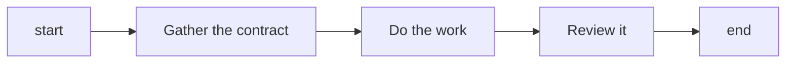

A workflow graph is read by an agent one step at a time, so every node it contains costs a turn and
every branch costs a decision. The default shape is therefore a straight line: `start` → the
responsibilities the task actually has → `end`. Branches, loops, and extra turns are added when
something in the task requires them, not to make the graph look thorough.

## Start with a straight line

Add a **branch** when there is a real alternative outcome — a user decision, a check that can fail,
a source that may or may not exist. Add a **loop** when changing the reviewed artifact can actually
resolve the finding; if repair cannot change or reproduce the problem, the correct behaviour is to
report the cause, not to route back.

## What earns a separate agent turn

A node that pauses for the agent is justified by one of these:

| Reason                           | Example                                             |
| -------------------------------- | --------------------------------------------------- |
| New judgment                     | Deciding an approach from the gathered requirements |
| Independent review               | A reviewer that must not be the producer            |
| A user decision                  | Approving a plan, accepting a result                |
| A separate side-effect authority | Publishing, deleting, mutating something external   |
| A real external wait             | A notification whose answer arrives later           |

Making a directory, copying a known value, renaming a report, assembling a prompt from files, or
recording what the previous node did are none of these. The owner of a substantive operation creates
its own artifacts in the same turn.

## Node count is a diagnostic, not a target

A graph that grew to forty nodes for a five-responsibility task is telling you something, and so is a
graph squeezed to five nodes by merging a reviewer into the producer. Neither number is the goal:
preserve the responsibilities, the routes, and the conditions first, then look at the resulting size.
Choosing a target count and deleting toward it removes behaviour — a skip route, a failure path, a
review — while the count looks better.

:::tip
Before consolidating or removing a node, trace its inputs, outputs, incoming and outgoing
connections, artifacts, failure and skip routes, and any external contract that depends on it.
:::

## Related

- [Branching](/docs/patterns/branching/) - when an alternative outcome is real
- [Validation Loop](/docs/patterns/validation-loop/) - the loop shape that repair actually resolves
- [Workspace](/docs/patterns/workspace/) - who creates the working files
- [Anti-Patterns](/docs/patterns/anti-patterns/) - the machinery this shape avoids
