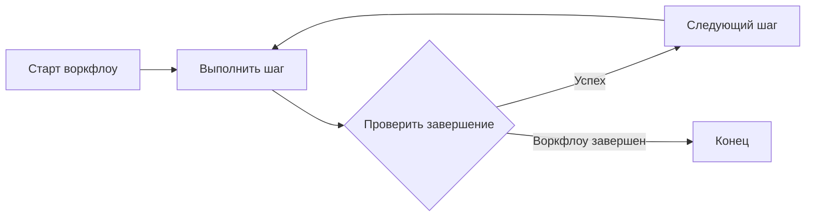

Moira не даёт ИИ-агенту сбиться. Она выдаёт агенту по одному понятному шагу и проверяет каждый
результат, прежде чем агент пойдёт дальше, поэтому многошаговая задача выполняется полностью и
по порядку. Шаги берутся из **флоу** (воркфлоу): процесса, который записан один раз и каждый раз
выполняется одинаково.

## Собирать флоу не нужно

Moira — agent-first инструмент. Вы работаете с агентом как обычно: описываете задачу обычными
словами. Остальное агент делает сам:

1. **Выбирает готовый флоу**, если подходящий есть, — например Quick Task, Robust Task или Todo
   List для понятной задачи без особой логики или Software Development Flow для изменения в
   репозитории кода.
2. **Или собирает новый флоу под вашу задачу** через Workflow Management Flow — собственный флоу
   Moira для создания и правки флоу. Флоу может быть простым — несколько шагов подряд — или
   сложным — процесс с ревью и циклами исправления; нужную задаче структуру агент подбирает сам.

Всё остальное — схемы в веб-приложении, переменные, типы нод, ручная правка флоу — необязательно.
Это нужно, чтобы заглянуть внутрь флоу, когда захочется, а не то, что надо выучить заранее.

## Постепенный путь

Начните сверху и остановитесь там, где вам уже достаточно:

1. [Быстрый старт](/ru/docs/getting-started/quickstart/) — подключите Moira к AI-клиенту и
   запустите первый флоу.
2. [Туториал: первые флоу](/ru/docs/getting-started/tutorial/) — три крошечных учебных флоу:
   простые шаги, одна развилка, несколько путей. Они показывают, как Moira ведёт флоу, по одной
   идее за раз.
3. [Какой готовый флоу выбрать](/ru/docs/getting-started/ready-flows/) — Quick Task, Robust Task и
   Todo List для повседневных задач и когда вместо них попросить агента сделать новый флоу.
4. [Концепции](/ru/docs/concepts/workflows/) и [Паттерны](/ru/docs/patterns/) — как устроены
   флоу, если захочется прочитать или собрать флоу самому.

## Что идёт не так без структуры

ИИ-агенты сильны, но на длинной задаче они могут:

- Терять фокус в сложных многошаговых задачах
- Пропускать важные шаги или предварительные условия
- Выдавать непоследовательные результаты
- Пропускать проверки качества и валидацию

Флоу даёт каждому шагу:

- **директиву** — что сделать;
- **условие завершения** — когда шаг считается сделанным;
- **схему ввода** — какое подтверждение агент обязан вернуть (необязательно);
- **связи** — куда процесс идёт дальше, в том числе выбор по ответу агента.

Агент выполняет каждый шаг, возвращает подтверждение, а Moira проверяет его и переходит к
следующему шагу флоу.

## Как это работает

Дальше на этой странице — для любопытных и для агентов, которые выполняют флоу.



### Процесс выполнения

1. Агент запускает воркфлоу через MCP инструмент
2. Получает директиву текущего шага и условие завершения
3. Выполняет директиву
4. Возвращает результат через инструмент `step()`
5. Движок проверяет и переходит к следующему шагу
6. Повторяет до завершения воркфлоу

:::tip
Состояние воркфлоу сохраняется на сервере. Если сессия прервана, агент может возобновить
выполнение с того же шага, используя process ID.
:::

## Ключевые концепции

### Воркфлоу

Воркфлоу — это направленный граф узлов. Каждый узел представляет шаг в процессе. Узлы могут ветвиться по условию, зацикливаться или делегировать подграфам.

```json
{
  "id": "my-workflow",
  "metadata": {
    "name": "Мой воркфлоу",
    "version": "1.0.0",
    "description": "Пример воркфлоу"
  },
  "nodes": [
    { "id": "start", "type": "start", "connections": { "default": "task-1" } },
    {
      "id": "task-1",
      "type": "agent-directive",
      "directive": "...",
      "connections": { "success": "end" }
    },
    { "id": "end", "type": "end" }
  ]
}
```

### Типы узлов

Ниже показаны распространённые типы узлов. Таблица содержит примеры, а не полный перечень; все
поддерживаемые типы и их актуальные контракты приведены в разделе
[Узлы](/ru/docs/concepts/nodes/).

| Тип                 | Назначение                                                 |
| ------------------- | ---------------------------------------------------------- |
| `start`             | Точка входа для выполнения воркфлоу                        |
| `end`               | Терминальный узел, отмечающий завершение                   |
| `agent-directive`   | Задача для агента с директивой и условием завершения       |
| `condition`         | Ветвление выполнения в один из нескольких выходов по case  |
| `expression`        | Вычисление значений с помощью арифметических выражений     |
| `subgraph`          | Делегирование другому воркфлоу                             |
| `user-notification` | Уведомление через настроенные каналы текущего пользователя |

### Шаблоны

Шаблоны позволяют использовать динамический контент в директивах и условиях через синтаксис `{{variable}}`:

```json
{
  "directive": "Проанализируй {{projectName}} и создай {{reportType}} отчёт"
}
```

Переменные могут ссылаться на:

- Начальные данные из start узла
- Результаты предыдущих шагов
- Параметры воркфлоу

### Выполнения

Выполнение — это работающий экземпляр воркфлоу. Оно поддерживает:

- **Текущая позиция** — Какой узел активен
- **Контекст** — Переменные и результаты шагов
- **История** — Завершенные шаги и их результаты

## MCP интеграция

Moira подключается к AI-агентам через [Model Context Protocol](https://modelcontextprotocol.io/). MCP сервер предоставляет инструменты для:

| Инструмент | Назначение                                                 |
| ---------- | ---------------------------------------------------------- |
| `list`     | Просмотр доступных воркфлоу                                |
| `start`    | Подготовка или выполнение запуска воркфлоу                 |
| `step`     | Выполнение текущего шага и переход                         |
| `manage`   | Создание, редактирование, получение воркфлоу               |
| `session`  | Получение информации о пользователе и активных выполнениях |

:::note
MCP — это открытый протокол. Moira работает с любым MCP-совместимым клиентом: Claude Code, Cursor
и другими.
:::

## Self-host или Cloud

Moira — open source (Apache-2.0). Движок, типы узлов и MCP-инструменты одинаковы, хостите ли вы её сами или используете управляемое облако:

### Self-host

Запустите весь движок, Web UI и MCP-сервер в одном Docker-контейнере на своей инфраструктуре —
бесплатно, single-tenant, данные остаются у вас. Аккаунты участников команды регистрируются с
подтверждением администратора. Это режим по умолчанию (`DEPLOYMENT_MODE=self-host`). См.
[руководство по self-hosting](/ru/docs/getting-started/self-hosting/).

### Moira Cloud

Управляемый инстанс без необходимости что-либо администрировать —
[moira-mcp.com](https://moira-mcp.com). Добавляет SaaS-вход через соцсети, политику юридических
согласий и верификации email, а также расширенное администрирование нескольких пользователей.

:::note
В self-host регистрация открыта, но новый аккаунт должен одобрить администратор. Верификация
email, юридические согласия и вход через соцсети остаются SaaS-функциями и по умолчанию выключены
в self-host. Детали режимов развёртывания — в
[Self-hosting](/ru/docs/getting-started/self-hosting/).
:::

## Следующие шаги

- [Быстрый старт](/ru/docs/getting-started/quickstart/) — Подключение Moira к AI-клиенту
- [Туториал: первые флоу](/ru/docs/getting-started/tutorial/) — Три крошечных учебных флоу
- [Какой готовый флоу выбрать](/ru/docs/getting-started/ready-flows/) — Повседневные задачи без сборки флоу
- [Воркфлоу](/ru/docs/concepts/workflows/) — Глубокое погружение в структуру воркфлоу
