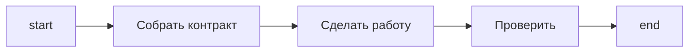

Граф workflow агент читает по одному шагу, поэтому каждая нода стоит хода, а каждая ветка — решения.
Форма по умолчанию — прямая линия: `start` → ответственности, которые у задачи действительно есть →
`end`. Ветки, циклы и дополнительные ходы появляются тогда, когда этого требует сама задача, а не для
того, чтобы граф выглядел основательным.

## Начинайте с прямой линии

Добавляйте **ветку**, когда есть реальный альтернативный исход: решение пользователя, проверка,
которая может упасть, источник, которого может не быть. Добавляйте **цикл**, когда изменение
проверяемого артефакта действительно способно снять замечание; если исправление не может изменить или
воспроизвести проблему, правильное поведение — сообщить причину, а не возвращаться по маршруту.

## Что оправдывает отдельный ход агента

Нода, которая останавливается и ждёт агента, оправдана одним из этого:

| Причина                        | Пример                                           |
| ------------------------------ | ------------------------------------------------ |
| Новое суждение                 | Выбор подхода по собранным требованиям           |
| Независимое ревью              | Рецензент, который не должен быть автором        |
| Решение пользователя           | Согласование плана, приёмка результата           |
| Отдельные полномочия на эффект | Публикация, удаление, изменение чего-то внешнего |
| Реальное внешнее ожидание      | Уведомление, ответ на которое придёт позже       |

Создать директорию, скопировать известное значение, переименовать отчёт, собрать промпт из файлов или
записать то, что сделала предыдущая нода, — ни одно из этого. Владелец содержательной операции
создаёт свои артефакты в том же ходе.

## Число нод — это диагностика, а не цель

Граф, разросшийся до сорока нод на задаче из пяти ответственностей, о чём-то говорит; но говорит и
граф, сжатый до пяти нод слиянием рецензента с автором. Цель не в числе: сначала сохраните
ответственности, маршруты и условия, а потом посмотрите на получившийся размер. Выбрать целевое число
и удалять до него — значит терять поведение: маршрут пропуска, ветку отказа, ревью, — пока число
выглядит лучше.

:::tip
Прежде чем объединять или удалять ноду, проследите её входы и выходы, входящие и исходящие связи,
артефакты, маршруты отказа и пропуска и любой внешний контракт, который от неё зависит.
:::

## Связанное

- [Ветвление](/ru/docs/patterns/branching/) — когда альтернативный исход реален
- [Цикл валидации](/ru/docs/patterns/validation-loop/) — форма цикла, который исправление действительно закрывает
- [Workspace](/ru/docs/patterns/workspace/) — кто создаёт рабочие файлы
- [Антипаттерны](/ru/docs/patterns/anti-patterns/) — машинерия, которой эта форма избегает
