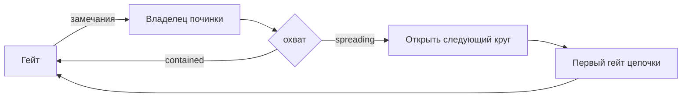

Workflow с несколькими гейтами валидации по умолчанию возвращает любую починку к самому раннему
гейту, чьи доказательства могли устареть. Это верно, когда правка изменила поведение, и абсурдно,
когда она исправила формулировку в названии теста. Платить полной цепочкой за исправление в одну
строку не просто медленно: круг начинает копить замечания, пока они не «окупят» цепочку, а автор
начинает удалять гейты, которые честно отрабатывали свою стоимость.

Паттерн даёт запуску способ установить, какие гейты действительно устарели: один ответ агента,
сделавшего правку, и одно условие, которое его читает.

## Структура



## 1. Владелец починки называет охват после правки

Значение — node-local свойство: объявлено в `inputSchema` узла, но не в `globalInputs`, поэтому
читается как `node-id.field` и не переживает переход, который на нём маршрутизирует. Глобальная
переменная реестра здесь была бы ошибкой: одно общее имя хранило бы последний записанный ответ, и
условие после починки другого гейта могло бы маршрутизировать по значению, которого эта починка не
давала.

```json
{
  "id": "repair-test-adequacy",
  "type": "agent-directive",
  "directive": "Воспроизведи каждый подтверждённый пробел и почини его в корне …\n\nПосле починки укажи её охват в repair_reach: это описание того, что ты реально изменил, а не того, насколько важным было замечание. `contained` — правка осталась в тестах, фикстурах и артефактах покрытия, которые судит этот гейт, не тронула продуктовое поведение, а детерминированные проверки проекта по изменённому прогнаны и прошли. `spreading` — правка дошла до продуктового кода, контрактов, схем, конфигурации, зависимостей или сгенерированных артефактов, либо эти проверки не удалось прогнать или они не прошли.",
  "completionCondition": "Содержимое репозитория изменено так, что все воспроизведённые дефекты адекватности тестов починены",
  "inputSchema": {
    "type": "object",
    "properties": {
      "repair_reach": {
        "type": "string",
        "enum": ["contained", "spreading"],
        "description": "Куда реально попала правка"
      }
    },
    "required": ["repair_reach"]
  },
  "connections": { "success": "route-test-adequacy-reach" }
}
```

Поле обязательное, а его enum состоит ровно из двух значений, поэтому любой принимаемый схемой ответ
выбирает маршрут осознанно.

## 2. Маршрут выбирает условие

```json
{
  "id": "route-test-adequacy-reach",
  "type": "condition",
  "condition": {
    "operator": "eq",
    "left": { "contextPath": "repair-test-adequacy.repair_reach" },
    "right": "contained"
  },
  "connections": {
    "true": "review-test-adequacy",
    "false": "advance-evidence-iteration"
  }
}
```

Пишите условие так, чтобы полная цепочка была веткой любого ответа, кроме `contained`. Тогда
консервативное направление совпадает с направлением по умолчанию.

Ветка `spreading` попадает в цепочку не напрямую: сначала она проходит через expression-ноду,
открывающую следующий круг, а цепочка идёт уже после неё.

```json
{
  "id": "advance-evidence-iteration",
  "type": "expression",
  "expressions": ["current_iteration = current_iteration + 1"],
  "connections": { "default": "validate-cheap" }
}
```

Держите эту арифметику в движке. Владелец починки, которого просят вернуть следующий номер, не может
отрендерить директорию, которую он же и создаёт: на его ходу счётчик ещё равен закрываемому кругу.
Директива тогда описывает путь вместо того, чтобы его назвать, а агент придумывает имя файла, которое
никто не читает. Когда номер двигает нода, починка рендерит круг, который закрывает, а цепочка —
круг, который открывает.

## Что делает короткий маршрут честным

**Охват описывает изменённое, а не важность замечания.** Шкала критичности приглашает спорить о
важности; ответ об охвате сверяется с только что сделанным диффом.

**Его называет тот, кто сделал правку, и после того, как сделал.** До починки никто не знает, чего
коснётся исправление, — и меньше всех ревьюер, который в делегированном случае починку вообще не
видит и который иначе решал бы, сколько перепроверки заслуживают его собственные находки. Это
единственное суждение, на которое независимость ревьюера не распространяется.

**Детерминированные проверки заменяют пропущенную цепочку.** `contained` требует, чтобы линтер,
проверка типов и точечные тесты проекта по изменённому были прогнаны и прошли. Без этой половины
короткий маршрут — просто пропущенная валидация.

**Починка, оказавшаяся крупнее ярлыка, идёт длинным путём.** Ответ описывает случившееся изменение,
а не намерение, с которого правка начиналась.

:::caution
Короткий маршрут — не освобождение от гейта. Он возвращает к гейту, поднявшему замечание, и тот
подтверждает закрытие, прежде чем запуск идёт дальше.
:::

## Где здесь делегированное ревью

Если замечание поднял делегированный ревьюер, `contained` возвращает к нему же, минуя цепочку перед
ним. Лишнего делегирования это не стоит: маршрут `spreading` всё равно заканчивается тем же
ревьюером, поэтому сокращается цепочка, а не ревью.

## Связанное

- [Цикл валидации](/ru/docs/patterns/validation-loop/) — обычный цикл, который уточняет паттерн
- [Ревью субагентом](/ru/docs/patterns/subagent-review/) — делегированный гейт, к которому возвращается contained-починка
- [Минимальный граф](/ru/docs/patterns/minimal-graph/) — что оправдывает отдельную ветку
- [Антипаттерны](/ru/docs/patterns/anti-patterns/) — шкалы критичности, счётчики и состояние без потребителя
